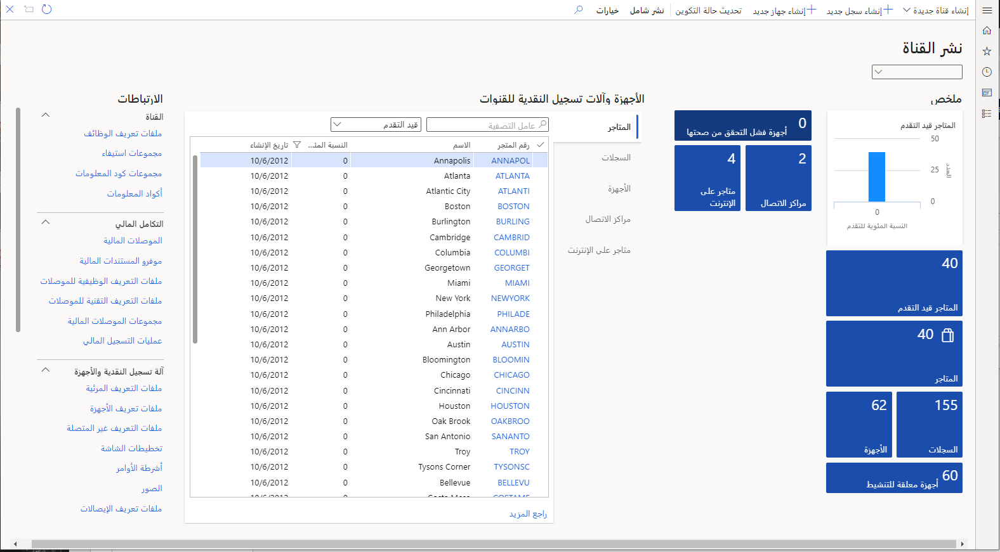

تصف هذه الوحدة المزيد من إمكانيات Dynamics 365 Commerce.

## Retail headquarters

باستخدام ميزات retail headquarters في Dynamics 365 Commerce، يمكنك إدارة الأصناف التالية:

- **المنتجات والفئات** - إدارة المنتجات ومجموعات المنتجات وصور المنتجات والتدرجات الهرمية للمنتجات وفئات المنتجات التكميلية. 
- **الكتالوجات والتشكيلات** - إدارة تشكيلات المنتجات والكتالوجات وصور الكتالوجات. 
- **توصيات المنتج** - إدارة قوائم البيع والتوصيات التي تعززها باستخدام التعلم الآلي. 
- **الأسعار والخصومات** - إدارة خصومات المنتجات وإدارة القسائم وإجراء تغييرات في الأسعار وإعداد قواعد أسعار الفئات ومجموعات الأسعار. 
- **قنوات البيع بالتجزئة** - إعداد وإدارة متاجر البيع بالتجزئة ومراكز الاتصال والمتاجر عبر الإنترنت. كما يسمح لك بمراجعة ومقارنة البيانات المالية للقناة.
- **الموظفون** - إدارة وتعيين قنوات للموظفين من خلال دفاتر العناوين وإنشاء مجموعات الأذونات. 
- **العملاء** - يساعدك على استخدام Dynamics 365 Customer Service لإنشاء أوامر العملاء وإدارتها، وإدارة أوامر الإرجاع والاستبدال، وإرسال الكتالوجات، وإعداد برامج الولاء، وعرض معاملات العملاء.
- **المخزون** - إدارة المخزون الفعلي وجرد المخزون. أيضاً، استخدم هذه الميزة لإعداد قواعد التزويد وحزم المنتجات للتسويق والرموز الشريطية والتسميات وإدارة مواقع الإرجاع وفئات الخدمة.

بالإضافة إلى ذلك، تساعدك ميزات retail headquarters في Dynamics 365 Commerce على إدارة الطلبات وبرامج الاستمرارية والمهام ومهام سير عمل البيع بالتجزئة.

## التجارة والمخزون

قبل أن تتمكن من عرض منتجات للبيع في قنوات البيع بالتجزئة الخاصة بك، تحتاج إلى إنشاء المنتجات وتكوينها في Dynamics 365 Commerce. لإنشاء المنتجات، تحتاج إلى تحديد خصائص المنتج وسماته وتعيين المنتجات إلى التسلسلات الهرمية لفئات البيع بالتجزئة. يمكنك إتاحة المنتجات لقنوات البيع بالتجزئة الخاصة بك وإضافتها إلى تشكيلة نشطة. بعد ذلك، يمكنك إصدار المنتجات للكيانات القانونية حيثما تكون متاحة.

بالإضافة إلى ذلك، يمكنك إجراء تغييرات في الأسعار على المنتجات أو إعداد الخصومات التي يتم تطبيقها على الأصناف أو المعاملات عبر قنوات المبيعات الخاصة بك.

## إدارة القناة

يمكنك تحديد كيفية تحديد وتكوين متاجرك، والتي يمكن أن تكون متاجر فعلية أو متاجر عبر الإنترنت أو مراكز اتصال. يمكن أن يكون لكل متجر طرق الدفع الخاصة به وطرق التسليم ومجموعات الأسعار وحسابات الدخل والمصروفات والسجلات والموظفين. 

بعد إنشاء متجرك، يمكنك إنشاء مجموعة متنوعة من المنتجات التي تريد أن يحملها المتجر. يمكنك أيضاً تحديد الأسعار والخصومات الخاصة بالمتجر التي تنطبق على المنتجات المتوفرة في المتجر.

تُظهر لقطة الشاشة التالية مثالاً على شاشة **نشر القنوات**.

## التجارة الإلكترونية

Dynamics 365 Commerce يدعم إدارة الكتالوجات، والمحتوى، والأصول، والعروض الترويجية، والمخزون، والتسعير عبر جميع القنوات. يمكنك إعداد واجهات المحلات وإدارة المحتوى وإنشاء كتالوجات للمنتجات للحصول على تجارب بيع أفضل.

يمكنك إنشاء تخطيطات وقوالب باستخدام أدوات تطوير وتأليف الويب المضمنة. يمكنك إعادة استخدام القواعد والمحتوى الافتراضي عبر نطاق واسع من الصفحات. بعد ذلك، يمكنك تخصيص الصفحات بالسمات وتحسينات الصفحة الأخرى لإضفاء العمق والثراء على تجربة العميل.

## نشر التجارة

يمنحك Dynamics 365 Commerce خيارات متعددة لنشر الحزمة. يمكنك تجميع حزم منفصلة للمكونات الفردية، مثل CPOS ووحدات مقياس المتجر ووحدات مقياس السحابة واعتبارات الأجهزة المحمولة كحزمة واحدة قابلة للنشر للبيع بالتجزئة.

بعد ذلك، ستقوم بمراجعة Microsoft Dynamics 365 Fraud Protection.
