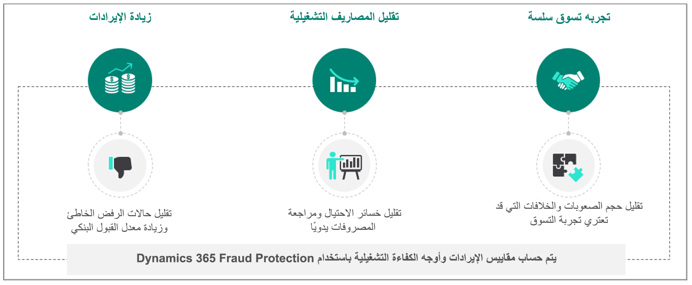
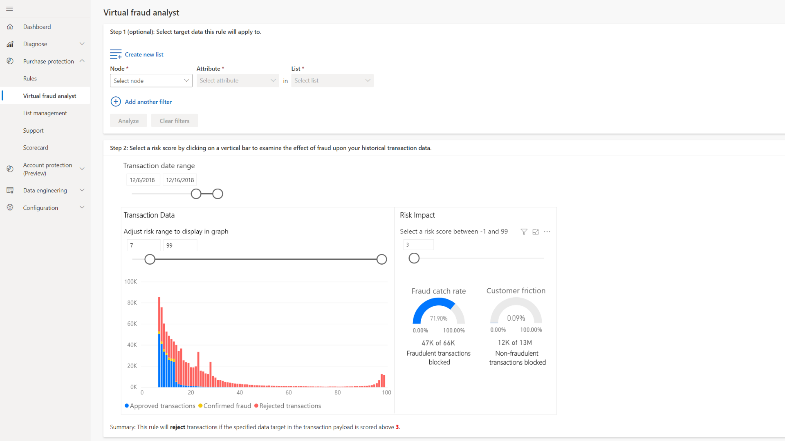
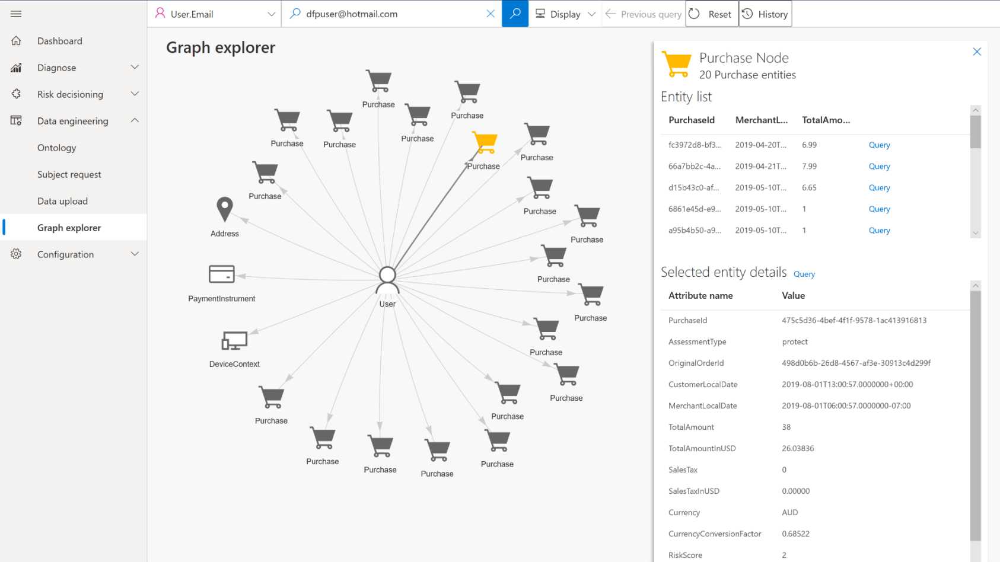
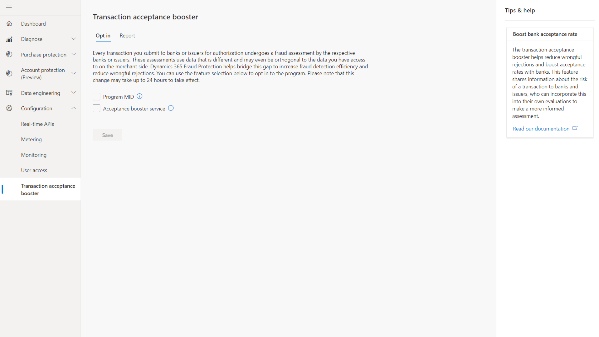

بصفتك مؤسسة رقمية، يمكنك إجراء الأعمال التجارية عبر الإنترنت وفي الوقت الفعلي. على الرغم من أن هذا النهج يساعدك على تقليل التكاليف وتحسين تجربة العميل، إلا أنه يعرضك أيضاً لتهديدات خطيرة بالاحتيال. يستفيد المستخدمون المتمرسون من إخفاء الهوية النسبي وإمكانية الوصول لقناتك على الإنترنت. على سبيل المثال، يقوم هؤلاء المستخدمون بإنشاء حركات ضارة من خلال الحسابات المخترقة وأدوات الدفع المسروقة. 

وقد يحاول الآخرون تنفيذ الإجراءات التالية:

- الاستيلاء على الحساب
- إساءة استخدام الإصدارات التجريبية المجانية
- مراجعات المنتجات المزيفة
- الضمان، أو رد الأموال، أو احتيال البائع
- إساءة استخدام خصومات البرنامج 

كل هذه الأنشطة تؤثر على ربحيتك وسمعتك.

حتى أن بعض أنواع الاحتيال لها عواقب وخيمة على المجتمع ككل، بما في ذلك غسيل الأموال ونشر أخبار كاذبة.

نظراً لأن الاحتيال عبر الإنترنت يمثل مخاطرة كبيرة، فمن المحتمل أن يتمكن المستخدمون من اكتشاف نقاط ضعفك واستغلالها. على عكس السنوات الأولى للإنترنت، تمول حلقات من المهنيين جيدة التمويل والمجهزة جيداً وتنظم الحركات الاحتيالية اليوم. يتمتع محترفو الحماية من الاحتيال بالمهارات اللازمة لمكافحة هذا التهديد.

تركز Dynamics 365 Fraud Protection على الحماية من الاحتيال في الدفع والسيناريوهات ذات الصلة في التجارة الإلكترونية، وتساعدك على:

- تقليل فقدان الاحتيال.
- زيادة معدلات قبول البنوك لتحقيق إيرادات أعلى.
- تحسين تجربة التسوق عبر الإنترنت للعملاء.

تتمتع Microsoft بسنوات من الخبرة في حماية أعمالها التجارة الإلكترونية من الاحتيال. لقد طورت Microsoft مجموعة تقنية متطورة تستخدم البيانات الضخمة المتصلة عبر خطوط عمل متعددة. كما تطبق الذكاء الاصطناعي (AI) للمساعدة في توفير القرارات الصحيحة في الوقت الحقيقي.

باستخدام Fraud Protection (الحماية من الاحتيال)، يمكنك حماية عملك من الاحتيال باستخدام إمكانات مبتكرة ومتقدمة بما في ذلك:

- الذكاء الاصطناعي والرؤى من شبكة الحماية من الاحتيال.
- بصمة الجهاز.
- محرك القواعد ومحلل الاحتيال الافتراضي.
- مستكشف الرسم البياني وبطاقة الأداء.
- معزز قبول حركة.

يمكنك استخدام لوحات معلومات Commerce والبيانات التاريخية لإنشاء تقارير مخاطر ومقاييس أسبوعية تحمي من الاحتيال.

يبين الرسم التالي فوائد الحماية من الاحتيال.

> [!div class="mx-imgBorder"]
> 
 
### تكنولوجيا الذكاء الاصطناعي التكيفية

تتعلّم Fraud Protection (الحماية من الاحتيال) من الأنماط وتتكيف معها بصورة مستمرة، وتزود مديري الاحتيال بأدوات لتحسين عناصر التحكم في الاحتيال.

تظهر لقطة الشاشة التالية شاشة **محلل الاحتيال الظاهري**.

> [!div class="mx-imgBorder"]
> 

### شبكة Fraud protection (الحماية من الاحتيال)

تتعلم Fraud Protection (الحماية من الاحتيال)من الأنماط وتتكيف معها باستمرار، وتزود مديري الاحتيال بأدوات لتحسين عناصر التحكم في الاحتيال. لقطة الشاشة التالية تعرض **مستكشف الرسم البياني**.

> [!div class="mx-imgBorder"]
> 

### معزز قبول الحركة

توفر المعرفة المتصلة وعياً واسعاً بأنشطة الاحتيال في جميع أنحاء العالم، مع الحفاظ على أمان معلوماتك السرية وخصوصية المتسوقين كأولوية. لقطة الشاشة التالية تعرض **معزز قبول الحركة**.

> [!div class="mx-imgBorder"]
> 

الآن بعد أن تعرفت على الوظائف الأساسية لـ Dynamics 365 Commerce وDynamics 365 Fraud Protection، يمكنك مراجعة ما تتذكره من خلال فحص المعرفة.
