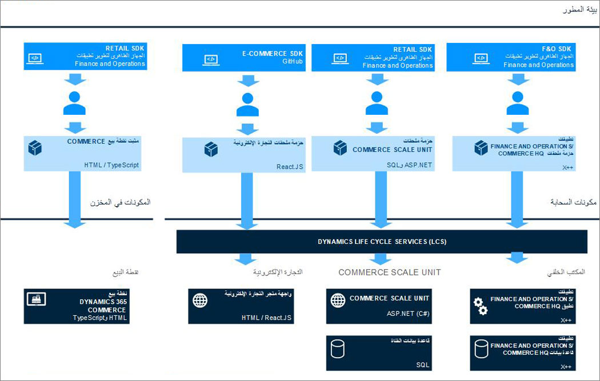

يوضح الرسم التخطيطي التالي بنية ملحق التجارة.

للاطلاع على كافة مكونات ملحق Commerce، انتقل إلى [Commerce لتكنولوجيا المعلومات للمحترفين والمطورين](/dynamics365/commerce/dev-itpro/dev-retail-home-page/?azure-portal=true). 

فيما يلي مكونات ملحق Commerce الرئيسية:

- **Commerce scale unit (CSU)**

  - Retail server (RS)
  - Commerce runtime (CRT)
  - قاعدة بيانات القناة
  - Store Commerce للمتصفحات

- **العميل**

  - Store Commerce لـ Windows
  - محطة الأجهزة (HWS)

## Dynamics 365 Commerce سوق التطبيقات
يوفر Commerce سوقاً مزدهراً عبر الإنترنت لاكتشاف الملحقات والوحدات النمطية والسمات التي يمكن استخدامها عبر جميع قنوات البيع بالتجزئة التجارية (في المتجر، ومركز الاتصال، والرقمية، والناشئة) وتجربتها وبيعها. لضمان جودة هذه الملحقات، يتم اعتماد جميع الأصناف المضافة إلى السوق باستخدام ممارسات الاعتماد القياسية.

يمكن لمقدمي الخدمات غير التابعين لشركة Microsoft سرد خدماتهم وموضوعاتهم ووحداتهم النمطية وبيعها في السوق.

يسمح سوق تطبيقات التجارة لعملاء التجارة بالبحث عن موصلات وبرامج نصية وموضوعات ووحدات نمطية والمزيد من المعلومات أو التعرف عليها أو شراؤها أو الاشتراك فيها ونشرها.

تتضمن أمثلة فئات الملحقات، على سبيل المثال لا الحصر:

- الإعلان
- التحليلات
- التقويمات
- الأنظمة الأساسية لإدارة البيانات
- التسويق المباشر
- الأحداث والمواعيد
- الاختبار
- Fraud Protection
- حوافز الهدايا
- تنظيم الرحلة
- خرائط
- المراسلة‬ والمحادثة
- عمليات الدفع
- إضفاء الطابع الشخصي
- التقييمات والمراجعات
- الشحن
- مشاركة وسائل التواصل الاجتماعي
- استهداف
- الترجمات

يدعم السوق أيضاً بيع السمات والوحدات النمطية المخصصة للاستخدام في القناة الرقمية، بالإضافة إلى الملحقات. سمات Bootstrap القابلة للتطبيق على نطاق واسع من الصناعات والأسواق. يمكن إنشاء الوحدات النمطية باستخدام React وBootstrap وCommerce SDK لعرض المحتوى والبيانات في السوق الرقمية لمجموعة متنوعة من الأغراض.

