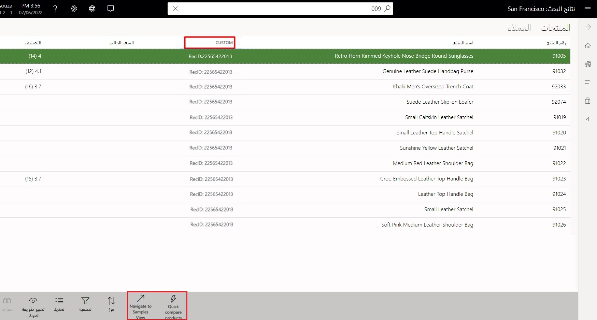
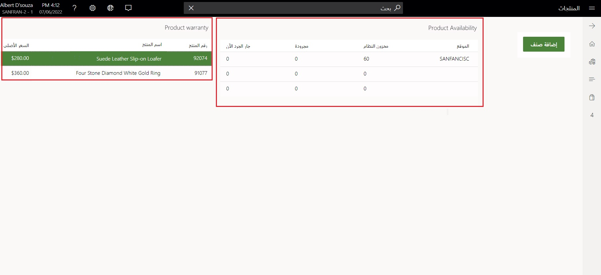

يمكن توسيع واجهة مستخدم نقطة البيع (POS) ومنطق الأعمال لإضافة وظائف مخصصة.The point of sale (POS) user interface and business logic can be extended to add custom functionality. 

تدعم واجهة مستخدم نقطة البيع (POS) أنماط الامتداد التالية:The POS user interface supports the following extension patterns:

-   **أزرار شريط التطبيق** - أضف أزراراً مخصصة إلى شريط التطبيقات في الصفحات المحددة.**App bar buttons** - Add custom buttons to the app bar on selected pages.
-   **مجموعات الأعمدة المخصصة** - استبدل أعمدة الشبكة بأعمدة مخصصة في الصفحات المحددة.**Custom column sets** - Replace the grid columns with custom columns on selected pages.
-   **عناصر تحكم مخصصة** - إضافة عناصر تحكم جديدة إلى الصفحات المحددة.**Custom controls** - Add new controls to selected pages.

لتوضيح هذه الوظيفة بشكل أفضل، ضع في اعتبارك الموقف الذي تحتاج فيه إلى إضافة عمود مخصص وأزرار شريط التطبيق في صفحة البحث **المنتجات** التي تعرض معلومات إضافية حول المنتج.To illustrate this functionality better, consider a situation where you need to add a custom column and app bar buttons in the **Products** search page that display additional information about the product. في صفحة **تفاصيل المنتج**، يجب إضافة عناصر تحكم مخصصة تعرض مدى توفر المنتج.In the **Product details** page, you should add custom controls that will display the availability of the product. 

تُظهر لقطة الشاشة التالية مثالاً على عمود مخصص وأزرار شريط التطبيق التي تمت إضافتها في نقاط البيع.The following screenshot shows an example of a custom column and app bar buttons that have been added in POS.

 
تمت تسمية العمود المخصص بالتسمية **خصص**، وفي أسفل الصفحة مثال على أزرار شريط التطبيق المخصصة.The custom column is named with the label **CUSTOM**, and at the bottom of the page is an example of custom app bar buttons. في ملحق أزرار شريط التطبيق، يمكنك كتابة منطق مخصص للتنقل إلى طريقة عرض مختلفة ومنطق عمل وما إلى ذلك.In the app bar buttons extension, you can write custom logic to navigate to a different view, business logic, and so on. 

تُظهر لقطة الشاشة التالية مثالاً لعنصر تحكم مخصص في نقطة البيع POS يمكنك استخدامه لعرض معلومات مخصصة ذات صلة بالمنتج.The following screenshot shows an example of a custom control in POS that you can use to display custom information that is related to the product. 

ليست كل طرق عرض نقاط البيع قابلة للتوسعة.Not all POS views are extensible. لمزيد من المعلومات، راجع [توسيع طرق عرض نقاط البيع لإضافة أعمدة مخصصة وأزرار شريط التطبيق](https://docs.microsoft.com/dynamics365/commerce/dev-itpro/pos-view-extension/?azure-portal=true).For more information, see [Extend POS views to add custom columns and app bar buttons](https://docs.microsoft.com/dynamics365/commerce/dev-itpro/pos-view-extension/?azure-portal=true). 

على سبيل المثال، إذا احتوت طريقة عرض نقطة البيع على شبكة، فيمكنك إضافة عمود مخصص فيها، ولكن لا يمكنك إضافة عنصر تحكم مخصص.For example, if the POS view contains a grid, then you can add a custom column in it, but you can't add a custom control. لا يمكن إضافة عناصر التحكم في طرق العرض التي تحتوي على شبكة.Controls can't be added in views that contain a grid. في طرق عرض POS UI الخاصة بإدارة خارج النطاق (OOB)، لا يمكنك إخفاء عناصر التحكم أو الأزرار، يمكنك فقط إضافة عناصر تحكم أو أزرار مخصصة جديدة.In the Out-of-Band Management (OOB) POS UI views, you can't hide controls or buttons, you can only add new custom controls or buttons.

## ملحق منطق الأعمال نقطة البيع POSPOS business logic extension

يمكن تمديد سير عمل نقطة البيع أو منطق الأعمال.POS workflow or business logic can be extended. تصف الأقسام التالية الأنماط المدعومة للامتدادات لتوسيع المنطق الحالي في نقاط البيع.The following sections describe the supported patterns for extensions to extend the existing logic in POS. على سبيل المثال، قد ترغب في تغيير كيفية التقاط الرقم التسلسلي في نقطة البيع، وتغيير المفتاح في تدفق الأسعار للعناصر، وما إلى ذلك.For example, you might want to change how a serial number is captured in POS, change the key in price flow for items, and so on. 

- **تمديد** - يوفر هذا النمط رموز الامتداد التالية التي يمكنك اختيارها وفقاً لاحتياجاتك:**Extend** - This pattern provides the following extension codes that you can choose according to your needs:

  - **المشغلات** - يمكن أن يضيف كود الامتداد منطقاً سابقاً أو منطقاً لاحقاً قبل عمليات نقطة البيع.**Triggers** - The extension code can add pre or post logic before POS operations.
  - **تجاوز معالجات** - يمكن أن يتجاوز كود الامتداد معالجات نقاط البيع لإضافة منطق عمل مخصص.**Override handlers** - The extension code can override POS handlers to add custom business logic.

- **الاستهلاك** - إذا كان الملحق ينشئ وظائف جديدة في نقاط البيع، فيمكن للإضافة أن تستهلك بعض واجهات برمجة التطبيقات الحالية أو APIs في نقاط البيع.**Consume** - If the extension is creating new functionality in POS, then the extension can consume some of the existing APIs or controls in POS. على سبيل المثال، إذا كنت تريد إضافة العنصر إلى سلة التسوق، فيمكن للملحق استخدام **إضافة صنف إلى عربة التسوق** API بدلاً من الاضطرار إلى إنشاء منطق مخصص لإضافة الصنف.For example, if you want to add the item to the cart, then the extension can use the **AddItemToCart** API instead of you having to create custom logic to add the item.

- **واجهات برمجة التطبيقات (API) لنقاط البيع** - يمكن أن تستهلك الإضافة واجهات برمجة التطبيقات (API) لنقاط البيع في كود الامتداد.**POS APIs** - Extension can consume POS APIs in the extension code.

- **POS UI SDK** - يمكن للإضافة أن تستهلك عناصر التحكم في نقاط البيع ومربعات الحوار في عروض الامتداد.**POS UI SDK** - Extension can consume POS controls and dialogs in the extension views.

## عينات تمديد نقاط البيعPOS extension samples

راجع صفحات التوثيق التالية للاطلاع على سيناريوهات ونماذج مختلفة لتمديد نقاط البيع.See the following documentation pages for various POS extension scenarios and samples.

### واجهة المستخدمUser interface

بالنسبة لسيناريوهات تمديد نقاط البيع ونماذج لواجهة المستخدم، حدد الروابط التالية:For POS extension scenarios and samples for the UI, select the following links:

-  [إضافة أعمدة مخصصة إلى شبكة معاملات نقطة البيع (POS)Add custom columns to a point of sale (POS) transaction grid](https://docs.microsoft.com/dynamics365/commerce/dev-itpro/pos-custom-transaction-column/?azure-portal=true)

-  [توسيع طرق عرض نقاط البيع لإضافة أعمدة مخصصة وأزرار شريط التطبيق](https://docs.microsoft.com/dynamics365/commerce/dev-itpro/pos-view-extension/?azure-portal=true) - بالنسبة إلى طرق العرض القائمة على مصمم تخطيط غير الشاشة.[Extend POS views to add custom columns and app bar buttons](https://docs.microsoft.com/dynamics365/commerce/dev-itpro/pos-view-extension/?azure-portal=true) - For non-screen layout designer- based views. 

-  [إضافة عناصر تحكم مخصصة إلى عروض نقاط البيعAdd custom controls to POS views]( https://docs.microsoft.com/dynamics365/commerce/dev-itpro/pos-custom-control/?azure-portal=true)   

### سير العملWorkflow

بالنسبة لسيناريوهات تمديد نقاط البيع ونماذج لسير العمل، حدد الارتباطات التالية:For POS extension scenarios and samples for the workflow, select the following links:

-  [مشغلات نقاط البيع]( https://docs.microsoft.com/dynamics365/commerce/dev-itpro/pos-trigger-printing/?azure-portal=true) - لإضافة المشغلات السابقة واللاحقة في عمليات نقاط البيع.[POS Triggers]( https://docs.microsoft.com/dynamics365/commerce/dev-itpro/pos-trigger-printing/?azure-portal=true) - To add pre and post-triggers in POS operations. 

-  [واجهات برمجة تطبيقات نقاط البيع (POS)](https://docs.microsoft.com/dynamics365/commerce/dev-itpro/pos-apis/?azure-portal=true) - للتعرف على كيفية استهلاك واجهات برمجة تطبيقات نقاط البيع في سيناريوهات الإضافات.[Point of sale (POS) APIs](https://docs.microsoft.com/dynamics365/commerce/dev-itpro/pos-apis/?azure-portal=true) - To learn how to consume POS APIs in extension scenarios.

-  [تجاوز معالج طلب نقاط البيع](https://docs.microsoft.com/dynamics365/commerce/dev-itpro/pos-handler/?azure-portal=true) - لمعرفة كيفية تجاوز منطق عمل نقاط البيع.[Override POS request handler](https://docs.microsoft.com/dynamics365/commerce/dev-itpro/pos-handler/?azure-portal=true) - To learn how to override POS business logic. 

