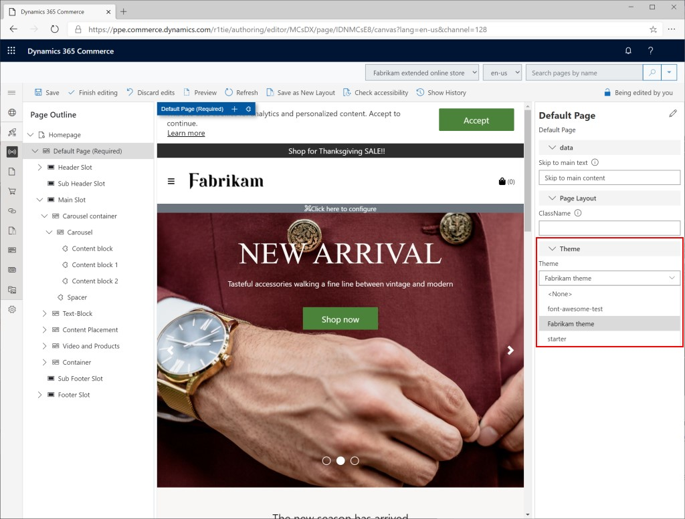

تعتبر إجراءات البيانات هي دالات JavaScript التي يتم استخدامها في بنية Commerce للمساعدة على إحضار وتعيين البيانات المطلوبة بواسطة الوحدات النمطية عبر التطبيقات.Data actions are JavaScript functions that are used in the Commerce architecture to help fetch and map data that is required by modules across applications. 

تتضمن منصة Commerce مجموعة من إجراءات البيانات الأساسية التي يمكن استدعاؤها من الوحدات النمطية للقيام باسترداد البيانات النموذجي.The Commerce platform includes a set of core data actions that can be called from modules to do typical data retrieval. 

على سبيل المثال، يمكن لإجراءات البيانات الأساسية الحصول على قائمة فئات وتفاصيل معلومات المنتج والمزيد.For example, core data actions can get a category list, product information details, and more.

شاهد الفيديو التالي لمعرفة كيفية إنشاء إجراء بيانات مخصص في Commerce.Watch the following video to learn how to create a custom data action in Commerce.  

 > [!VIDEO https://www.microsoft.com/videoplayer/embed/RE4xvq1]

في Commerce، يمكنك تطبيق سمة على موقعك على الإنترنت أو القوالب الفردية أو الصفحات الفردية.In Commerce, you can apply a theme to your online site, individual templates, or individual pages. 

على سبيل المثال، قد يكون لديك سمة افتراضية تم تعيينها للموقع على الإنترنت ونسق حملة يتم تطبيقه على مجموعة فرعية من الصفحات على الموقع.For example, you might have a default theme that is set for the online site and a campaign theme that is applied to a subset of the pages on the site. بعد إنشاء سمة وتحميلها إلى موقع الإنتاج الخاص بك، يمكنك استخدام أداة منشئ موقع Commerce لتعيين السمة للموقع.After a theme is created and uploaded to your production site, you can use the Commerce site builder tool to set the theme for the site. يمكنك تعيين سمة الموقع في قالب أو في تخطيط أو في صفحة واحدة.You can set the site's theme in a template, in a layout, or on a single page.

تظهر لقطة الشاشة التالية كيفية تحديد سمة لصفحة في Commerce.The following screenshot shows how a theme is selected for a page in Commerce. 
 

 
في لقطة الشاشة السابقة، لاحظ أن حاويه الصفحة (**الصفحة الافتراضية**) محددة، وأن حقل **السمة** يظهر في جزء الخصائص الموجود علي اليسار.In the preceding screenshot, notice that the page container (**Default Page**) is selected, and the **Theme** field for the page appears in the Properties pane on the right. يمكن تعيين السمة على الصفحة **الرئيسية** بطريقة مشابهة.A theme can be set on the **Master** page in a similar manner. في هذه الحالة، يتم تطبيق السمة على كافة الصفحات المشتقة من الصفحة **الرئيسية**.In this case, the theme is applied to all pages that are derived from the **Master** page. 

> [!NOTE]
> إذا تم إيقاف الخاصية **تأمين**، يمكن للصفحات الفردية تجاوز السمة.If the **Locked** property is turned off, individual pages can override the theme. 

يمكنك إنشاء سمة مخصصة، ويمكنك أيضاً الحصول على سمة حملة يتم تطبيقها على بعض صفحات الموقع.You can create a custom theme, and you can also have a campaign theme that is applied only to some pages of the site. 

شاهد الفيديو التالي لمعرفة كيفية إنشاء سمة مخصصة.Watch the following video to learn how to create a custom theme. 

 > [!VIDEO https://www.microsoft.com/videoplayer/embed/RE4xvqS]

