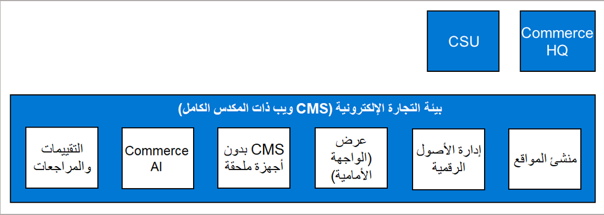

التجارة الإلكترونية في Dynamics 365 Commerce هي وجهة متجر على الويب خاصة بالقنوات على الإنترنت التي تتم إضافتها في شبكة Commerce وتوفر تواجداً غير مسبوق على الإنترنت لبائعي التجزئة.E-Commerce for Dynamics 365 Commerce is the web storefront for the online channels that are hosted in the Commerce network and provides out-of-the-box online presence for retailers.
 
يتعين إنشاء قناة واحدة أو أكثر عبر الإنترنت في المراكز الرئيسية في Commerce قبل التمكن من البدء في إنشاء موقع التجارة الإلكترونية لديك.One or more online channels must be created in Commerce headquarters before you can start building your e-Commerce site. تتميز الاتصالات بين القنوات عبر الإنترنت ومواقع التجارة الإلكترونية بالمرونة، كما أنها تغطي سيناريوهات متعددة للأعمال التجارية:Connections between online channels and e-Commerce sites are flexible and cover multiple business scenarios:

-   يمكن ربط قناة واحدة على الإنترنت في المراكز الرئيسية في Commerce بعدة مواقع للتجارة الإلكترونية (واحد إلى متعدد).One online channel in Commerce headquarters can be linked to multiple e-Commerce sites (one-to-many).
-   يمكن ربط عدة قنوات على الإنترنت في المراكز الرئيسية في Commerce بموقع واحد للتجارة الإلكترونية (متعدد إلى واحد).Multiple online channels in Commerce headquarters can be linked to one e-Commerce site (many-to-one). على سبيل المثال، إذا تم إعداد عدة متاجر عبر الإنترنت لدعم مناطق جغرافية مختلفة، يمكن استخدام مجموعة واحدة من الصفحات لتوفير الخبرات الفريدة التي تم تحديدها بواسطة كل متجر.For example, if multiple online stores are set up to support different geographical regions, a single set of pages can be used to provide the unique experiences that are defined by each store.

ترتبط كل بيئة تجاره إلكترونية بوحدة مقياس السحابة الفردية (CSU) ويمكن أن تحتوي على عدة مواقع، مما يعني أنه لا يلزم عليك نشر مكون جديد للتجارة الإلكترونية لكل موقع من المواقع.Each e-Commerce environment is associated with a single cloud scale unit (CSU) and can contain multiple sites, which means that you do not have to deploy a new e-Commerce component for each of your sites. يتم دعم مكون التجارة الإلكترونية حالياً فقط من خلال وحده Commerce Cloud Scale Unit، مما يعني أنه يتم استضافتها في السحابة.The e-Commerce component is currently supported only through the Commerce Cloud Scale Unit, which means that it is hosted in the cloud. ولا يمكن استضافتها محلياً.It cannot be hosted on-premises. 

يعد مكون التجارة الإلكترونية بمثابة ميزة مرخصة بشكل منفصل ولا يتم تضمينها في ترخيص Dynamics 365 Commerce.The e-Commerce component is a separately licensed feature and is not included in the Dynamics 365 Commerce license. وهي متكاملة تماماً مع خدمات Dynamics 365 Lifecycle Services (‏LCS)، والتي تسمح بتزويد الحل وإدارته بشكل مؤتمت.It is fully integrated to Dynamics 365 Lifecycle Services (LCS), which allows automated provisioning and management of the solution. التجارة الإلكترونية هي بيئة تعمل بنظام القوالب، مما يعني أن معظم عمل الإعداد الأساسي يتم الاهتمام به بشكل تلقائي وستحصل على حق الوصول إلى الأدوات التي تحتاجها لهذه العملية.E-Commerce is a template-driven environment, meaning that most of the base setup work is taken care of automatically and you get access to the tools that you need for this process. الصفة المميزة الرئيسية هي النظام الأساسي سهل الاستخدام والذي يسمح بعملية إنشاء بسيطة وبدون تعقيدات برمجية للقوالب والسمات والمحتويات العامة عبر الوحدات النمطية.A main characteristic is the user-friendly platform that allows for simple, no-code creation of templates, themes, and overall content across modules.

توفر الصورة التالية نظرة عامة عالية المستوى لبعض مكونات التجارة الإلكترونية لتوضيح القدرات المهمة.The following image provides a high-level overview of some e-Commerce components to illustrate important capabilities.

 

- **منشئ الموقع** – تعد هذه البيئة أحد حلول خدمة تأجير البرامج متعددة المستأجرين.**Site builder** – This environment is a multi-tenant software as a service (SaaS) solution. هذه الأداة هي الأداة التي يمكنك استخدامها لإنشاء موقع التجارة الإلكترونية وإدارته.This tool is one that you would use to build and manage your e-commerce site. يتواجد منشئ المواقع في الشبكة السحابية فقط ويستخدم نظام إدارة المحتوى بدون عنوان (أو وحدة CMS بدون عنوان) كنظام تشغيل له.Site Builder exists only in the cloud and it uses headless content management system (or headless CMS) as its operating system. 
- **إدارة الأصول الرقمية** – تستخدم هذه البيئة أيضا وحدة CMS بدون عنوان باعتبارها نظام التشغيل.**Digital asset management** – This environment also uses headless CMS as its operating system. وهي تمثل جزءاً من منشئ المواقع وعلى هذا النحو، يمكن الوصول إليها من قائمة التنقل في **مكتبة الوسائط**.It represents a part of the site builder and, as such, can be accessed from the navigation menu in **Media library**. يمكن استخدام مكتبه الوسائط لوضع الصور ومقاطع الفيديو والملفات الثنائية (مثل PDF) وغير ذلك من المستندات الأخرى في قاعدة بيانات المنتج.The Media library can be used to put images, videos, binaries (such as PDF), and other documents in the product database.
- **التقديم** (واجهة متجر على الويب) – هذه البيئة موزعة حالياً في نموذج مستأجر واحد.**Rendering** (web storefront) – This environment is currently deployed in a single tenant model. وهي توفر إمكانات أساسية من خلال واجهة WYSIWYG، مثل بيئة منشئ الموقع، وتكون مسؤولة عن توفير التجربة الكاملة لموقع التجارة الإلكترونية باستخدام إمكانيات التقديم.It provides core capabilities through a WYSIWYG interface, like the Site Builder environment, and is responsible for providing the full experience of the e-Commerce site by using its rendering capabilities.
- **CMS بدون عنوان** - هذه البيئة مسؤولة عن تخزين كافة محتويات البيانات وبيانات التكوين.**Headless CMS** – This environment is responsible for storing all data content and configuration data. وتوفر إمكانات أساسية مثل البحث والفهرسة لمنشئ الموقع وبيئات إدارة الأصول الرقمية، ودعم كتابة المستندات وتخزينها وتدفيق الفيديو، بالإضافة إلى تخزين الصفحات والأجزاء وعناوين URL للصور والقوالب والتخطيطات والمزيد.It provides core capabilities such as search and indexing for the Site builder and Digital asset management environments, authoring and storing support for documents and streaming video, in addition to store pages, fragments, image URLs, templates, layouts, and more. 
- **الذكاء الاصطناعي في Commerce** – في هذه البيئة، توفر التوصيات قوائم منتجات مخصصة محسنة تستند إلى سجل عمليات الشراء لدى العميل.**Commerce AI** – In this environment, recommendations provide optimized personalized product lists based on the customer’s purchase history. وتكون هذه التوصيات مرئية من خلال واجهة متجر التجارة الإلكترونية.Those recommendations are visible through the e-Commerce storefront. 
- **التقييمات والمراجعات** – توفر هذه البيئة الواجهة الخاصة بحصر المراجعات، والتي تتكامل بدقة مع بيئة منشئ المواقع.**Ratings and Reviews** – This environment provides the interface for reviews moderation, which is thoroughly integrated with the Site Builder environment. كما أنها أيضاً موفر الوحدات النمطية التي تسمح للعملاء بتقديم التقييمات والمراجعات.It is also the provider of modules that allow customers to submit ratings and reviews. وتعتبر هذه البيئة من ميزات القنوات متعددة الاتجاهات، بمعنى أن نقطة البيع يمكن تكوينها لعرض تقييمات المنتجات أيضاً.This environment is an omnichannel feature in the sense that POS can be configured to show the product ratings as well.

