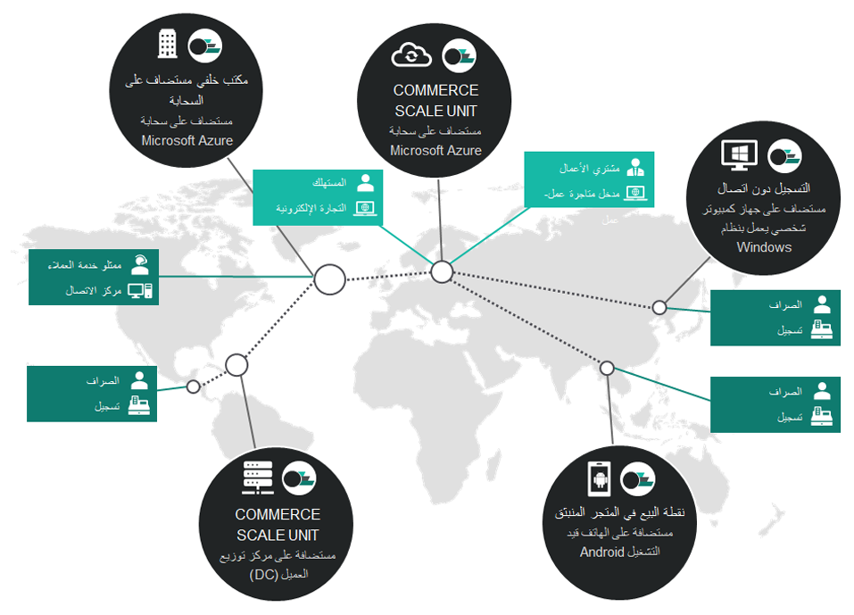
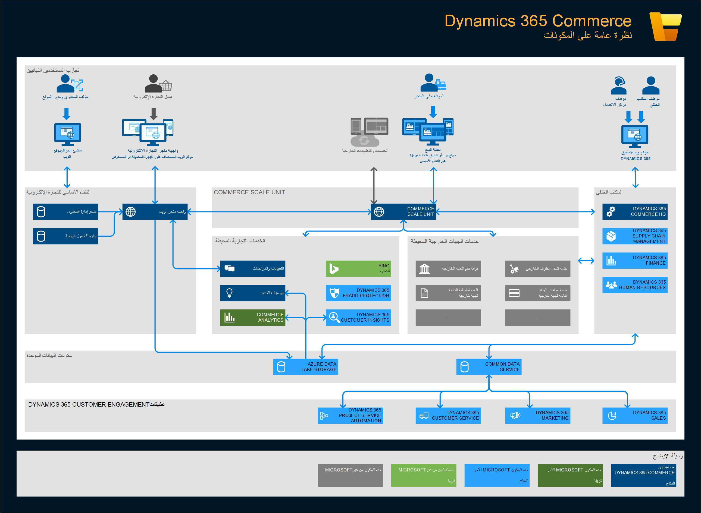

يوفر الحل Commerce للأسواق المتوسطة ومتاجر بيع التجزئة الكبيرة بحل مقر رئيسي كامل وStore Commerce والذي يتضمن دعماً للمتاجر على الإنترنت والمتاجر التقليدية القياسية. ويمكنه مساعدة بائعي التجزئة على زياد العوائد المادية وتحسين الخدمات وإدارة التنمية والوصول للعملاء والكفاءات السهلة.

توضح الصورة التالية نظرة عامة عالية المستوى لبنية الحل Commerce.

يلبي الحل Commerce الاحتياجات والتحديات التي تواجه المؤسسات التي تقوم بإجراء عمليات تجارية معقدة عبر أنحاء العالم، وعلى هذا النحو، يمكن لأي مؤسسة أن تعمل في عدة مناطق جغرافية. ولتمكين هذه الميزة، يتضمن الحل Commerce المكون Headquarters، والذي يتم إنشاؤه في موقع واحد. يمكن ربط المكون Headquarters بموقع تجارة إلكترونية وعدة قنوات لمركز الاتصال في مواقع مختلفة ومتاجر Store Commerce لـ Windows ومتاجر Store Commerce لـ Browsers، مدمجة مع إمكانات Store Commerce لـ Windows غير المتصلة، وذلك لتغطية كل حالات الاستخدام. من خلال الإعداد، يمكن أن يوفر الحل Commerce نظام مستقل جغرافياً ويمكن اعتماده لكل احتياجات العميل والسيناريوهات المتعلقة به.

تُظهر الصورة التالية نظرة عامة على مكونات التجارة.

 
يمكن تقسيم العمارة الأساسية للتجارة إلى عدة مكونات: 

- **Commerce Headquarters** - يعمل على التحكم في العمليات اليومية وتعقب معلومات المبيعات لكل متجر في سلسلة المؤسسات. يمكن استخدام المكون Headquarters جنباً إلى جنب مع أي Store Commerce أو نظام متجر على الإنترنت يمكنه تلقي البيانات المطلوبة وإرسالها. 
- **Commerce Scale Unit (CSU)** - توفر خدمات على الويب تتيح للموظفين والعملاء الوصول إلى المعلومات وإجراء المهام باستخدام عملاء Retail Store Commerce والمتاجر على الإنترنت.
    - **Commerce Store Scale Unit** - يدعم بيع المنتجات في متجر لا يوجد فيه اتصال إنترنت ثابت للاتصال بالمكتب الخلفي أو المقر الرئيسي. 
    - **Commerce Cloud Scale Unit** – تتم استضافتها بالكامل في الشبكة السحابية، وتعد وحدة CSU الوحيدة التي تعمل على تمكين التجارة الإلكترونية.
- **Store Commerce** - ‏‫يدعم الحل Commerce نوعين من حلول Store Commerce: Store Commerce لـ Browsers وStore Commerce لـ Windows. 
    - **Store Commerce لـ Browsers** - هي Store Commerce قائمة على أحد المتصفحات ويمكن استخدامها على الأجهزة المحمولة. 
    - **Store Commerce لـ Windows** - يمكن استخدامها في عملاء مثل، الكمبيوتر الشخصي والأجهزة اللوحية والهواتف لمعالجة حركات المبيعات وأوامر العملاء والعمليات اليومية، وأيضا لتنفيذ إدارة المخزون.
- **محطة الأجهزة** - توفر خدمات تعمل على تمكين عملاء Retail Store Commerce والأجهزة الطرفية، مثل الطابعات وأدراج النقدية وأجهزة الدفع، من الاتصال فيما بينها.
- **Commerce runtime** - تعمل كمحرك أساسي يدعم العناصر المنطقية للأعال التجارية عبر قنوات متعددة. تستخدم كل قناة من القنوات وظيفة Commerce Run Time كواجهة بين الحل Commerce والمصادر الخارجية كمحرك للاتصال فيها.
- **قاعدة بيانات القناة** - تعد مسؤولة عن بيانات القناة الخاصة بواحدة أو أكثر من القنوات التجارية، مثل المتاجر عبر الإنترنت أو المتاجر التقليدية المادية.
- **النظام الأساسي للتجارة الإلكترونية وواجهة متجر التجارة الإلكترونية** – يحتويان على جميع الأدوات الضرورية لتمكينك من إنشاء متجر على الإنترنت يمكنه الاستفادة من خدمات القناة متعددة الاتجاهات في النظام الأساسي. تكون المكونات الرئيسية لإدارة إحدى القنوات، مثل الترويج للأعمال التجارية وتحديد الأسعار وإدارة العملاء وإدارة الأوامر وغير ذلك، قابلة للوصول عبر واجهة مستخدم Commerce لتزويد المستخدمين بالقدرة على إدارة الأعمال من المقر الرئيسي أو الشركات المناظرة.
- **مكون Site Builder** - هو تطبيق متصفح لكتابة المحتويات، والذي يعمل على تمكينك من إنشاء المحتوى التجاري الخاص بك. كما يمكنك أيضاً من تحسين تصنيفاتك ومراجعاتك وإدارة التوصيات وإنشاء الأنواع الثلاثة لقوائم التوصيات، والتي تدعم قوائم الخوارزميات والقوائم التحريرية والقوائم المخصصة. وتلك القوائم يمكن تهيئتها في النظام والبحث عنها من خلال محرك التوصيات. وبعد ذلك تتجمع كل البيانات معاً لموقع ويب التجارة الإلكترونية عبر النظام الأساسي المرتبط والمستجيب الذي يقوم بتقديم المحتوى إلى العملاء. 
- **مجموعه أدوات تطوير برامج البيع بالتجزئة (SDK)** - تحتوي على نموذج لكود المصدر والقوالب التي يمكن استخدامها من أجل تخصيص التجارة.

لمزيد من المعلومات حول كيفية تخصيص ميزات جديده وإضافتها إلى Dynamics 365 Commerce، راجع [توسيع Dynamics 365 Commerce](/learn/modules/extend-commerce/?azure-portal=true)
