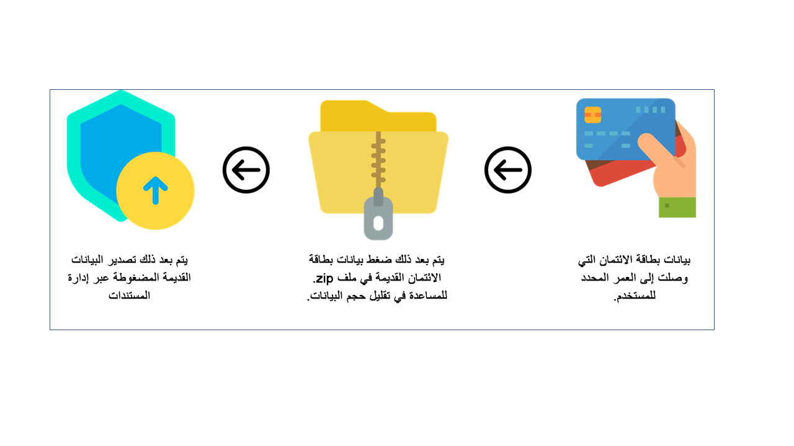

يعتمد توزيع البيانات في التجارة على Commerce Data Exchange، الذي ينقل البيانات بين المركز الرئيسي والقنوات المختلفة لـ التجارة. 

وتكون قاعدة البيانات التي تقوم بتخزين البيانات لإحدى القنوات، منفصلة عن قاعده بيانات Commerce. تحتوي قاعدة بيانات القناة فقط على البيانات المطلوبة للحركات. علي سبيل المثال، يتم إعداد البيانات الرئيسية في المركز الرئيسي ثم يتم توزيعها على القنوات، وعلى الجانب الآخر من الحركة، يتم إنشاء بيانات الحركات في نقطة البيع أو المتجر على الإنترنت، ثم يتم رفعها إلى المركز الرئيسي.

وفيما يلي المكونات المختلفة التي تساعد في توزيع البيانات بين المصدر والنظام المستهدف:

- **خدمة غير متزامنة** - تعد عملية تجميع البيانات عند المصدر (المركز الرئيسي) هي عملية تحضيرها للتوزيع. تحدث هذه العملية بشكل منفصل عن عملية إرسال هذه البيانات إلى القنوات المختلفة، وتطبيق التغييرات على قواعد البيانات لديها. تستخدم الخدمة غير المتزامنة مجدول التجارة لجدولة توزيع البيانات بمهام التحميل والتنزيل.
    - **Microsoft SQL Server تتبع التغيير في قاعدة بيانات التجارة** – يُستخدم لتحديد تغييرات البيانات التي يجب إرسالها إلى القناة.
    
    - **مجدول التجارة** – آلية لتبادل البيانات بين المواقع عبر وظائف دفعية مجدولة.

- **خدمة الوقت الفعلي** – توفر اتصالاً في الوقت الفعلي بين إحدى القنوات وDynamics 365 Commerce للسيناريوهات التي يجب أن تتوفر فيها البيانات في الوقت الفعلي، مثل عمليات البحث عن المخزون، وإصدار بطاقات الهدايا واستردادها، وإنشاء سجلات العملاء وتحديثها، وغير ذلك الكثير. 

## الاتساق في إدارة المدفوعات عبر قنوات البيع بالتجزئة

يرغب تجار التجزئة في تقديم خدمة بالجودة ذاتها للعملاء عبر جميع الأنظمة الأساسية، مع ضمان أن يكون لموظفي المكاتب الخلفية خبرة واضحة في التعامل مع أوامر البيع بالتجزئة. يجب أن تكون أي من واجهات معالجة أوامر البيع بالتجزئة قادرة على عرض وتعديل ومعالجة حركات الدفع المتعلقة بأوامر المبيعات بطريقة متسقة.

تستخدم الإدارة الخلفية لمدفوعات أوامر التجارة الإلكترونية ونقطة البيع جداول **MCRCustPaym***. من خلال إدارة بيانات دفع أوامر مبيعات التجزئة بطريقة متسقة، يُسمح بإدارة دفع أوامر البيع بالتجزئة ذات القنوات متعددة الاتجاهات الحقيقية لمستخدمي مركز الاتصال.

## أرشفة بيانات حركات البطاقة المدينة
يمكن أن تشغل بيانات استجابة البطاقة المدينة مساحة كبيرة في قاعدة البيانات. ونظراً لأن هذه البيانات مطلوبة في الغالب لإجراء عمليات استرداد مرتبطة، تقل فائدة البيانات بشكل كبير بعد انتهاء صلاحية سياسة استرداد الأعمال الخاصة بالحركة. تعمل وظيفة الأرشفة تلقائياً على أرشفة بيانات البطاقة المدينة عندما لا يمكن استخدامها لاسترداد الأموال المرتبطة وفقاً لسياسة الأعمال، وبالتالي ضمان الاحتفاظ بالبيانات الهامة فقط للعمليات اليومية.

يمكن تكوين وظيفة الأرشفة لأرشفة بيانات استجابة تفويض XML الخاصة بالبطاقة المدينة التي تتجاوز عمراً معيناً. عندما تصل بيانات البطاقة المدينة إلى العمر المحدد، ستقوم الوظيفة بضغطها في ملف ‎.zip وتصديرها عبر إدارة المستندات. لا يمكن استعادة البيانات برمجياً بعد تصديرها. نظراً لأن بيانات التفويض الخاضعة للتصدير مطلوبة لعمليات الاسترداد المرتبطة، يجب فقط أن تخضع البيانات الأقدم من نافذة الاسترداد المرتبطة المحددة في سياسة إرجاع الشركة للتصدير.

> [!Important]
> لا يمكن استعادة البيانات بسهولة بعد أرشفتها. لذلك، لا ينبغي أرشفة الحركات التي تخضع إلى [عمليات الاسترداد المرتبطة](/dynamics365/commerce/dev-itpro/archive-cc-data?azure-portal=true#key-terms). على سبيل المثال، إذا كانت سياسة إرجاع التاجر تسمح بإعادة الحركات إلى البطاقة المدينة ذاتها في غضون عامين، يجب تعيين الحقل **الحد الأدنى لعمر الحركة بالأيام** للوظيفة على 730 يوماً (سنتان). في هذه الحالة، إذا تم إرجاع حركة ما بعد 730 يوماً، فلن يتم العثور على XML المطلوب لإجراء عملية استرداد مرتبطة. لذلك، سيتعين على العميل استرداد المبلغ المدفوع من خلال [استرداد مستقل](/dynamics365/commerce/dev-itpro/archive-cc-data?azure-portal=true#key-terms) إما إلى بطاقة مدينة أو طريقة دفع أخرى، مثل مذكرة ائتمان أو بطاقة هدايا.

لمعرفة المزيد من المعلومات حول كيفية إعداد الوظيفة القابلة للأرشفة، راجع: [أرشفة بيانات حركات البطاقة المدينة](/dynamics365/commerce/dev-itpro/archive-cc-data/?azure-portal=true)

