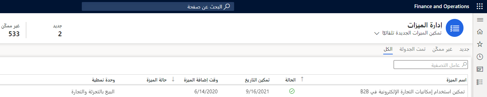

قبل أن تتمكن من إعداد التدرجات الهرمية للعملاء أو إدارتها باستخدام التدرجات الهرمية للعملاء، ستحتاج إلى تمكينهم داخل مساحة عمل **إدارة الميزات**. للقيام بذلك، انتقل إلى مساحة العمل وحدد علامة تبويب **الكل**. قم بتصفية المعلومات عن طريق البحث عن **الوحدة النمطية: البيع بالتجزئة والتجارة**، وابحث عن ميزة **تمكين استخدام إمكانات التجارة الإلكترونية في متاجرة عمل-عمل**، ثم حدد **تمكين الآن** في الزاوية السفلية اليسرى.

> [!div class="mx-imgBorder"]
> 

وبعد تمكين الميزة، يمكن إعداد التدرجات الهرمية للعملاء. للقيام بذلك، ستحتاج أولاً إلى إعداد تسلسل رقمي خصيصاً للتدرج الهرمي للعملاء. تقوم التسلسلات الرقمية بإنشاء معرفات فريدة وقابلة للقراءة لسجلات البيانات الرئيسية وسجلات الحركات التي تتطلب مثل هذا التعريف. ستستخدم التسلسل الرقمي المطلوب للتدرجات الهرمية للعملاء لإنشاء المعرف لكل تدرج هرمي.

لإعداد التسلسل الرقمي، انتقل إلى الوحدة **البيع بالتجزئة والتجارة** وحدد **إعداد المقر الرئيسي > التسلسلات الرقمية > التسلسلات الرقمية**. قم بإنشاء تسلسل رقمي جديد أو استخدم تسلسلاً رقمياً موجوداً لإعادة استخدامه. بعد ذلك، انتقل إلى **البيع بالتجزئة والتجارة > إعداد المركز الرئيسي > المعلمات > معلمات التجارة**. في علامة التبويب **التسلسلات الرقمية**، أضف التسلسل الرقمي الذي قمت بإنشائه أو تحديده إلى مرجع **معرف التدرج الهرمي للعميل**.

## عملية الموافقة

عندما يقدم شريك تجاري طلباً للانضمام إلى موقع التجارة الإلكترونية B2B، سيقوم النظام بحفظ الطلب كعميل محتمل. يمكن للشخص المسؤول في Commerce headquarters، مثل مدير عمليات البيع بالتجزئة، اعتماد هذه الطلبات أو رفضها. عند الموافقة على العميل المحتمل، سيقوم النظام بإنشاء سجلين جديدين للعملاء: سجل واحد لنوع **المؤسسة** الذي يمثل المؤسسة التي تطلب أن تصبح شريكاً للعمل وسجل آخر من النوع **شخص** الذي يمثل الشخص الذي قام بتقديم الطلب. سيتم أيضاً إنشاء سجل التدرج الهرمي للعميل الجديد، الذي يحتوي علي العديد من الخصائص، مثل **معرف** **التدرج الهرمي** **للعميل** و **الاسم** و **الغرض** و **معرف** **المؤسسة**.
