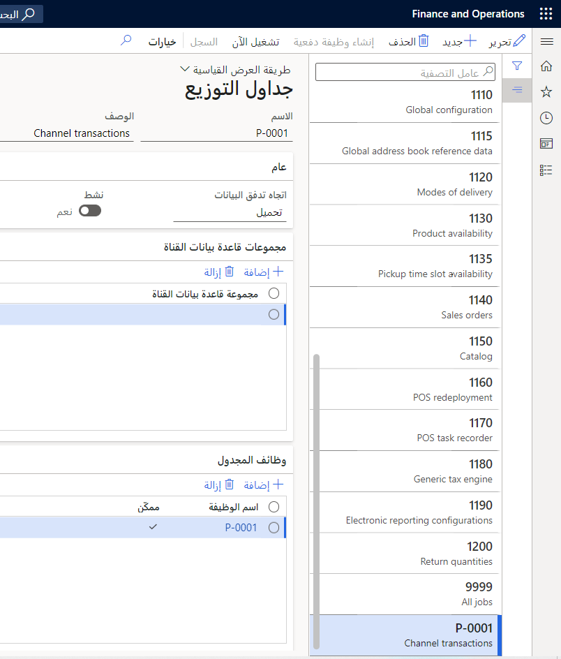
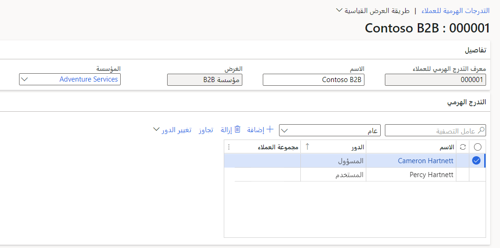

لإضافة مستخدمين شركاء أعمال وحذفهم وتحريرهم عَلى موقع التجارة الإلكترونية B2B وفي Commerce headquarters، تحتاج المؤسسة إلى التسجيل لتصبح شريكاً تجارياً أولاً. بعد أن تقدم المؤسسة تفاصيل التسجيل، كما ذكرنا سابقاً، ستخضع لعملية التأهيل وستتم إضافتها بعد ذلك كشريك تجاري. بعد إضافتهم كشريك تجاري، يتم تحديد مستخدم المؤسسة الذي بدأ الطلب كمستخدم مسؤول. يتم منح المستخدم المسؤول امتيازات لإضافة المزيد من المستخدمين المصرح لهم لموقع التجارة الإلكترونية B2B. يمكن لهؤلاء المستخدمين المعتمدين تقديم طلبات نيابة عن شريك الأعمال.

للموافقة عَلى طلب شريك الأعمال فِي Commerce headquarters، انتقل إلى **البيع بالتجزئة والتجارة > تجارة التجزئة وتكنولوجيا المعلومات > جدول التوزيع** فِي التطبيق. بعد ذلك، قم بتشغيل الوظيفة **P-0001** لسحب جميع طلبات إعداد شركاء الأعمال إلى Commerce headquarters.

> [!div class="mx-imgBorder"]
> 

بعد تشغيل هذه الوظيفة بنجاح، انتقل إلى **البيع بالتجزئة والتجارة > تجارة التجزئة وتكنولوجيا المعلومات > العميل** وقم بتشغيل وظيفة **مزامنة العملاء وطلبات القناة**. بعد تشغيل هذه الوظيفة بنجاح، سيتم إنشاء طلبات شركاء الأعمال كنوع **متطوع B2B محتمل** فِي Commerce headquarters. بعد ذلك، يمكنك الانتقال إلى الصفحة **العملاء > جميع المتطوعين المحتملين** وتحديد سجل احتمال شريك العمل الجديد لفتح صفحة التفاصيل. بعد ذلك، يمكنك تحديد **تحويل > قبول/رفض** للموافقة عَلى الطلب. عندما تظهر رسالة التأكيد، ستحتاج إلى تأكيدها لمتابعة العملية. بعد **الموافقة** على الحقل **الحالة** في السجل، سيتم إرسال بريد إلكتروني إلى عنوان البريد الإلكتروني لمقدم الطلب لتأكيد الموافقة على مؤسسته كشريك تجاري. سيتم أيضاً إنشاء تدرج هرمي للعملاء، حيث سيتم إضافة مقدم الطلب كمسؤول لشريك الأعمال. في هذه المرحلة، يمكنك الانتقال إلى **البيع بالتجزئة والتجارة > جدول التوزيع** وتشغيل الوظيفة **1010 (العملاء)** لمزامنة التدرج الهرمي للعميل والعميل الجديد مع قاعدة بيانات القناة. يمكن لمقدم الطلب تسجيل الدخول إلى موقع التجارة الإلكترونية B2B، بعد مزامنة هذه السجلات مع قاعدة بيانات القناة.

يمكن للأشخاص استخدام تدفق التسجيل لتحديد كلمة المرور لحسابهم. بالإضافة إلى ذلك، يمكنك إعداد ارتباط تلقائي لتمكين سجلات موفر هوية Microsoft Azure Active Directory B2C (Azure AD B2C) للارتباط بعميل B2B الذي تم إنشاؤه. لمزيد من المعلومات، راجع [تمكين الربط التلقائي لسجلات الهوية بحسابات العملاء](/dynamics365/commerce/identity-record-linking/?azure-portal=true).

## أضف العملاء الحاليين كشركاء تجاريين

إذا كان لديك عملاء حاليون فِي Commerce headquarters، فيمكنك إضافتهم كشركاء أعمال. للقيام بذلك، حدد عميلاً من نوع **المؤسسة** لإضافته كشريك تجاري فِي Commerce headquarters. حدد عميلاً من نوع **الشخص** لإضافته كمسؤول أو مستخدم لشريك الأعمال. تأكد من أن عناوين الرسالة الإلكترونية الأساسية مرتبطة بالعملاء لأنه سيتم استخدام عناوين الرسالة الإلكترونية لتسجيل الدخول إلى موقع الويب. يجب أن يكون عنوان البريد الإلكتروني الأساسي فريداً لهذا العميل؛ وإلا فلن يتمكن المستخدم من تسجيل الدخول.

بعد أن تقوم بإضافة **مؤسسة** و **شخص**، قم بإنشاء معرّف هرمي للعميل، وفي الحقل **الاسم**، أدخل اسماً. في الحقل **المؤسسة**، أدخل عميل مؤسسة شريك الأعمال. في علامة التبويب السريعة **التدرج الهرمي**، حدد **إضافة**، وفي الحقل **الاسم** فِي علامة التبويب هذه، حدد عميلاً من النوع **الشخص**. حدد دور **المسؤول** للعميل الذي يجب تعيينه كمسؤول. يمكنك تكرار هذه العملية لإضافة المزيد من العملاء إلى التدرج الهرمي. قم بتشغيل الوظائف المذكورة سابقاً لمزامنة البيانات مع قاعدة بيانات القناة بحيث يمكن للعملاء تسجيل الدخول إلى موقع التجارة الإلكترونية من خلال تدفق الاشتراك.

> [!div class="mx-imgBorder"]
> 
