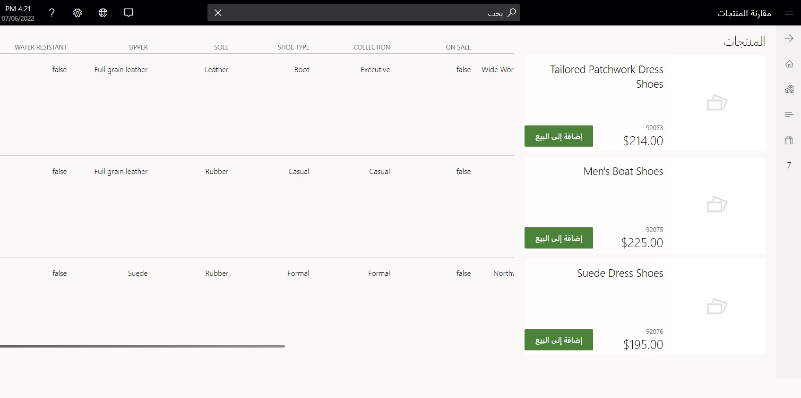
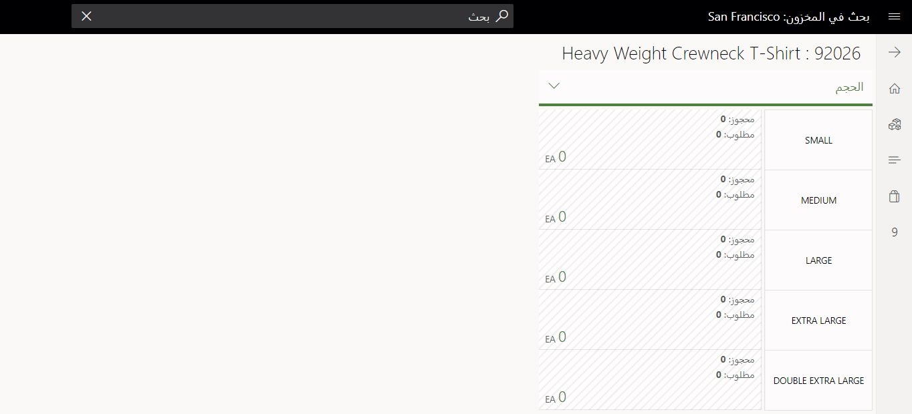

عندما يدخل العملاء المتجر، يكشفون عن معلومات مهمة لطاقم البائعين. 

على سبيل المثال، إذا كان العميل يبحث عن صندل أو نوع حذاء خاص يفضله، يتعين عليك كفرد مبيعات، أن تحسّن طريقة بحثك عن التصميم الخاص بالحذاء، أو يمكنك إضافة عامل تصفية للعلامة التجارية وإضافة نطاق سعر والمزيد. تمثل عوامل التصفية هذه الأنواع القيّمة من المعلومات التي يريد العميل وبائعي التجزئة الحصول عليها فوراً، لأن التعرف على ما يريده العميل يعني خدمته بشكل أفضل. 

## التوصيات المتعلقة بالمنتجات
في سياق التعرف على عميلك، إليك التوصيات المتعلقة بالمنتج. مبدئياً، عليك الاستثمار في خدمة التوصيات، لكن الجودة المتعلقة بهذه التوصيات تقوم بشكل كبير على مدى جودة معرفتك بالعميل وتفضيلاته. لذلك، إذا اندمجت إمكانات التعامل مع العملاء في حلول المتجر الداخلي لديك، فسيمكنها المساعدة في إضافة قيمة على خدمة التوصيات لديك أيضاً. 

يمكنك مقارنة المنتجات جنباً إلى جنب في صفحة **مقارنة المنتجات**، بعد ظهور قائمة المنتجات التي تهتم بها. 

 

 
## البحث في المخزون

من خلال التعامل مع العملاء، تتاح أيضاً إمكانية البحث في المخزون. تتيح لك إمكانية البحث في المخزون البحث في المتغيرات المتاحة في المتجر، وفي حالة كانت غير متوفرة، للتحقق من أقرب متجر لديه بضائع فعلية للمنتج المحدد والتحقق من سعر هذه المنتجات. تتيح هذه الإمكانات لفرد المبيعات الرد على تساؤلات العميل أثناء متابعته له، وذلك لاكتساب الفرصة للتعرف أكثر على العميل دون تركه.

 

