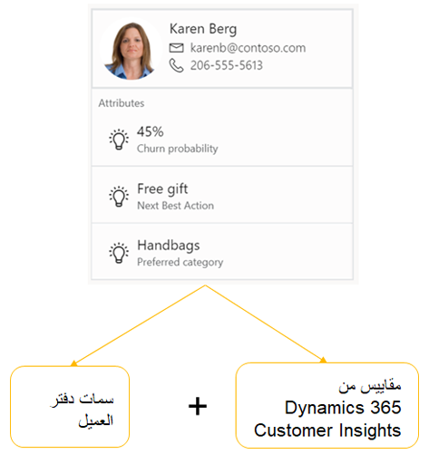

يمكن لبائعي التجزئة استخدام Dynamics 365 Customer Insights لجمع البيانات حول العملاء من أنظمة مختلفة ودمجها حيث يتفاعلون مع العلامة التجارية لبائع التجزئة، سواء كانت الأنظمة تطبيقات Dynamics 365 أم لا.Retailers can use Dynamics 365 Customer Insights to collect and combine data about customers from different systems where they interact with the retailer's brand, whether the systems are Dynamics 365 applications or not. يتم بعد ذلك تجميع هذه البيانات في عرض واحد للعميل في الوقت الفعلي بحيث يمكن اشتقاق المعلومات من سلوكه.This data is then aggregated into a single view of the customer in real time so that insights can be derived from their behavior. 

يمكن لـ Customer Insights استخدام قوالب التعلّم الآلي للتنبؤ بالتغير، وتحديد الإجراء التالي الأمثل، وتقديم توصيات المنتج، والتي يمكن لتجار التجزئة استخدامها من خلال تمكين التكامل مع Commerce وتقديم هذه القيم كمقاييس.Customer Insights can employ machine learning templates to predict churn, define the next best action, and provide product recommendations, which retailers can use by enabling an integration with Commerce and presenting these values as measures. يمكن عرض هذه المقاييس (مؤشرات الأداء الأساسي لعملك) على بطاقة العميل في دفتر العميل وتوفير معلومات مهمة لشركاء المبيعات.These measures (key performance indicators for your business) can be shown on the customer card of the Client Book and provide important information to sales associates. 

 
سيتم عرض المقاييس من Customer Insights على بطاقة العميل أولاً.The measures from Customer Insights will first be shown on the customer card. على سبيل المثال، إذا تم تحديد مقياسين من Customer Insights، فسيتم عرض هذين المقياسين أولاً، ثم تتبعهم سمة **دفتر العميل** (التي يتم تكوينها ‏‫في المركز الرئيسي لـ Commerce).If for example, two measures from Customer Insights are selected, those two measures will be displayed first, followed by the **Client Book** attribute (which is configured in Commerce Headquarters). يتم عرض سمات دفتر العميل وفقاً لترتيب العرض المحدد في مجموعة سمات **دفتر العميل**.The Client Book attributes are shown according to the display order that is defined on the **Client Book** attribute group. 

لتشغيل تكامل Customer Insights مع Commerce، يجب عليك التأكد من أن لديك مثيلاً نشطاً من Customer Insights في المستأجر حيث يتم توفير Commerce.To turn on the integration of Customer Insights with Commerce, you must ensure that you have an active instance of Customer Insights in the tenant where Commerce is provisioned. مطلوب أيضاً حساب Microsoft Azure Active Directory يحتوي على اشتراك Azure، ويجب إنشاء معرّف تطبيق Azure في معلمات Commerce لأغراض المصادقة.A Microsoft Azure Active Directory account that has an Azure subscription is also required, and an Azure application ID must be created in the Commerce parameters for authentication purposes. 

