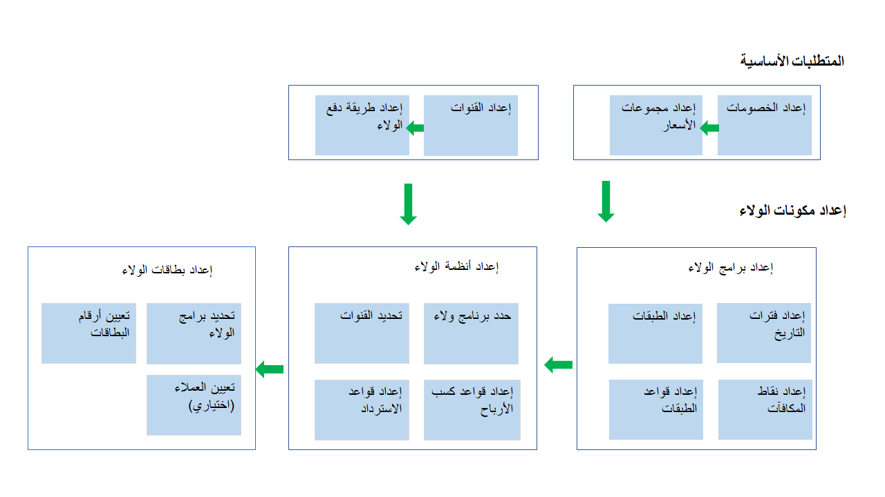

يتم استخدام برامج الولاء بشكل متزايد من جانب بائعي التجزئة والشركات حول العالم لتحفيز العملاء ومكافآت هم على تفاعلاتهم مع العلامة التجارية وإنشاء شعور متنام بالولاء لمنتجات بائعي التجزئة. 

يوفر الحل Commerce قدرات برامج ولاء بسيطة أو معقدة، والتي تشمل كيانات قانونية وجميع قنوات Commerce. كما أنه يوفر حلاً مرناً لتضمين أي من الخيارات التالية كجزء من استراتيجية الولاء لدى بائعي التجزئة:

-   إنشاء قواعد للكسب والاسترداد حتى تكون عملة اكتساب نقاط الولاء وتحديد الخيارات الخاصة بالحصول على مكافآت واضحة.
-   تتبع المشاركة ف برامج الولاء.
-   إنشاء برامج للولاء تمثل حوافز مختلفة للولاء. على سبيل المثال، يمكنك إنشاء طبقات برنامج الولاء لتمثل مستوى الارتباط للعملاء وتوفير حوافز أكبر للمرتبطين بشكل أكبر بالعلامة التجارية لديك.
-   إصدار بطاقات ولاء من أي قناة في Commerce وربطها ببرنامج واحد أو أكثر للولاء التي قمت بإنشائها.
-   ربط بطاقات الولاء بسجلات العملاء بحيث يمكن للعملاء تحصيل النقاط من بطاقات الولاء المختلفة التي قد تكون لديهم.
-   تحويل أرصدة مكافآت الولاء بين الأصدقاء وأفراد العائلة أو تعديل نقاط الولاء لتلبية مطالب العملاء التي تتوافق مع سياسات برنامج الولاء لديك.

شاهد هذا الفيديو للتعرف على كيفية إنشاء نقاط مكافأة الولاء، وبرامج الولاء مع الطبقات.

 > [!VIDEO https://www.microsoft.com/videoplayer/embed/RE4zf0m] 

تتواجد العديد من التبعيات الداخلية بين مكونات وظائف الولاء التي يتعين عليك مراعاتها عند التحضير للتكوينات الدقيقة في النظام. يتم توضيح هذه التبعيات الداخلية في الصورة التالية.
 

 
يصف القسم التالي المطالب الأساسية ومكونات الولاء في الصورة الواردة أعلاه، لتوضيح الغرض من كل مكون والميزات الإضافية المتاحة لبائعي التجزئة من أجل استخدامها:

-   **عروض الخصم** – تمثل عمليات الخصم التي قد توفرها للعملاء أصحاب الولاء. على سبيل المثال، يمكنك توفير خصم بقيمة 10 بالمائة على كل المنتجات عندما يتم استخدام بطاقة الولاء في عملية السداد.

-   **مجموعات السعر** – هو كيان نظام يمكنك استخدامه لإنشاء وإدارة الأسعار والخصومات بطريقة أكثر فعالية من خلال تجميع العملاء أو الأصناف أو القنوات التي لديها نفس طريقة تحديد السعر في المثال السابق، ستتضمن مجموعات السعر عمليات الخصومات التي قد تنطبق على برامج الولاء لديك. 

-   **القنوات** – قنوات Commerce التي تشارك في برامج الولاء. هذه القنوات يمكن أن تكون أي قناة في Commerce، مثل متاجر البيع بالتجزئة أو مراكز الاتصال أو المتاجر على الإنترنت.

-   **طريقة الدفع في الولاء** – يتعين عليك إعداد طريقة دفع قبل التمكن من استخدام بطاقة الولاء في أحد السجلات، كما يمكن استرداد نقاط الولاء كجزء من برنامج الولاء. كما يتعين عليك أيضاً إضافة طريقة الدفع للقناة قبل أن يتمكن العملاء من استرداد نقاط الولاء كطريقة دفع مقابل المنتجات. قم بإعداد طريقة دفع نوع الولاء، ثم قم بتعيين طريقة الدفع في الولاء إلى القنوات التي تشارك في برنامج الولاء.

-   **تاريخ الفترات الزمنية الفاصلة**– تعرض الفترات الفاصلة للتحقق من طبقات الولاء. يمكن استخدام هذه الفترات الفاصلة لتحديد مدى صلاحية طبقات الولاء أو الفترة الزمنية التي يتعين على العميل إكمال نشاط لاستحقاق إحدى الطبقات. لا ينطبق تاريخ الفترات الزمنية الفاصلة إذا كان برنامج الولاء لديك لا تحتوي على طبقات.

-   **نقاط المكافآت** – تمثل هذه النقاط المكافأة التي يمكن لعملائك الاستفادة منها. ويتم استخدامها لتأهيل العملاء للطبقات وإرجاعهم إلى قواعدهم. كما يتم إرجاعهم في مخططات الولاء لتحديد قواعد الاكتساب والاسترداد. تحدد قواعد الاكتساب المكافآت التي يمكن للعميل كسبها بناءً على أنشطته، كما تحدد قواعد الاسترداد المكافآت التي يمكن للعميل استخدامها كتبادل المال مقابل الانشطة. يمكن أن تكون نقاط المكافآت على النحو التالي:
    -   **قابلة للاسترداد** - تستخدم لشراء المنتجات أو استبدالها مقابل الخدمات.
    -   **غير قابلة للاسترداد** - يتم تجميعها لنقل العملاء إلى طبقة أعلى لبرنامج الولاء وتتبع مشاركاتهم.

    يتم حفظ نقاط الولاء المكتسبة مقابل خطوط المبيعات التي حصلوا عليها أو استخدموها للتأكد من أن عدد النقاط يمكن استرداده أو استرجاعه في حالة الإرجاع الكلي أو الجزئي. 

    يمكن لبائعي التجزئة تحديد فترة الاستحقاق للنقاط التي تحدد الوقت بين نشاط العميل الذي يمنحه الحق في كسب النقاط، وعندما تتاح هذه النقاط للعميل لكي يستردها. في معظم السيناريوهات، قد تستغرق فترة الاستحقاق هذه عدة أيام تمتد لعدة أسابيع، وفقاً لاختصاصات الأعمال. 

    يمكن تحديد الحد الأقصى لنقاط المكافآت بحيث لا يتمكن العميل من اكتساب نقاط أكثر عند الوصول إلى هذا الحد. تحمي هذه المعلمة بائع التجزئة من أنشطة الاحتيال المتعلقة بالولاء. في حالة اكتشاف حالة احتيال، قد يتم حظر بطاقة الولاء. بالإضافة إلى ذلك، يمكن أن يتم أيضاً حظر العميل لمنعه من التسجيل في برنامج الولاء مستقبلاً. 

-   **برامج الولاء** – يتم استخدام هذه البرامج لتحديد بنية عروض الولاء لديك. على سبيل المثال، يمكنك تحديد الطبقات التي ستكون متاحة في عروض الولاء وكيف سيستحق العملاء الوصول إلى إحدى الطبقات. بالإضافة إلى ذلك، يمكنك إقران مجموعات الأسعار ببرنامج الولاء، مما يعني أن كل العملاء المسجلين في برنامج الولاء يمكنهم تلقي أسعار أو خصومات خاصة. وعلاوة على ذلك، يمكنك إقران مجموعة الأسعار في مستويات طبقة الولاء، والتي ستعمل على تمكينك من منح أسعار وخصومات خاصة لكل طبقة. على سبيل المثال، سيتلقى عضو الطبقة الذهبي خصومات أكثر من عضو الطبقة الفضي. 

-   **طبقات الولاء وقواعد الطبقات** – المستويات التي يمكنك تحديدها لبرامج الولاء لديك. كلما زاد تفاعل العميل مع علامتك التجارية في فترة محددة، تمكن من الوصول إلى طبقة أعلى. عادةً ما توفر هذه الطريقة حوافز أكثر مثل الخصومات الأعلى والمنتجات المجانية والمزيد. يمكنك تحديد القواعد للوصول إلى كل طبقة والفترة التي يمكن للعملاء قضاءها في هذه الطبقة. تعد هذه الطبقات اختيارية، لذا يمكنك تشغيل برنامج ولاء بدون طبقات. 

- **مخططات الولاء** – تستخدم لتحديد قواعد الكسب والاسترداد لبرنامج ولا ء محدد. يمكنك إقران قناة أو أكثر في Commerce بمخطط ولاء لتحديد القواعد التي يتم تطبيقها على القناة. لذلك، يمكن أن يكون لديك قواعد خاصة للكسب والاسترداد لكل قناة. على سبيل المثال، يمكنك تحفيز عملائك إذا قاموا بالشراء من قناة معينة. يمكن إنشاء قواعد الكسب والاسترداد بالنسبة لطبقات مختلفة في البرنامج للتمييز بين المكافآت للعملاء في مستويات مختلفة. يمكن لبائعي التجزئة اختياري تضمين الشركات الفرعية كجزء من قواعد الكسب والاسترداد لمجموعة العملاء مثل الطلاب أو قدامى المحاربين.
 
    بالنسبة للسيناريوهات التي يقوم فيها بائع التجزئة بمنح أسعار تفضيلية لمجموعة من العملاء، مثل الموظفين أو تجار الجملة، لكنه لا يريدهم أن يقوموا بتجميع نقاط الولاء، يمكنك استبعاد مجموعات العملاء هذه من كسب أو استرداد نقاط الولاء لديهم من خلال إضافة التابع المناظر في قسم "التابعون المستبعدون" من مخطط الولاء.

-   **بطاقات الولاء** – تمنح العميل الذي يمتلكها الحق في مشاركة برامج الولاء التي تم ربطها بالبطاقة. قد تكون البطاقات مجهولة أو مرتبطة بسجل عميل معين. يتمكن بائعو التجزئة من عرض حركات الولاء والنقاط المجمعة المرتبطة بالبطاقة، كما يمكنه أيضاً ضبط البطاقة إلى طبقة أعلى أو إضافة نقاط أو نقل نقاط الرصيد إلى بطاقة أخرى. قد يمتلك بائعو التجزئة الخيار لتعيين رقم يدوياً إلى بطاقة ولاء مثل رقم هاتف العميل أو يمكنهم إنشاء أرقام بطاقة الولاء في القنوات. 

