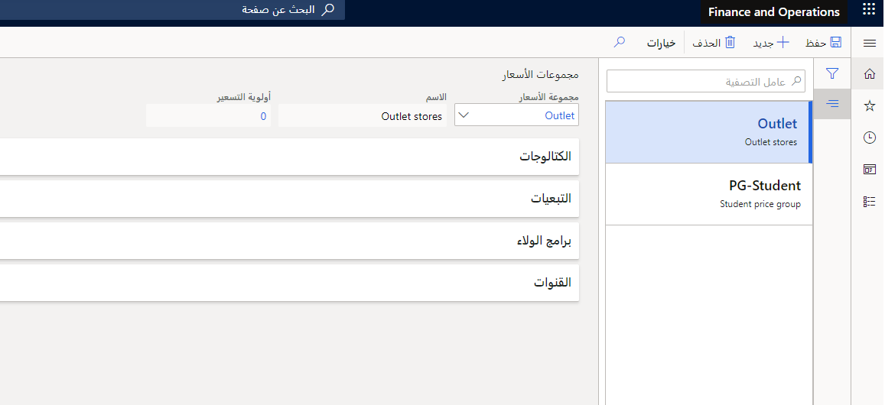

بشكل عام، يعني *الانتماء* الارتباط بمجموعة ما أو الاقتران بها.In general, *affiliation* means a link to or an association with a group. وفي التجارة، يعني الانتماء مجموعة من العملاء.In Commerce, an affiliation is a group of customers. 

توفر التبعيات أداة أكثر مرونة لتسعير العملاء وخصوماتهم من مجموعات أسعار العملاء العادية ومجموعات الخصم لمحرك التسعير الأساسي.Affiliations provide a more flexible tool for customer pricing and discounts than the regular customer price groups and discount groups of the core pricing engine. يتمثل الاختلاف في أنه، في محرك التسعير العادي لـ Dynamics 365، هناك حاجة إلى مجموعات أسعار مختلفة لتحديد الأسعار والخصومات، بينما يمكن استخدام الانتماء (من خلال مجموعة الأسعار المرتبطة) لكل من الأسعار والخصومات.The difference is that, in the regular pricing engine of Dynamics 365, different price groups are needed to define pricing and discounts, whereas an affiliation (through the linked price group) can be used for both prices and discounts. ومن الميزات الأخرى أن العميل يمكن أن ينتمي إلى أكثر من انتماء واحد، وبالتالي، أكثر من مجموعة أسعار واحدة، حيث إنه في محرك التسعير العادي، لا يمكن ارتباطه إلا بمجموعة أسعار واحدة للسعر ومجموعة أسعار واحدة للخصم.Another advantage is that a customer can belong to more than one affiliation and, hence, more than one price group, where in the regular pricing engine, they can only be directly linked to one price group for price and one price group for discount.

أثبت استخدام الانتماءات أنه مفيد في السيناريوهات عندما يريد تاجر التجزئة إعطاء خصومات لمجموعات محددة من العملاء مثل الطلبة وكبار السن والعملاء المنتمين لشركات قد يعطيها تاجر التجزئة خصومات خاصة أو لموظفي تاجر التجزئة.Working with affiliations proves useful in scenarios when the retailer wants to give discounts to specific groups of customers such as students, seniors, customers who are affiliated with companies that the retailer might be giving special discounts to, or to the employees of the retailer. يمكن أن تتمثل الانتماءات أيضاً في خصومات للعملاء المخلصين لتقديم مزايا إضافية لهم.Affiliations can also be discounts to loyal customers to provide extra benefits to them. 

بالإضافة إلى ذلك، يمكن تعيين الانتماءات لسجل العميل لبدء الخصم الذي يتم تطبيقه تلقائياً، ومع ذلك، ليس من الضروري ربطها بعميل ما، يمكن استخدام الانتماء المخصص لعميل عابر في نقطة البيع.Additionally, affiliations can be assigned to a customer record to trigger the discount that is being applied automatically; however, they do not have to be linked to a customer, an ad-hoc affiliation can be used for a walk-in customer at point of sale (POS). تتضمن سيناريوهات العمل النموذجية الطلبة أو كبار السن الذين يتلقون خصماً عند إبراز بطاقة عضوية المجموعة الخاصة بهم (الهوية الجامعية أو بطاقة هوية كبار السن).Typical business scenarios include students or seniors who receive a discount when they show their group membership card (university ID or senior ID). 

في كثير من الأحيان، يتم استخدام الانتماءات مع الخصومات، ومع ذلك، فهي أيضاً حل ممكن لتحقيق التسعير التفاضلي.Frequently, affiliations are used with discounts; however, they are also a possible solution toward achieving differential pricing. بدلاً من تقديم خصومات، ربما يمكنك تقديم أسعار مختلفة لمجموعة معينة بدلاً من ذلك.Instead of giving discounts, perhaps you provide different pricing to a certain group instead. يمكن للانتماءات تمكين هذه السيناريوهات، مثل تقديم أسعار تفضيلية لعملاء متاجرة عمل-عمل مقارنةً بمتاجرة عمل-مستهلك، أو ربما تقديم أسعار خاصة لموظفيك لتحفيز استهلاك منتجات علامتك التجارية.Affiliations can enable those scenarios, such as offering preferential pricing for B2B customers compared to B2C, or perhaps offering special pricing for your employees to incentivize consumption of your brand products. 

تجعل هذه السمات وظيفة الانتماءات أكثر مرونة وأقل تعقيداً وميزة يمكنها تبسيط هياكل التسعير المعقدة إلى حد كبير.These attributes make the affiliations functionality more flexible, less cumbersome, and a feature that can greatly streamline complex pricing structures. 

لاستخدام ميزة الانتماءات، يجب إنشاء عدة سجلات في النظام، وهي مجموعة الأسعار والخصومات/الأسعار والانتماءات.To use the affiliations feature, several records must be created in the system, namely price group, discounts/prices, and affiliations. بعد ذلك، يمكن ربط الانتماءات بسجل العميل بحيث عندما يضيف الصراف العميل المعني إلى الحركة، يتم تطبيق الانتماء والخصم المرتبط تلقائياً على حركة المبيعات.Subsequently, affiliations can be linked to a customer record so that when the cashier adds the respective customer to the transaction, the affiliation and the related discount are automatically applied to the sales transaction. 

يمكنك أيضاً تقييد خصومات الانتماء والولاء لمتاجر معينة.You can also restrict affiliation and loyalty discounts to specific stores. يتيح ذلك السيناريوهات التي يريد فيها تاجر التجزئة تشغيل خصومات خاصة بالعميل فقط في متاجر معينة، على سبيل المثال، منفذ البيع والمركز التجاري والمتاجر الكاملة، يمكنك استخدام هذه الميزة إذا كنت ترغب فقط في تقديم خصم للطلبة (خصم الانتماء) في قنواتك الكاملة.This enables scenarios where a retailer wants to run customer-specific discounts only in certain stores, for example outlet, mall, and full-line stores, you might use this feature if you only want to offer a student discount (an affiliation discount) at your full line channels. 

يمكنك تمكين هذا على خصومات معينة عن طريق تعيين مجموعة أسعار القناة للخصم.You can enable this on specific discounts by assigning the channel price group to the discount. 

1.  انتقل إلى **البيع بالتجزئة والتجارة > الأسعار والخصومات > جميع الخصومات**.Go to **Retail and commerce > Pricing and discounts > All discounts**.
2.  حدد خصم الانتماء.Select the affiliation discount. 
3.  إذا تم تمكين الخصم، فستحتاج أولاً إلى تعطيل الخصم حتى تتمكن من التعديل.If the discount has been enabled, you will first need to disable the discount so you can modify. يمكنك القيام بذلك عن طريق تغيير حقل **الحالة** في الخصم إلى **معطل**، ثم حدد **حفظ** في جزء الإجراء.You can do this by changing the **Status** field on the discount to **Disabled**, then select **Save** in the Action Pane. 
4.  بمجرد الفتح، حدد **مجموعات الأسعار** في جزء الإجراء.Once open, select **Price groups** in the Action Pane. 
5.  الآن، ستضيف مجموعة الأسعار للقنوات التي تريد أن تجعل هذا الخصم متاحاً لها.Now, you will add the price group for the channels that you want to make this discount available. 
6.  لإضافة مجموعة الأسعار، حدد **جديد** في جزء الإجراء.To add the price group, select **New** in the Action Pane. 
7.  ثم حدد **مجموعة الأسعار** التي ترغب في إضافتها باستخدام القائمة المنسدلة **مجموعة الأسعار**.Then, select the **Price group** you would like to add using the **Price group** drop-down. 
 
 > [!NOTE]
> إذا كان الخصم يحتوي على مجموعتي أسعار، مثل مجموعة أسعار الطلبة ومجموعة أسعار متجر سان فرانسيسكو، فسيتم تطبيق هذا الخصم فقط في متجر سان فرانسيسكو للطلبة.If a discount has two price groups, such as a student price group and a San Francisco store price group, then this discount will only apply in the San Francisco store for students.

  

## مثالExample
لتوضيح هذا المفهوم بشكل أكبر، ضع في اعتبارك السيناريو الذي تعمل فيه تاجر تجزئة وتريد تقديم خصومات بنسبة 10 في المئة لجميع طلبة الجامعة الذين يتسوقون في متاجر البيع بالتجزئة الخاصة بك.To further illustrate this concept, consider the scenario where you are a retailer who wants to give 10 percent discounts to all university students who shop at your retail stores. يجب على الطلبة إظهار بطاقات الهوية الجامعية الخاصة بهم للحصول على هذا الخصم في الوحدات الطرفية لنقطة البيع.The students must show their university ID cards to receive this discount at the POS terminals. لإكمال هذه المهمة، اتبع الخطوات التالية:To complete this task, follow these steps:

1.  أنشئ مجموعة أسعار تعمل كجسر بين الخصم والانتماء.Create a price group that acts like a bridge between the discount and the affiliation. انتقل إلى **البيع بالتجزئة والتجارة > الأسعار والخصومات > مجموعات الأسعار > جميع مجموعات الأسعار** وأنشئ مجموعة أسعار جديدة ترتبط بخصم طلبة الجامعة.Go to **Retail and Commerce > Pricing and discounts > Price groups > All price groups** and create a new price group that will be associated with the university students discount.

2.  انتقل إلى **البيع بالتجزئة والتجارة > الأسعار والخصومات > الانتماءات**، حيث يمكنك إنشاء انتماء للطلبة.Go to **Retail and Commerce > Pricing and discounts > Affiliations**, where you can create an affiliation for the students. لإقران هذا الانتماء بمجموعة الأسعار التي أنشأتها سابقاً، حدد زر **مجموعة الأسعار** في جزء الإجراءات بصفحة **الانتماء** ثم أضف مجموعة الأسعار المعنية إلى انتماء الطلبة.To associate this affiliation with the price group that you created earlier, select the **Price group** button in the Action Pane of the **Affiliation** page and then add the respective price group to the students’ affiliation.

3.  حدد خصم 10 بالمئة للطلبة في النظام ثم اربطه بمجموعة الأسعار نفسها التي قمت بإنشائها سابقاً وربطها بالانتماء.Define the 10 percent discount for the students in the system and then link it to the same price group that you previously created and associated with the affiliation. بهذه الطريقة، تربط مجموعة الأسعار الانتماء بالخصم المرتبط به.In this way, the price group connects the affiliation and the discount that is related to it.

4.  يمكنك ـ على نحو اختياري ـ تعيين الانتماء إلى سجل العميل (إذا كان موجوداً خصيصاً للطلبة) بحيث يتم تعيين خصم 10 بالمئة تلقائياً في نقطة البيع عندما يتم تحديد العميل الذي يمثل طلبة الجامعة في الحركة.Optionally, you can assign the affiliation to the customer record (if one exists specifically for the students) so that the 10 percent discount is automatically assigned at POS when the customer who represents the university students is selected in the transaction. 

    انتقل إلى **البيع بالتجزئة والتجارة > العملاء > جميع العملاء** وحدد سجل العميل الذي يتوافق مع طلبة الجامعة.Go to **Retail and Commerce > Customers > All customers** and select the customer record that corresponds to the university students. حدد علامة التبويب **البيع بالتجزئة** في جزء الإجراءات ثم حدد **الانتماءات** في قسم **معلومات العلاقة** لإنشاء ارتباط مع انتماء الطلبة الذي تم إنشاؤه مسبقاً.Select the **Retail** tab in the Action Pane and then select **Affiliations** in the **Relation information** section to create the link with the students’ affiliation that was previously created. 

    سيتم تشغيل خصم 10 بالمئة فقط للعميل الذي قمت بتعيينه له.The 10 percent discount will be triggered only for the customer whom you have assigned it to. 

5.  لمزامنة التغييرات في نقطة البيع، قم بتشغيل وظائف الجدولة **1020** و **1010** و **1050** في المركز الرئيسي لـ Commerce.To synchronize the changes to the POS, run scheduler jobs **1020**, **1010**, and **1050** in Commerce Headquarters. 
