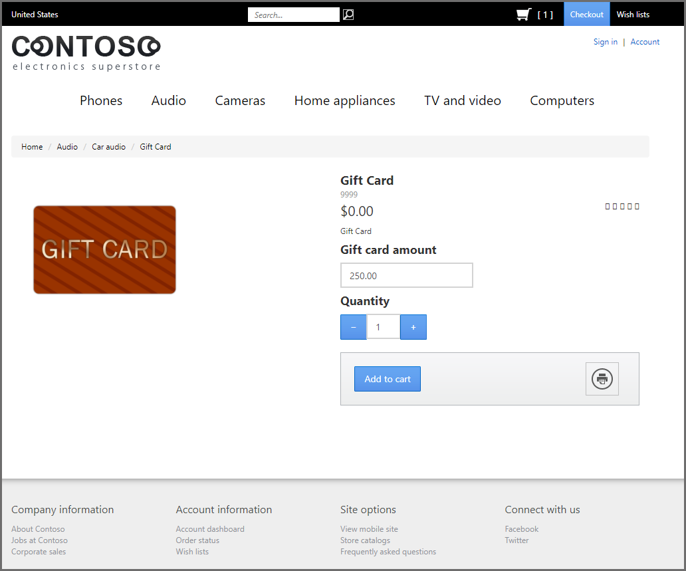

توفر Commerce لبائعي التجزئة القدرة على إصدار واستيراد بطاقات الهدايا.Commerce offers retailers the capability of issuing and redeeming gift cards. يمكن أن تكون هذه البطاقات بطاقات هدايا مادية يتم إصدارها من نقطة البيع أو بطاقات هدايا إلكترونية يتم إصدارها من خلال مركز الاتصالات أو موقع e-Commerce.These cards can be physical gift cards that are issued at POS or electronic gift cards that are issued through a call center or e-Commerce site. يمكن تجديد أموال بطاقات الهدايا في نظام Retail POS.Gift card funds can be replenished in the Retail POS system. يمكن استرداد بطاقات الهدايا في كل قناة Commerce، وهي في هذا المشهد، عامل تمكين إضافي لميزة القناة متعددة الاتجاهات للمدفوعات الكلية في Commerce.Gift cards can be redeemed in every Commerce channel and are, in that sense, an additional enabler of the omnichannel payments feature of Commerce. 

عندما يتم بيع بطاقة هدايا أو إضافة أموال إليها، فإن هذا الإجراء يحفز الالتزام بالميزانية العمومية لبائع التجزئة.When a gift card is sold or funds are added to it, this action triggers liability accrual in the retailer’s balance sheet. بعد استخدام بطاقة الهدايا كطريقة للدفع، يؤدي إلى تخفيف الالتزام بمبلغ الحركة المعني.After the gift card has been used as a payment method, it results in relieving the liability for the respective amount of the transaction. يمكن بيع بطاقات الهدايا في Commerce وقبولها من قبل كيانات قانونية مختلفة لبائع التجزئة.Gift cards in Commerce can be sold and accepted by different legal entities of the retailer. في هذه الحالة، يحتفظ كيان قانوني واحد برصيد الالتزام عن بطاقات الهدايا وتُقيد الأرصدة المناسبة المستحقة من/للكيانات المعنية التي تبيع بطاقات الهدايا.In this situation, one legal entity holds the liability balance for gift cards and the appropriate due from/due to balances are posted to the respective entities that sell the gift cards.

يمكن لتجار التجزئة الإطلاع على التاريخ الكامل لحركات بطاقات الهدايا الداخلية الصادرة من خلال Commerce Headquarters.Through Commerce Headquarters, retailers have access to the full transaction history of the issued internal gift cards. يشمل سجل الحركات جميع أرباح البطاقات أو الأموال المضافة أو الأموال المستردة أو الأموال المحولة.This transaction history includes all card earnings, added funds, redeemed funds, or transferred funds. 

أحد السيناريوهات التجارية الشائعة هو أن بائعي التجزئة، بسبب طلب العميل، يحتاجون إلى دفع رصيد منخفض على بطاقة الهدايا نقداً.A common business scenario is that retailers, because of a customer’s request, need to pay out a low balance on a gift card in cash. توفر ميزة **صرف الرصيد النقدي لبطاقة الهدايا** للصرّافين في متاجر التجزئة خيار صرف المبلغ المستحق على بطاقة هدايا معينة.The **cash out gift card balance** feature provides cashiers in the retail stores an option to cash out the outstanding amount on a certain gift card. 

لتمكين ميزة **صرف الرصيد النقدي لبطاقة الهدايا** يلزم توافر الشروط الأساسية التالية:To enable the **cash out gift card balance** feature, the following prerequisites are required:

- يجب أن تكون هذه الميزة مدعومة من موصل المدفوعات المختار وبوابة أو معالج الدفع المناظر له.The feature must be supported by the chosen payment connector and its corresponding payment gateway or processor.
- بالنسبة لبطاقات الهدايا الخارجية، يلزم وجود حساب لدى موفر بطاقات الهدايا ويجب تهيئة بطاقات الهدايا لـ Commerce Headquarters ونقطة البيع.For external gift cards, an account is needed with the gift card provider and the gift cards must be configured for Commerce Headquarters and POS.

شاهد هذا الفيديو لتتعلم كيفية إصدار بطاقة هدايا، واستخدامها كطريقة دفع في Retail Modern POS.Watch this video to learn how to issue a gift card, and use it as a payment method in the Retail Modern POS. 

 > [!VIDEO https://www.microsoft.com/videoplayer/embed/RE4zoV9]

## بطاقات الهدايا الخارجيةExternal gift cards
تدعم Commerce بطاقات الهدايا الداخلية والخارجية.Commerce supports internal and external gift cards. إن بطاقات الهدايا الخارجية يديرها مقدم خدمات آخر، في حين أن البطاقات الداخلية تُدار بالكامل في Commerce Headquarters.The external gift cards are managed by another service provider, while the internal gift cards are managed entirely in Commerce Headquarters. نوصي باستخدام موفري بطاقات هدايا خارجية عندما يكون بائع التجزئة موجوداً في العديد من الدول والمناطق ويستخدم أنظمة نقاط بيع متعددة.We recommend that you use external gift card providers when a retailer is present in multiple countries and regions and uses multiple POS systems.
 
يتم دعم بطاقات الهدايا الخارجية في واجهة متجر e-Commerce، ومركز الاتصالات، وRetail POS.External gift cards are supported in the e-Commerce storefront, call center, and the Retail POS. يمكن أن يكون هذا الدعم بسبب التكامل القياسي مع SVS وGivex (مزودا بطاقات هدايا) والذي يتم توفيره من خلال موصل دفع Dynamics 365 لـ Adyen.This support is possible due to a standard integration with SVS and Givex (gift card providers) that is provided through the Dynamics 365 Payment Connector for Adyen. يجب تمكين هذه الميزة في المعايير التجارية المشتركة.The feature must be enabled in the Commerce shared parameters. 

ولا تتضمن بطاقات الهدايا الخارجية التي تصدر وتُدار من خلال Headquarters الرقم الكامل لبطاقة الهدايا في واجهة المستخدم، ولا يتم حفظ الرقم الكامل في قاعدة البيانات.External gift cards that are issued and administered through the Headquarters don’t include the full gift card number in the user interface, and the full number is not saved in the database. لذلك، فإن استخدام البطاقات الخارجية في مركز الاتصال وe-Commerce يتطلب رمزاً مميزاً، بمعني أن الرموز المميزة تستخدم للإشارة إلى الرقم الحقيقي لبطاقة الهدايا لأن الأرقام تكون مقنعة عندما يتم حفظها في الطلب.Therefore, the use of external cards in call center and e-Commerce requires tokenization, meaning that tokens are used to refer to the real gift card number because the numbers are masked when they are saved on an order line. 

عند استخدام بطاقة هدايا خارجية كطريقة دفع مقابل أمر ما، يتم حفظ العطاء الخاص بالبطاقة كدفعة مقدمة، مما يعني أن الأموال الخاصة بالأمر يتم التقاطها في النظام عند إنشاء الأمر.When an external gift card is used as a payment method on an order, the tender for the card is saved as prepayment, meaning that the funds for the order are captured in the system at order creation. هناك قيود على بطاقات الهدايا الخارجية وهي أنه لا يمكن استخدامها لإصدار المبالغ المستردة للعميل.A limitation of the external gift cards is that they can’t be used for issuing refunds to the customer. إذا أراد أحد العملاء إلغاء طلب غير معالج، فيجب إصدار بطاقة هدايا جديدة للعميل أو يجب استخدام طريقة استرداد بديلة.If a customer wants to cancel an unprocessed order, a new gift card must be issued to the customer or you must use an alternative refund method. والسبب هو منع الحالات التي يتم فيها استرداد الأموال إلى بطاقة هدايا تجاهلها المستخدم بالفعل.The reason is to prevent situations when a refund is given to a gift card that the user has already discarded. 

## شراء بطاقة الهدايا في e-CommerceGift card purchase in e-commerce
لتوفير تجربة شراء كاملة لبطاقة الهدايا، تمكن Commerce العميل من شراء بطاقات الهدايا وإرسالها كهدية، واسترداد قيمتها من خلال قناة e-Commerce.To provide a complete gift card purchasing experience, Commerce enables the customer to purchase, send as a gift, and redeem gift cards through the e-commerce channel.

يمكن للعميل شراء بطاقات هدايا مادية ورقمية من خلال قناة e-Commerce.The customer can purchase physical and digital gift cards through the e-commerce channel. يتم توفير وحدات لمكتبة الوحدة النمطية لدعم شراء بطاقة الهدايا دون الحاجة إلى تخصيص إضافي.Modules for the module library are provided to support gift card purchase without the need for additional customization.

