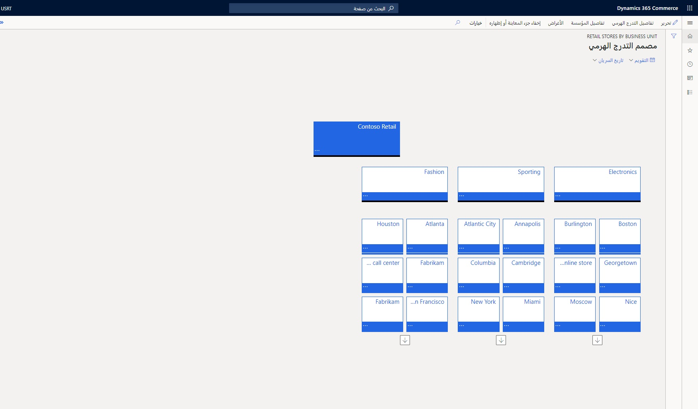

تُظهر الصورة التالية صفحة **مصمم التدرج الهرمي**، الموجودة ضمن **Retail وCommerce > إعداد القناة > ‬‏‫التدرجات الهرمية للمؤسسة** في زر **عرض** التابع للصفحة لسجل **متاجر بيع بالتجزئة حسب وحدة الأعمال**.

يعد الكيان القانوني نوعاً من الشركات ويتبع نفس مفهوم الكيان القانوني لـ Dynamics 365. وعادةً ما يكون الكيان القانوني هو العقدة الأولى في التدرج الهرمي، ولكن ليس من الضروري أن يكون كذلك. 

وحدة التشغيل هي مؤسسة داخل كيان قانوني تقسم العمليات التشغيلية والموارد الاقتصادية داخل الشركة، سواء كانت تلك العمليات هي التصنيع أو الحسابات المدينة أو الموازنة أو مبيعات التجزئة. على سبيل المثال، يمكن أن تعد قناة المتجر أو قناة التجارة الإلكترونية بمثابة وحدة تشغيل. يمكن أن تعد المنطقة الجغرافية لمتاجر البيع بالتجزئة بمثابة وحدة تشغيل. تم وصف قائمة بالأنواع الرئيسية لوحدات التشغيل وأغراضها في الجدول التالي. تعد كل عقدة تقريباً في التدرج الهرمي التنظيمي بمثابة وحدة تشغيل، مما يعني أنه يجب إنشاء وحدات التشغيل أولاً. 

|     نوع وحدة التشغيل    |     الوصف                                                                                                                                           |     الاستخدام                                                                                                                                      |
|----------------------------|-----------------------------------------------------------------------------------------------------------------------------------------------------------|--------------------------------------------------------------------------------------------------------------------------------------------------|
|     مركز التكلفة            |     وحدة تشغيل يكون مديروها مسؤولين عن النفقات المدرجة بالموازنة والنفقات الفعلية.                                                           |     تُستخدم للتحكم في الإدارة والعمليات لكل العمليات التجارية التي تمتد على الكيانات القانونية.                                            |
|     وحدة الأعمال          |     وحدة تشغيل شبه ذاتية أنشئت للوفاء بأهداف الأعمال الاستراتيجية.                                                             |     تُستخدم للتقارير المالية المستندة إلى الصناعات أو خطوط الإنتاج التي تخدمها المؤسسة بشكل مستقل عن الكيانات القانونية.    |
|     تدفق القيم           |     وحدة تشغيل تتحكم في عملية واحدة أو أكثر من عمليات تدفق الإنتاج.                                                                                         |     شائعة الاستخدام في lean manufacturing للتحكم في الأنشطة والتدفقات المطلوبة لتوفير منتج أو خدمة إلى العملاء.     |
|     القسم             |     وحدة تشغيل تمثل فئةً أو جزءاً وظيفياً من إحدى المؤسسات تقوم بتنفيذ مهمة معينة، مثل المبيعات أو المحاسبة.    |     تُستخدم في التقرير عن المناطق الوظيفية. قد يكون للقسم مسؤولية عن الأرباح والخسائر، ويمكن أن يتكون من مجموعة من مراكز التكلفة.       |
|     قناة Commerce       |     وحدة تشغيل تمثل متجراً تقليدياً أو متجراً أو سوقاً على الإنترنت.                                              |     تُستخدم للتحكم في الإدارة والعمليات لواحد أو أكثر من المتاجر داخل أو عبر الكيانات القانونية.                                     |

يمكن أن يوجد أكثر من تدرج هرمي تنظيمي واحد، ويمكن إنشاء متطلبات العمل لعرض المؤسسات بشكل مختلف لأغراض أو عمليات مختلفة. 

على سبيل المثال، قد يكون من الأسهل تشغيل التقارير المالية في تدرج هرمي ولكن من الأسهل إدارة متاجر البيع بالتجزئة والموظفين في تدرج هرمي منفصل.  

يتم تعيين غرض لكل تدرج هرمي. يحدد الغرض الذي يتم تعيينه للتدرج الهرمي أنواع المؤسسات التي يمكن تضمينها في التدرج الهرمي. ويحدد الغرض أيضاً سيناريوهات التطبيق التي يمكن استخدام التدرج الهرمي فيها. عند إنشاء تدرجات هرمية للأغراض، لا تحتاج إلى إنشاء تدرج هرمي واحد لكل غرض. يمكن تعيين أغراض متعددة إلى تدرج هرمي تنظيمي واحد.

