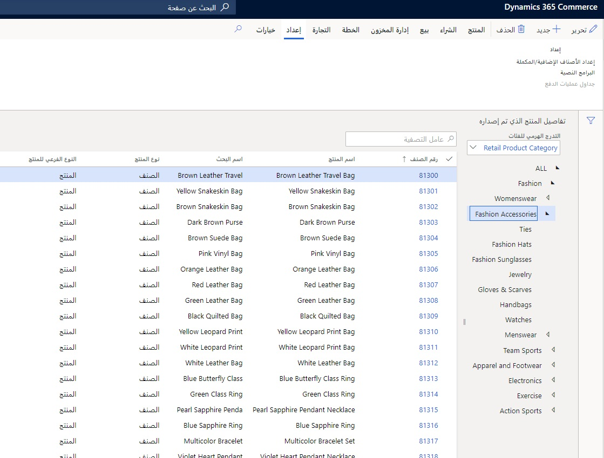

يمكن تعيين نوع لكل تدرج هرمي للفئات للتحكم في الوظائف المختلفة لهذا التدرج الهرمي، ويمكن تحديد منتج في التدرج الهرمي مرة واحدة فقط.Each category hierarchy can be assigned a type in which to control different functionality for that hierarchy, and a product can be specified in the hierarchy only once. 

أنواع التدرجات الهرمية الثلاثة هي:The three hierarchy types are: 

- المنتجProduct
- التكميليSupplemental
- التنقلNavigation

## التدرج الهرمي للمنتجاتProduct hierarchy
يتوفر تدرج هرمي واحد فقط للمنتج في Commerce، ويجب تكوينه وفقاً لكيفية عرض المؤسسة بأكملها للمنتجات.Only one Commerce product hierarchy is available, and it should be configured to how the entire organization views products. 

تعرض الصورة التالية صفحة **الإعداد**، الموجودة ضمن **البيع بالتجزئة والتجارة > المنتجات والفئات > المنتجات التي تم إصدارها حسب الفئة**.The following image shows the **Setup** page, which is located under **Retail and Commerce > Products and categories > Released products by category**.

## التدرج الهرمي التكميليSupplemental hierarchy 
يمكن استخدام التدرجات الهرمية التكميلية لأي عملية تجارية يكون من المفيد فيها وجود تجميع فريد من الأصناف.Supplemental hierarchies can be used for any business process in which a unique grouping of items would be beneficial. على سبيل المثال، يمكن تجميع الأصناف حسب الموسمية والشركة المصنعة وغير ذلك.For example, items can be grouped by seasonality, manufacturer, and more. في كثير من الأحيان، يتم إنشاء العديد من التدرجات الهرمية التكميلية المختلفة لأغراض وقنوات مختلفة.Often, many different supplemental hierarchies are created for different purposes and channels.  

## التدرج الهرمي للتنقل‬Navigation hierarchy 
يجب إنشاء التدرجات الهرمية للتنقل لكل متطلب تنقل فريد موجود لقنوات Commerce.Navigation hierarchies should be created for each unique navigation requirement that exists for the Commerce channels. في بعض الحالات، سيكون التدرج الهرمي للتنقل كافياً لاستعراض المنتجات في نقطة البيع ومركز الاتصال وقنوات التجارة الإلكترونية.In some cases, one navigation hierarchy will be sufficient for browsing products in the point of sale (POS), call center, and e-commerce channels. ومع ذلك، إذا ظهرت متطلبات ما، مثل عدم صلاحية بعض الفئات في القناة، يجب استخدام تدرجات هرمية متعددة للتنقل لهذه القنوات.However, if requirements arise, such as certain categories not being valid in a channel, multiple navigation hierarchies should be used for those channels.

