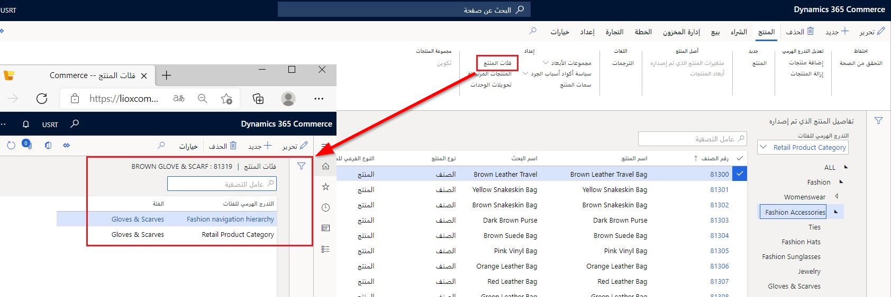

يمكن أن يوجد تدرج هرمي منتج واحد فقط في المؤسسة.

تتضمن مكونات منطق العمل المستمدة من هذا التدرج الهرمي ما يلي:

- ترويج البضائع
- التسعير
- الترقيات
- إعداد التقارير
- التخطيط المتنوع

لذلك، يجب تصميم التدرج الهرمي للمنتج بعناية. 
  
تعيين المنتجات لفئات المنتجات على المنتجات الصادرة. يمكن إضافتها مباشرة من المنتجات الصادرة أو من التدرجات الهرمية. يمكن تعيين منتج إلى فئة واحدة فقط في التدرج الهرمي للمنتج، إذا كان ضمن التدرج الهرمي للمنتج Commerce. للتنقل والتسلسلات الهرمية التكميلية، يمكن ربط المنتج بفئات متعددة. 

يمكن إضافة العديد من الخصائص وإدارتها في عُقد الفئات مثل أكواد المعلومات وسمات المنتج وقيم السمات وسمات المنتج الأخرى.

تُظهر الصورة التالية صفحة **فئات المنتجات** والتي يمكنك العثور عليها من خلال الانتقال إلى **البيع بالتجزئة والتجارة > المنتجات والفئات > المنتجات الصادرة > المنتج** علامة تبويب > مجموعة **إعداد**، ثم تحديد زر **فئات المنتج**. 

شاهد الفيديو التالي للتعرف على كيفية إنشاء التدرجات الهرمية للمنتجات وتعيين المنتجات.

 > [!VIDEO https://www.microsoft.com/videoplayer/embed/RE4Axd0]

