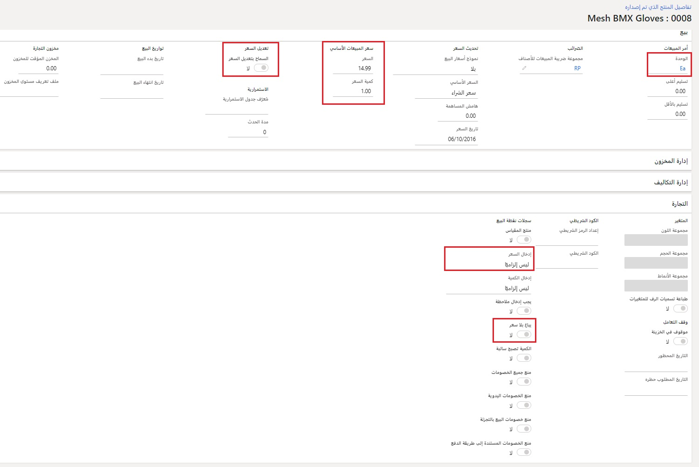

يستخدم Dynamics 365 Commerce العديد من العوامل لتأسيس سعر المبيعات قبل تطبيق الخصومات أو القسائم. يتم تأسيس سعر المبيعات لأحد الأصناف في ثلاثة مواقع:

- على المنتج (السعر الأساسي)
- في اتفاقية التجارة المتعلقة بسعر المبيعات
- في التعديلات السعرية

يوضح الجدول التالي المصطلحات الشائعة المستخدمة فيما يتعلق بأسعار المبيعات.

|     المصطلح                     |     التعريف                                                                                                                                                                                                                                                                                                                                                                                                             |
|------------------------------|-------------------------------------------------------------------------------------------------------------------------------------------------------------------------------------------------------------------------------------------------------------------------------------------------------------------------------------------------------------------------------------------------------------------------------------------------|
|     السعر                    |     مبلغ الوحدة الفردية الذي يتم بيع المنتج به في عميل نقطه البيع (POS) أو في أمر المبيعات. في هذا الموضوع، يشير مصطلح *السعر* دائماً إلى سعر المبيعات، وليس سعر المخزون أو سعر التكلفة.                                                                                                                                                                                                                             |
|     السعر الأساسي               |     السعر الذي يتم تعيينه في حقل **السعر** بالنسبة للمنتج الصادر.                                                                                                                                                                                                                                                                                                                                                                           |
|     سعر الاتفاقية التجارية    |     هو السعر الذي يتم تعيينه لأحد المنتجات أو المتغيرات باستخدام اتفاقية تجارية لنوع **السعر (مبيعات)**.                                                                                                                                                                                                                                                                                                                                     |
|     أفضل سعر               |     وعندما يمكن تطبيق أكثر من سعر أو عروض خصم على أحد المنتجات، فإنه يكون أصغر مبلغ سعر و/أو أكبر مبلغ خصم ينتج عنه أدنى حد ممكن للمبلغ الصافي الذي يتعين على العميل دفعه. في هذا الموضوع، تتم دائماً الإشارة إلى مفهوم أفضل سعر على أنه "السعر الأفضل". ويختلف هذا السعر الأفضل عن، ويجب عدم الخلط بينه بين قيمة تعداد **السعر الأفضل** لوضع تزامن عرض الخصم.    |

يمكن تجاوز أسعار المبيعات داخل القنوات التجارية استناداً إلى القواعد المحددة مسبقاً. قد يمنع الإعداد الموجود في المنتج الذي تم إصداره الأشخاص من زيادة أسعار المبيعات. 

في بعض الأحيان، قد يتضمن سعر الصنف ضريبة المبيعات بشكل افتراضي. سيشتمل السعر الذي يتم تقديمه للعميل على الضريبة. يتم إعداد هذا التكوين على القناه التجارية من خلال حقل **السعر متضمناً ضريبة المبيعات**.

يمكن أيضا أن تساعد العديد من الحقول الموجودة في المنتج الصادر من خلال سعر البيع الأساسي. على سبيل المثال، يمكن تكوين سعر البيع الأساسي لكي يقوم المستخدم بإدخال السعر أو يكون السعر الصفري مسموحاً به للمنتج. 

يمكن العثور على صفحة **تفاصيل المنتج الصادر** ضمن **البيع بالتجزئة والتجارة > المنتجات والفئات > المنتجات الصادرة**.

 

## السعر الأساسي (المنتج الصادر)
يتم إعداد سعر البيع الأساسي على المنتج بجانب الكمية الخاصة بأقل وحدة للقياس سيتم بيعه بها (على سبيل المثال، كل). وهو حقل واحد لا يحتفظ بالسجل، ويتم اعتباره غالباً سعر البيع بالتجزئة المقترح للجهة المصنعة (MSRP). سعر البيع الأساسي سيكون هو السعر الافتراضي لكل شيء في النظام، بغض النظر عن المكان الذي تمت فيه عملية الشراء أو عن طريق مَن. 
