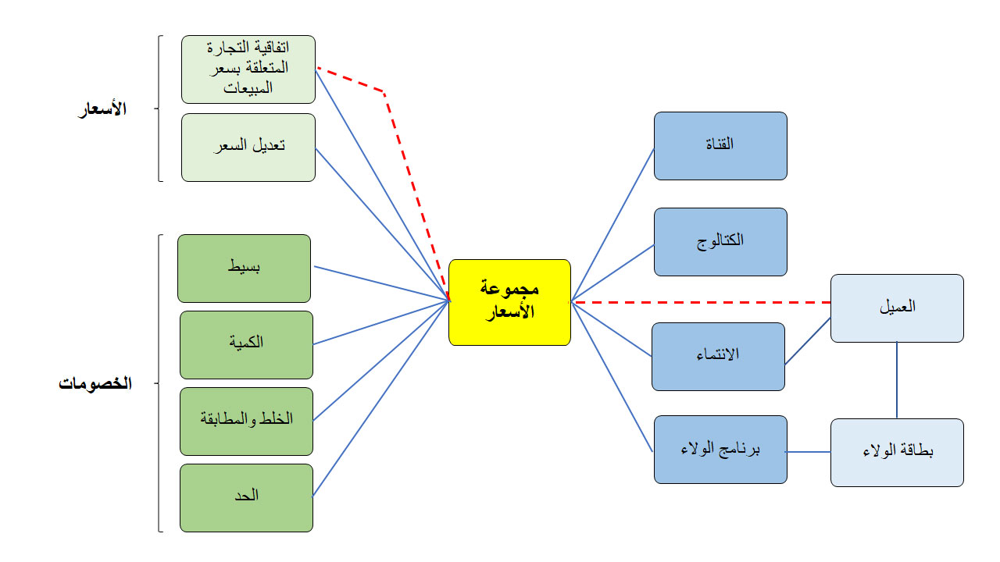

تُستخدم مجموعات أسعار البيع بالتجزئة لربط مكونات أسعار المبيعات بالخصومات إلى كيانات مختلفة مثل القنوات والكتالوجات وانتماءات العملاء وبرامج الولاء ومجموعات العملاء.

يوضح الرسم التوضيحي التالي كيفية استخدام مجموعات الأسعار. 

في هذا الرسم التوضيحي، لاحظ أن **مجموعة الأسعار** تكون في مركز التسعير وإدارة الخصومات. توجد كيانات Commerce التي يمكنك استخدامها لإدارة الأسعار والخصومات التفاضلية على اليسار، ويوجد السعر الفعلي وسجلات الخصم على اليمين. 
 
عند إنشاء مجموعات أسعار، يجب ألا تستخدم مجموعة أسعار واحدة لأنواع متعددة من كيانات Commerce. وبخلاف ذلك، قد يكون من الصعب تحديد سبب تطبيق سعر أو خصم معين على حركة.

كما يُظهر الخط الأحمر المتقطع في الصورة، تدعم التجارة وظيفة Dynamics 365 الأساسية لمجموعة أسعار تم تعيينها مباشرة على العميل. ومع ذلك، في هذه الحالة، ستحصل فقط على اتفاقيات تجارة سعر المبيعات. إذا كنت ترغب في تطبيق أسعار خاصة بالعميل، نوصيك بعدم تعيين مجموعات أسعار مباشرة على العميل. بدلاً من ذلك، استخدم الانتماءات.

إذا تم تعيين مجموعة الأسعار على العميل، فسيتم إقران مجموعة الأسعار هذه برأس أمر المبيعات للأوامر التي يتم إنشاؤها لهذا العميل. إذا قام المستخدم بتغيير مجموعة الأسعار في رأس الأمر، فسيتم استبدال مجموعة الأسعار القديمة بمجموعة الأسعار الجديدة ولكن للأمر الحالي فقط. 

على سبيل المثال، لن تؤثر مجموعة الأسعار القديمة على الأمر الحالي، لكنها ستظل مرتبطة بالعميل للطلبات المستقبلية.
