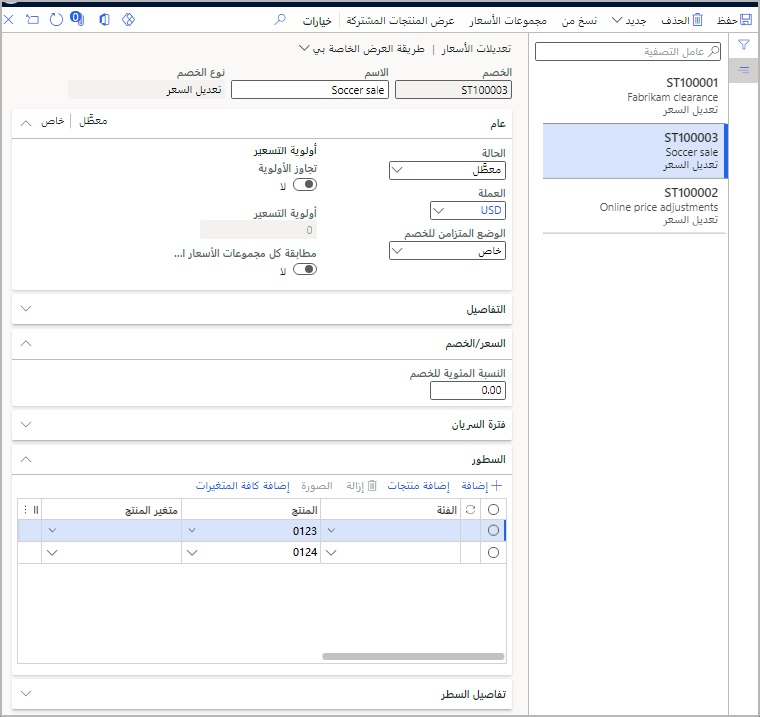
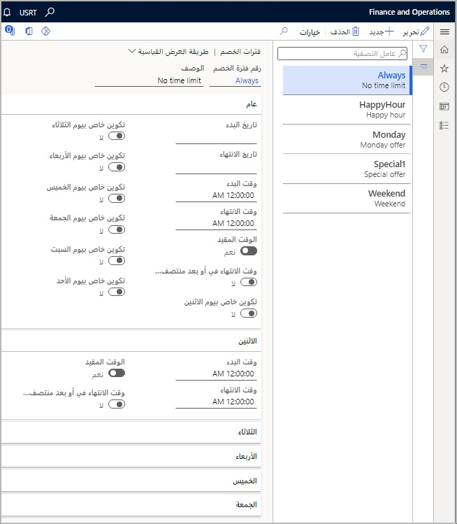

تستخدم تعديلات الأسعار إطار عمل الخصم، ولكنها تعتبر أيضاً جزءاً من وظيفة السعر الأساسي، جنباً إلى جنب مع الأسعار التي تم تكوينها في المنتج الصادر واتفاقيات التجارة. عندما يتغير السعر بمرور الوقت لمنتج ما، يمكنك استخدام تعديلات الأسعار للحفاظ على تكامل وظيفة اتفاقيات التجارة الأصلية. 

تستخدم تعديلات الأسعار مجموعات الأسعار، لذا يجب استخدامها للسيناريوهات التي لا يمكن فيها استخدام اتفاقيات التجارة لتحديد السعر، على سبيل المثال، الموقع. 

يتم إعداد تعديلات الأسعار في **البيع بالتجزئة Commerce > الأسعار والخصومات > تعديلات الأسعار**.

 
بخلاف اتفاقيات التجارة، تسمح تعديلات الأسعار بتكوينات أكثر تعقيداً باستخدام إطار العمل الذي يمتلكه محرك الخَصم، مثل وظيفة فترات الخصم المتقدمة. يمكن تحديد اتفاقيات التجارة حسب التاريخ، بينما تسمح فترات الخصومات لتعديلات الأسعار بتغييرات الأسعار من خلال العديد من المعايير الأخرى، كما هو موضح في المثال التالي لصفحة **فترات الخصم**، الموجودة في **البيع بالتجزئة وCommerce > التسعير والخصومات**.
 

