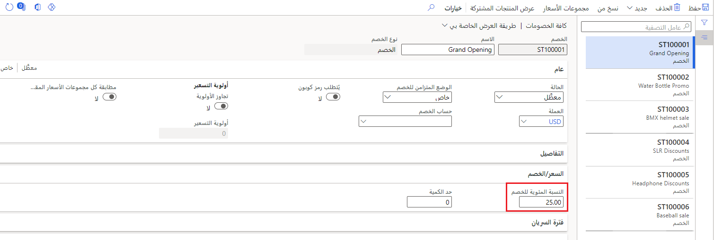

هناك خمسة مكونات تسعير تستخدم وظيفة الخصومات، لكن أربعة منها فقط عبارة عن خصومات. تعد تعديلات الأسعار جزءاً من استراتيجية سعر البيع، لذا فهي لا تعتبر خصماً حقيقياً. مكونات التسعير الأربعة الأخرى هي خصومات حقيقية يتم تطبيقها على سعر البيع:

- **بسيط** - نسبة مئوية أو مبلغ واحد. (على سبيل المثال: احصل على خصم بنسبة خمسة بالمائة على أي صنف في الفئة في عطلة نهاية هذا الأسبوع فقط.)
- **كمية** – خصم يتم تطبيقه عند شراء منتجين أو أكثر. (على سبيل المثال: قم بشراء ثلاثة منتجات أو أكثر واحصل على خصم 20 بالمائة.)
- **خلط ومطابقة** – خصم يتم تطبيقه عند شراء مجموعة معينة من المنتجات. (على سبيل المثال: قم بشراء خمسة منتجات من نوع معين واحصل على خصم 5 بالمائة على السعر الكلي.)
- **الحد** – خصم يتم تطبيقه عندما يزيد إجمالي الحركة عن مبلغ معين. (على سبيل المثال: اشترِ بقيمة 100 دولار أمريكي (USD) أو أكثر واحصل على خصم 5,00 دولارات أمريكية.) في بعض الأحيان يرغب تجار التجزئة أن يتنافس خصم الحد مع الخصومات الأخرى لتطبيق أفضل خصم. يمكن لبائعي التجزئة تشغيل تكوين يضمن تنافس خصومات الحد الحصرية مع الخصومات الحصرية الأخرى غير الحدية لتقديم أفضل سعر.

يمكن تطبيق الكائنات التي تستخدم وظيفة الخصم على المنتجات أو المتغيرات أو الفئات، وتستخدم مجموعات الأسعار التي سيتم تعيينها إلى الكيانات الصحيحة. من خلال وظيفة فترات الخصم المتقدمة، تدعم التكوينات العديد من تنسيقات التاريخ والوقت. 

يمكن تطبيق الخصومات من خلال نسبة الخصم أو مبلغ الخصم النقدي أو سعر الخصم للفئات أو البنود بالكامل، مع خيار تحديد ما إذا كان يجب استبعاد البند أو تضمينه عندما يقوم شركاء المبيعات بتطبيق الخصم (على سبيل المثال، جميع الأصناف في الفئة باستثناء صنف واحد).

يمكن عرض الخصومات التجارية وإنشاؤها في **البيع بالتجزئة والتجارة > التسعير والخصومات‬ > جميع الخصومات**. من هنا، يمكنك تحديد حقل مثل **نسبة الخصم**، وتطبيق أي قواعد أخرى تريد تنشيطها، وحفظ الخصم. 

> [!div class="mx-imgBorder"]
> 

يمكن تمكين الخصومات أو تعطيلها. في حالة تعطيلها، يمكن تحريرها ولكن لن يتم استخدامها في محرك التسعير. وفي حالة تمكينها، سيقوم محرك التسعير بتقييمها عند تحديد الخصومات. 

يحدد محرك التسعير أيضاً الخصومات التي سيتم تطبيقها على كل من بند المبيعات الفردي وسلة التسوق الكاملة للعميل. وبسبب احتمال وجود خصومات متعددة أو متباينة تنطبق على أمر أكبر حجماً، بإمكان Commerce أن يفحص سلة التسوق بكاملها بطريقة حدسية لمعرفة الخصم المطلوب تطبيقه. 

علاوةً على ذلك، لأنه من الشائع أن يكون لدى شركات B2B (متاجرة عمل-عمل) وحتى بعض شركات B2C (متاجرة عمل-مستهلك) أحجام أوامر كبيرة، يمكن تأخير حساب الخصم لتحسين أداء أوامر المبيعات من خلال تمكين الحقل **حساب الأسعار والخصومات متعددة الأسطر يدوياً** في **معلمات Commerce > الأسعار والخصومات**. مع تمكين هذا الحقل، سينظر محرك التسعير فقط إلى بند المبيعات الذي تمت إضافته أو تحريره لتجنب إبطاء عملية أمر المبيعات بالكامل. 

## الخصومات الأخرى
يمكن تطبيق العديد من الخصومات الأخرى على الأوامر الموجودة خارج أمثلة الخصم القياسية التي تم شرحها في وقت سابق:

- **القسائم** - هي تلك الخصومات التي تتطلب أكواداً أو رمزاً شريطياً لإضافة خصم معين إلى الحركة. يمكن أن تقيد القسائم الاستخدام حسب التاريخ وتتطلب وجود عميل، أو يمكنهم تعيين حد أقصى لعدد القسائم القابلة للاسترداد قبل انتهاء صلاحيتها. يتم وضع القسائم فوق الخصومات وتتطلب أن يتم تمكين الخيار **رمز القسيمة المطلوب**.
- **مستند إلى طريقة الدفع** - هي خصومات بالنسبة المئوية المستندة إلى بند والتي يتم منحها في وقت الدفع، بناءً على نوع ‏‫طريقة الدفع التي ترغب الشركة في الترويج لها. وتتم إضافته إلى الخصومات الموجودة، بغض النظر عن القيود. 
- **الشحن** - هو خصم أو عرض بشحن الأمر مجاناً لطرق شحن محددة، إذا تم استيفاء معايير معينة. (على سبيل المثال: أنفق أكثر من 100 دولار أمريكي على الحركة واحصل على شحن مجاني.)

شاهد الفيديو التالي للحصول على نظرة عامة حول أنواع خصومات البيع بالتجزئة وكيفية استخدام محاكي الأسعار (الذي سيتم مناقشته لاحقاً في هذه الوحدة النمطية).

 > [!VIDEO https://www.microsoft.com/videoplayer/embed/RE4AslE]
