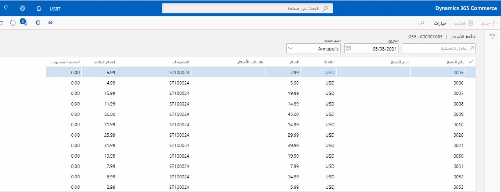

يعد فهم التسعير الحالي أو المستقبلي لأحد المتاجر أمراً مهماً لمديري المتجر وموظفيهم.Understanding a store’s current or future pricing is important for store managers and their employees. يمكن أن يساعد تقرير **قائمة الأسعار** في هذا السيناريو عن طريق الاستعلام عن أسعار كل متجر والخصومات المطبقة في يوم محدد.The **Price list** report can help in this scenario by querying every store’s pricing and applicable discounts for a specified day. يمكنك العثور على هذا التقرير بالانتقال إلى علامة التبويب **البيع بالتجزئة والتجارة > القنوات > المتاجر > جميع المتاجر > المتجر** ثم تحديد **مجموعة الأسعار > قائمة الأسعار**.You can find this report by going to **Retail and Commerce > Channels > Stores > All stores > Store** tab and then selecting **Pricing group > Price list**.

 
## محاكي الأسعارPrice simulator
يعد محاكي الأسعار في **البيع بالتجزئة والتجارة > التسعير والخصومات > محاكيات الأسعار** أداة يمكن استخدامها لتقليد حركات قنوات Commerce لاختبار مجموعة متنوعة من السيناريوهات باستخدام الاختبار الاستكشافي أو التحقق من الصحة.The Price simulator in **Retail and Commerce > Pricing and discounts > Price simulators** is a tool that can be used to mimic Commerce channel transactions to test a variety of scenarios with exploratory or validation testing. 

يسمح محاكي الأسعار للمستخدم في المركز الرئيسي (HQ) لـ Commerce بإدخال سطور الحركات التجارية، كما ستكون عليه في المتجر، ثم تطبيق جميع المدخلات التي يمكن لمحرك التسعير استخدامها (التاريخ ومجموعات الأسعار والقسائم والعملاء والقنوات والعملة وغيرها الكثير).The Price simulator allows a user in Commerce Headquarters (HQ) to enter commerce transaction lines, as they would in a store, and then apply all the inputs that the pricing engine could use (date, price groups, coupons, customers, channels, currency, and more). يمكن أن يتضمن أيضاً خصومات معطلة بحيث يمكن اختبار الخصومات التي يتم تكوينها مقابل الخصومات النشطة في النظام الحالي.It can also include disabled discounts so that discounts that are being configured can be tested against active discounts in the current system. 

لتوفير فهم أعمق لخصومات البيع بالتجزئة والاتفاقيات التجارية وتعديلات الأسعار التي يتم استخدامها، يتم تفصيل الحركات لتوفير رؤى حول ما يتم أخذه في الاعتبار.To provide a deeper understanding of the retail discounts, trade agreements, and price adjustments that are being used, transactions are itemized to provide insights into what is being considered. بالإضافة إلى ذلك، يمكن تمكين التشخيصات لإظهار البيانات الفنية الفعلية التي تتم معالجتها.Additionally, diagnostics can be enabled to show the actual technical data that is being processed. يمكن تكوين سيناريوهات محاكي الأسعار المتعددة واستخدامها بمرور الوقت.Multiple price simulator scenarios can be configured and used over time. 

شاهد مقطع الفيديو في وحدة **أنواع خصم البيع بالتجزئة** للاطلاع على عرض توضيحي لمحاكي الأسعار.Watch the video in the **Retail discount types** unit for a demonstration of the Price simulator.

