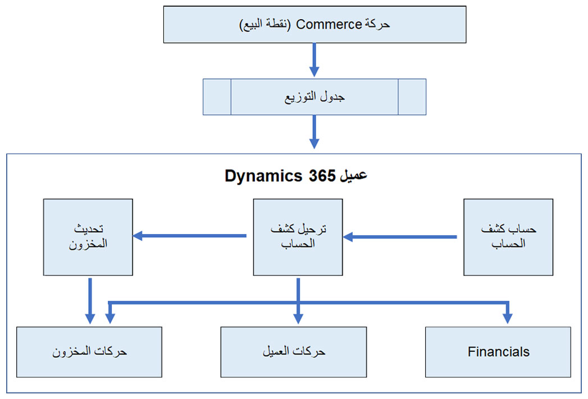

تقوم وظيفة ترحيل كشف الحساب في Dynamics 365 Commerce بنقل الحركات التجارية في Commerce من إحدى القنوات، وتكون عادةً Store Commerce وتحويلها إلى عمليات ترحيل للحركات المالية وحركات العملاء وحركات المخزون. ستسمح العمليات المشتركة بين رفع البيانات من القنوات إلى عملية الترحيل بإبراز الوضوح في الحركات خلال اليوم. بالإضافة إلى ذلك، ستساعد الوظيفة على التأكد من أن عمليات إنهاء اليوم هذه تعمل بسلاسة. عند التعرف على المشكلات، يمكنك استخدام أدوات مثل الوظيفة الإضافية في Microsoft Excel لتصحيح البيانات. 

يقد الشكل التالي نظرة عامة على مكونات معالجة كشف الحساب. 

 

