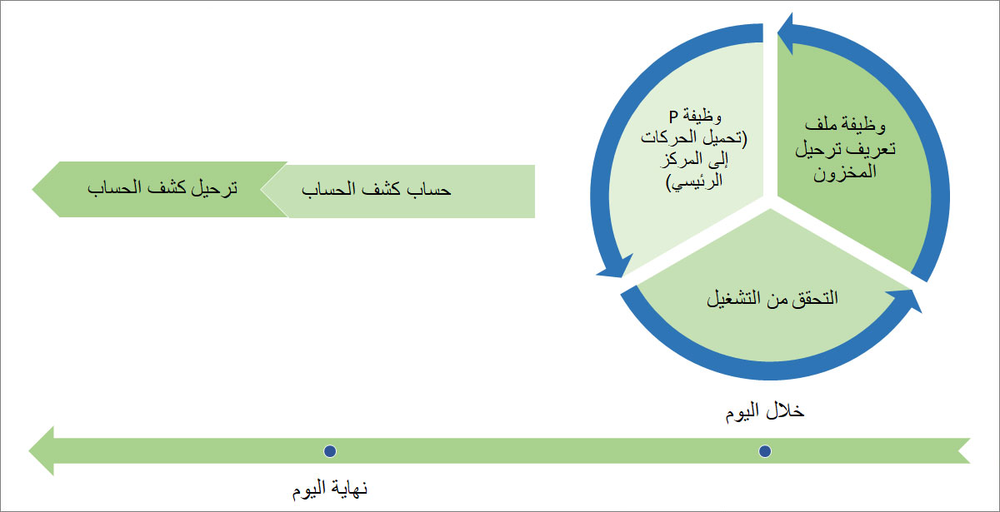
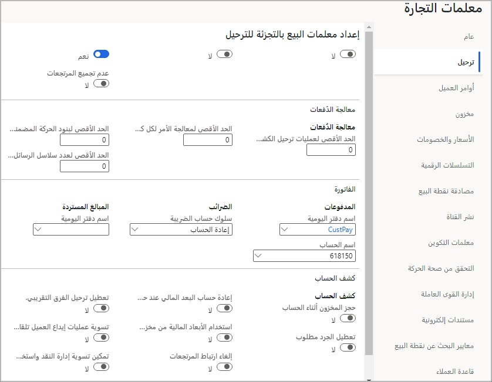

عادةً ما تتم إدارة عمليات ترحيل كشف الحساب في جزأين: 

- خلال اليوم
- نهاية اليوم 
 
توضح الصورة التالية العمليات التي تنتمي إلى هذه المناطق. 

 
## خلال اليوم
والعمليات التي يتم اجراؤها خلال اليوم هي:

- وظيفة P (تحميل الحركات إلى الإدارة)
- وظيفة ملف تعريف ترحيل المخزون
- التحقق من التشغيل

### وظيفة P
عند حدوث حركات البيع بالتجزئة في قناة Commerce، يمكن تخزين الحركات محلياً في قناة Commerce، لاستردادها لاحقاً من المركز الرئيسي لـ Commerce (HQ)، أو إنشاؤها في الوقت الفعلي من القناة إلى المركز الرئيسي. 

يمكن سحب الحركات المخزنة محلياً من القنوات على فترات زمنية محددة مسبقاً باستخدام وظائف تحميل إطار توزيع البيانات **P-…** للوظيفة). بالنسبة لحركات التجارة الإلكترونية عبر الإنترنت، يلزم وجود خطوة إضافية باسم **مزامنة الأمر** لتحويل الأوامر عبر الإنترنت. بالنسبة لأوامر الوقت الفعلي، يتم إنشاء أمر المبيعات في المركز الرئيسي بواسطة قناة Commerce ويقوم النظام أيضاً بإنشاء سجل في إطار عمل الحركة. ولا يلزم وجود أي وظائف دورية لهذه العملية. 

سيتم سحب الوظائف (ومن هنا اصطلاح التسمية **P-…** ) بيانات الحركة إلى المركز الرئيسي، وعلى سبيل المثال، جدول **إطار عمل حركات البيع بالتجزئة**. يمكن تدقيق الحركات والبحث عنها عند تحميلها. يحتوي إطار عمل الحركة على جميع الإجراءات التي حدثت في قناة Commerce، سواء كان ذلك تسجيل الدخول أو تسجيل الخروج أو الحركة المعلقة أو أي من البيانات الموجودة في الحركة (إلغاء البند والمدفوعات وأكواد المعلومات والخصومات والمزيد).

يمكنك العثور على الحركات من خلال الانتقال إلى **Retail وCommerce > Retail وCommerce IT > جدول التوزيع** ثم انتقل إلى **Retail وCommerce > ‏‫الاستعلامات والتقارير > حركات المتجر**.

### وظيفة ملف تعريف ترحيل المخزون
نظراً لأن الحركات التي يتم سحبها إلى النظام لا يتم ترحيلها إلى المخزون حتى يتم ترحيل كشف الحساب، يمكن تشغيل وظيفة **ترحيل كشف الحساب** لاجتياز الحركات غير المنشورة التي تؤثر على المخزون إلى حجز الكميات مادياً. تؤدي هذه الميزة إلى انخفاض المخزون الفعلي، مما يوفر تمثيلاً دقيقاً للمخزون القابل للبيع في قناة Commerce للقنوات الأخرى ومسارات عمل جرد المركز الرئيسي مثل التزويد.

### التحقق من التشغيل 
عند إدخال الحركات في النظام، فإن **مدقق تناسق الحركة** في **Retail وCommerce > إعداد المركز الرئيسي > المعلمات > معلمات Commerce** يمكن تشغيلها لتحديد أي حركات، مما قد يتسبب في مشكلة عندما ينتقل البيان إلى عمليات الحساب والترحيل في نهاية يوم العمل. يحتوي المدقق على العديد من القواعد التي يمكن تمكينها وتعطيلها لتزويد تجار التجزئة بالمرونة لتحديد ما يريدون/لا يريدون التحقق من صحته.

تصبح وظيفة التحقق من الصحة أكثر أهمية عندما يتم توسيع إطار عمل الحركة للاتصال بمصادر أخرى أو تطبيقات Store Commerce القديمة. لا يمكن التحقق من سلامة البيانات من المصادر المتكاملة بشكل كامل. 

يمكن تشغيل اتساق الحركة في أي فترة زمنية يريدها بائع التجزئة. على سبيل المثال، يمكن تشغيله فوراً بعد تحميل حركات Commerce الجديدة. 

## نهاية اليوم - حساب كشف الحساب وترحيله
في نهاية اليوم، يتم إنشاء ‏‫كشوف الحسابات وحسابها وترحيلها. 

يمكن إنشاء كشوف الحسابات يدوياً أو من خلال عملية مجمعة. سيكون لكل قناة Commerce كشف حساب خاص بها تم إنشاؤه لها. 

بالنسبة للعمليات الحسابية، يمكن إجراء التكوينات التي يتم تجميع البيانات عليها عند الترحيل على صفحة **معلمات Commerce** التابعة للكيان القانوني. لاختبار ما إذا كانت الإعدادات صحيحة قبل حساب الكشف، يمكنك استخدام صفحة **الحركات** لمعاينة ما سيتم تضمينه في كل كشف حساب. 

يتم إكمال تسوية آلة تسجيل المدفوعات النقدية في هذه الخطوة لتحديد ما إذا كان المبلغ المحسوب يقع ضمن فرق معين للسماح بالترحيل أو إذا كان يجب عليك التحقيق فيه قبل تنفيذ الحركات مالياً. تعرض صفحة **معلمات Commerce** عدداً قليلاً فقط من إعدادات الترحيل التي يجب تكوينها لترحيل كشف الحساب. 

قم بالوصول إلى الخيار **إعداد معلمات البيع بالتجزئة للترحيل** عن طريق الانتقال إلى **Retail وCommerce > إعداد المركز الرئيسي > المعلمات > معلمات Commerce**.

تدعم الحسابات عدة متطلبات أساسية:

- يمكن للشركات التي تتبع عملية نهاية يوم العمل الذي لا يحدث في منتصف الليل استخدام الخيار **‬‏‫الترحيل كيوم العمل‬‏‫**.
- إدراج حركات من تواريخ سابقة لم تكن مدرجة في كشوف الحسابات السابقة. 
- توحيد طرق الدفع من خلال إنشاء بند كشف حساب لأنواع الدفع بواسطة الحركة بأكملها (**الإجمالي**)، بواسطة طريقة الدفع التي يتخذها الفريق (**الفريق**) أو الوحدة الطرفية لـ Store Commerce (**وحدة طرفية لنقطة البيع**) أو الوردية (**الوردية**).

عند ترحيل الكشوف، يتم تجميع الحركات النقدية والتي تحمل المبالغ التي ليس لديها عميل مرتبط بها بأمر مبيعات واحد وتتم فوترتها إلى العميل الافتراضي الذي تم تعيينه على قناه التجارة. 

إذا كان العميل مضمناً في الحركات التجارية لأحد المتاجر، سيتم دمجه في أمر مبيعات منفصل باستخدام حساب هذا العميل. 

ثم يتم بعد ذلك فوترة أوامر المبيعات، ثم ترحيل المدفوعات إلى دفاتر اليومية للمدفوعات وتسويتها مقابل الفواتير. 

هناك نوعان من تكوينات ترحيل كشف الحساب التي يمكن استخدامها وهما: كشوف الحسابات وكشوف الحسابات (القديمة).

ستستخدم عمليات التنفيذ الجديدة وظيفة **كشوف الحسابات**، بينما ستستخدم التطبيقات السابقة **كشوف الحسابات (القديمة)**. لا يمكن تشغيل كل منهما في نفس الوقت. تم الآن إيقاف تكوين **كشوف الحسابات (القديمة)**، لذلك نوصي بتغيير عمليات الأعمال واعتماد التكوين الجديد عندما يكون ذلك مناسباً. 
