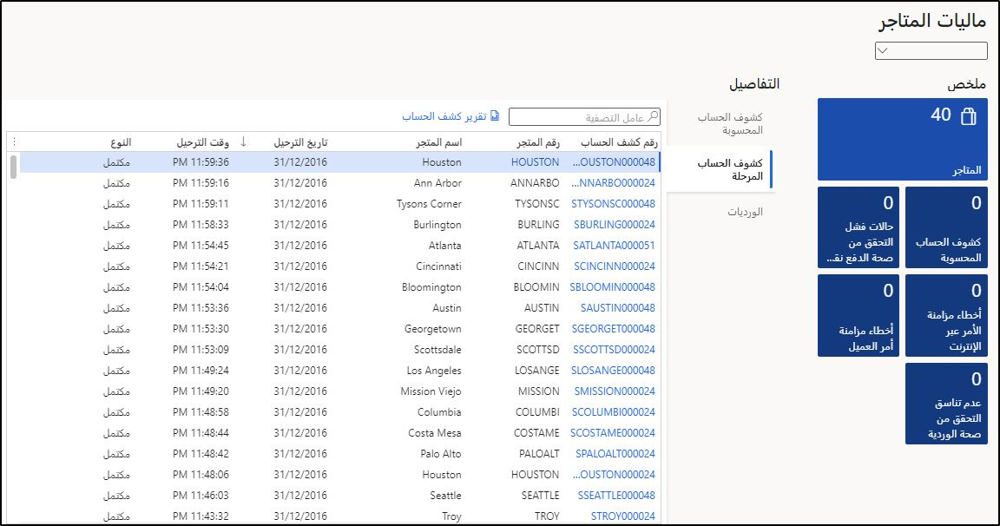

شاهد الفيديو التالي للحصول على عرض توضيحي لترحيل كشف الحساب في التجارة.Watch the following video for a demonstration of statement posting in Commerce. 

 > [!VIDEO https://www.microsoft.com/videoplayer/embed/RE4AP3H]

معظم الخطوات في ترحيلات كشوفات البيع بالتجزئة التجارية تلقائية بالكامل، ولكن تتطلب العديد من الأجزاء تفاعلاً يدوياً.Most of the steps in the Commerce retail statement postings can be fully automated, but several parts require manual interaction. عندما تتفاعل مع بيانات البيع بالتجزئة، فإن **تخزين البيانات المالية** مساحة العمل في **البيع بالتجزئة والتجارة> مساحات العمل** سيكون الموقع الرئيسي للتفاعل.When you are interacting with retail statements, the **Store financials** workspace in **Retail and Commerce > Workspaces** will be the main location for interaction. 

 
على سبيل المثال، عندما يواجه مدقق تناسق الحركة مشكلات مع الحركات، يتم وضع علامة على الحركات ثم استبعادها من الكشوف.For example, when the transaction consistency checker encounters issues with transactions, the transactions are flagged and then excluded from the statements. يمكن تعديل هذه الحركات الخاطئة من قبل المستخدم.These errored transactions can be modified by a user. يمكن للمستخدم الانتقال إلى ملف **تخزين البيانات المالية** مساحة العمل واستخدام **فشل التحقق من الحركة** لعرض قائمة تمت تصفيتها مسبقاً بالحركات التي فشلت في إحدى القواعد التي تم تمكين مدقق تناسق الحركة بها.A user can navigate to the **Store financials** workspace and use the **Transaction validation failures** tile to view a pre-filtered list of transactions that failed one of the transaction consistency checker’s enabled rules. 

يمكن تصدير حركة خاطئة وكافة السجلات المرتبطة بها (البنود والمدفوعات والخصومات والضرائب والتكاليف) إلى الوظيفة الإضافية لبرنامج Excel لمزيد من التحليل والتعديل.An errored transaction and all its associated records (lines, payments, discounts, taxes, and charges) can be exported to the Excel add-in for further analysis and modification. تسمح الوظيفة الإضافية بنشر البيانات المتغيرة مرة أخرى في مقر التجارة.The add-in allows the changed data to be published back into Commerce Headquarters. التغييرات التي تم إجراؤها على هذه الحركات مفصلة بالكامل، بما في ذلك القيمة القديمة والجديدة والتاريخ والوقت ومن قام بتعديل البيانات.Changes that are made to these transactions are fully detailed, including the old and new value, date and time, and who modified the data. 

