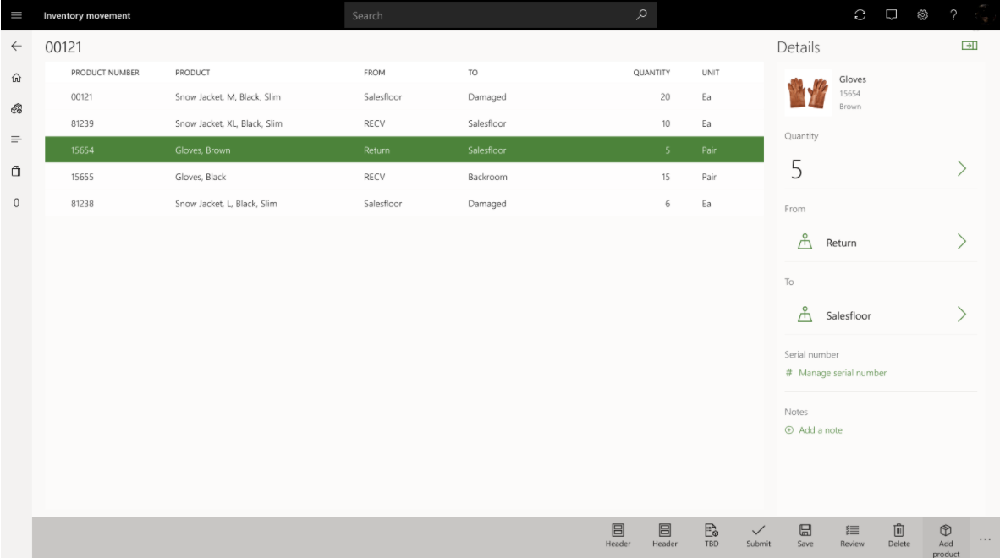

قد يرغب موظفو المتجر في نقل بعض مخزون متجرهم خارج متجرهم وإرساله إلى مستودع آخر (إما مركز توزيع أو متجر آخر).  قد يكون هذا النقل ضرورياً في السيناريوهات التي يحتوي فيها المتجر على مخزون زائد يمكن أن يستخدمه موقع آخر. يمكن لموظفي المتجر بدء هذه العملية عن طريق إنشاء أمر التحويل أولاً من خلال عملية **المخزون الصادر** في Store Commerce.

عند إنشاء أمر التحويل الصادر وإرساله من Store Commerce، يتم إنشاء سجل أمر التحويل في HQ. سيكون أمر النقل هذا متاحاً الآن لموظفي المتجر في Store Commerce كي يتمكنوا من تحديد معالجة شحن أصناف أمر النقل هذه من خلال عملية **المخزون الصادر**.

يمكن رؤية ميزة استخدام عمليات النقل مباشرة من Store Commerce في انخفاض تكاليف تكنولوجيا المعلومات القديمة. تستخدم عمليات النقل في هذه العملية قدرة دفتر يومية نقل المخزون المتوفرة من Commerce Headquarters لبدء معالجة حركة المخزون. 

على سبيل المثال، إذا كانت عملية إدارة المخزون الجديدة تستخدم Commerce Store Commerce، فيمكن للعملية الجديدة أن تدعم تجربة مسح الرموز الشريطية لإضافة منتجات إلى طلب الحركة المحدد. بالنسبة إلى المنتجات التي تتم مراقبتها بواسطة سلسلة، تسمح العملية الجديدة للمستخدمين بإدخال الأرقام التسلسلية كي يبقى عملهم منظماً أثناء الحركة. 

للتأكد من أن كل شيء يحافظ على دقته، هناك وظيفة مراجعة تتيح للمستخدمين التحقق مسبقاً من البيانات غير الصحيحة أو المفقودة قبل إرسال الطلب. 

> [!div class="mx-imgBorder"]
> 

## دعم تسجيل الرقم التسلسلي على شحنات أوامر النقل الصادرة من Store Commerce
يبيع العديد من تجار التجزئة المنتجات التي تتطلب التحكم التسلسلي ويجب عليهم إدارة الأرقام التسلسلية كجزء من عمليات إدارة المخزون. أثناء سير الاستلام، تسمح عملية **المخزون الوارد** في Store Commerce بتسجيل الأرقام التسلسلية أو التحقق من صحتها. ولدعم تسجيل الرقم التسلسلي لسير الشحنة، تمت إضافة هذه الميزة إلى عملية **المخزون الصادر**.

تتيح هذه الميزة للمستخدمين إمكانية إدخال الأرقام التسلسلية للأصناف الخاضعة للتحكم التسلسلي في أوامر النقل الصادرة أثناء عملية الشحن في عملية **المخزون الصادر** لـ Store Commerce. يتم التحقق من صحة الأرقام التسلسلية مقابل مستودع الشحن للتأكد من أن المتجر يقوم بشحن الأرقام التسلسلية المعروفة للمخزون المتوفر حالياً في المتجر. تتم مراعاة الإعدادات المتعلقة بأبعاد تعقب الرقم التسلسلي في Commerce Headquarters لتحديد ما إذا كان تسجيل الرقم التسلسلي مدعوماً وما إذا كان يُسمح باستخدام الأرقام التسلسلية الفارغة.

## تطبيق الأرقام التسلسلية اثناء تنفيذ أوامر العميل أو استلامها
عند استخدام عملية **تنفيذ الأمر** في Store Commerce لتلبية بنود أمر العميل للمنتجات المتسلسلة، يجب الحصول على الرقم التسلسلي قبل التنفيذ النهائي. إذا لم يتم توفير رقم تسلسلي في أثناء الالتقاط الأولي للأمر، يجب التقاطه في أثناء عمليات الانتقاء أو التعبئة أو الشحن في Store Commerce. يتم التحقق من الصحة في كل خطوة، ولن تُطلب معلومات حول الرقم التسلسلي من المستخدم إلا إذا كانت مفقودة أو لم تعد صالحة. إذا تخطى المستخدم خطوات الانتقاء أو التعبئة وبدأ شحنة على الفور، ولم يتم تسجيل رقم تسلسلي للبند، فسيطلب Store Commerce من المستخدم أن يقوم بإدخال الرقم التسلسلي قبل إكمال خطوة الفاتورة النهائية. تظل جميع القواعد المذكورة سابقاً في هذا الموضوع سارية عند فرض التقاط الرقم التسلسلي في أثناء عمليات تنفيذ الأمر في Store Commerce. 

‏‫لا تخضع سوى الأصناف المتسلسلة التي تم تعيينها إلى **نشطة** للتحقق من صحة مخزون الرقم التسلسلي.‬ لن يتم التحقق من صحة الأصناف التي تم وضع علامة عليها كنشطة في عملية المبيعات. إذا تم السماح **بالمخزون السلبي الفعلي** لمنتجات نشطة، فسيتم قبول أي رقم تسلسلي، بغض النظر عن توفر المخزون. إذا تم تمكين إعداد **مسموح بالإصدار الفارغ** لكل من الأصناف **النشطة** و **النشطة في عملية المبيعات**، يمكن للمستخدم ترك الأرقام التسلسلية فارغة في أثناء خطوات الانتقاء والتعبئة والشحن.‬

عندما يقوم المستخدم بإجراء عمليات الاستلام على أوامر العملاء في Store Commerce، سيتم أيضاً إجراء عمليات التحقق من صحة الأرقام التسلسلية. لن يسمح تطبيق Store Commerce بإتمام عملية الاستلام على منتج متسلسل ما لم يجتاز عمليات التحقق من الصحة المذكورة سابقاً. تعتمد عمليات تحقق من صحة دائماً على بُعد تعقب المنتج وتكوينات مستودع البيع.

## تسجيل الأرقام المسلسلة مقابل الأصناف المتسلسلة
بالنسبة لأمر النقل، سيتم توجيهك من خلال مربع حوار يحتوي على الخيار **إدارة الرقم التسلسلي** خلال عملية الشحن لصنف متسلسل. ويمكنك تحديد الخيار لفتح الصفحة **إدارة الأرقام التسلسلية** والبدء في تسجيل الأرقام التسلسلية. يمكنك أيضاً تخطي هذه الخطوة خلال عملية الشحن وتقديم الإدخال لاحقاً، قبل ترحيل الشحن.

بشكل افتراضي، يتم عرض علامة التبويب الخاصة بالصنف الحالي. تحتوي كافة بنود الرقم المسلسل على قيمه رقمية تسلسلية فارغة وتكون حالتها **غير مسجلة**. يمكنك مسح الرموز الشريطية للرقم التسلسلي ضوئياً، أو يمكنك تحديد **الرقم التسلسلي** من شريط التطبيقات لإدخال الأرقام التسلسلية باستمرار. تظهر الأرقام المتسلسلة التي تقوم بإدخالها في القائمة، وتتغير حالتها إلى " **‏‫جارٍ التسجيل**. الحد الأقصى لعدد الأرقام التسلسلية التي يمكنك تسجيلها في القائمة يساوي كمية الشحن. إذا قمت بارتكاب خطأ، فيمكنك تحديد **تحرير** أو **مسح** في جزء **التفاصيل** لإجراء تغييرات على الأرقام التسلسلية التي أدخلتها.

يمكنك أيضاً تسجيل الأرقام التسلسلية في علامة التبويب **جميع الأصناف المتسلسلة** في الصفحة **إدارة الأرقام التسلسلية**. في القائمة، حدد الصنف الذي تريد تسجيل الأرقام التسلسلية مقابله.

وبشكل اختياري، يمكنك تمكين التحقق من توفر الرقم التسلسلي أثناء تسجيل الرقم التسلسلي مقابل أمر نقل صادر. وبعملية التحقق هذه، إذا حاولت شحن رقم تسلسلي غير متوفر في مخزون متجر الشحن، فستتلقى رسالة خطأ وسيتعين عليك تقديم رقم مختلف.

لتمكين عملية التحقق هذه، كشرط أساسي، تحتاج إلى جدولة الوظائف التالية ليتم تشغيلها على أساس متكرر:

- **Retail وCommerce > تكنولوجيا معلومات Retail وCommerce > المنتجات والمخزون > توفر المنتجات بأبعاد التعقب**
- **Retail وCommerce > جداول التوزيع > 1130 (توفر المنتجات)**
