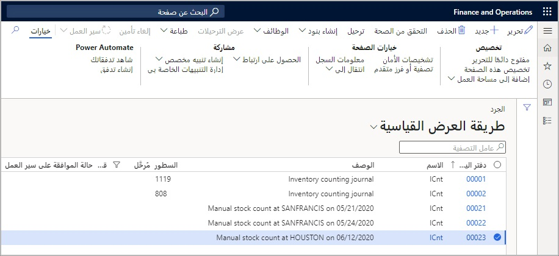

تُستخدم دفاتر يومية الجرد لتحديث جرد المخزون المادي لصنف معين داخل مستودع معين وتعديله. بينما يتعقب منطق المخزون في Commerce باستمرار المخزون الذي يأتي إلى المستودع ويخرج منه، ستحدث مواقف حيث يصبح جرد المخزون المادي الذي يتم تعقبه بواسطة التطبيق غير متطابق مع الجرد المادي للمخزون على الرف. يمكن أن يحدث هذا السيناريو لمجموعة متنوعة من المواقف، مثل عدم معالجة استلام المخزون عن طريق الخطأ، أو بسبب السرقة أو الكسر أو أي خسارة أخرى لم يتم تعديلها مسبقاً، وما إلى ذلك. 

يمكن أن تكون عمليات جرد المخزون عملية إنشاء مرتجلة من قبل موظف المتجر في تطبيق نقطة البيع، أو يمكن التخطيط لها مسبقاً من الشركة وإتاحتها لموظف المتجر لعرضها وتشغيلها من خلال نقطة البيع. 

لإنشاء دفتر يومية مرتجل للجرد من نقطة البيع، سيستخدم موظف المتجر عملية **جرد المخزون**. عند إنشاء دفتر يومية لجرد المخزون، يمكن لمستخدم نقطة البيع إضافة رقم منتج إلى دفتر يومية الجرد من خلال تحديد الوظيفة **إضافة** أو عن طريق المسح الضوئي للكود الشريطي للمنتج. يمكن للمستخدمين إدخال الكمية المجرودة يدوياً أو يمكن لكل عملية مسح ضوئي زيادة **كمية الجرد** بمقدار وحدة واحدة إذا كان الموظف يستخدم فحص الكود الشريطي.   

عند إدخال جميع الأصناف والكميات، يمكن للمستخدمين إرسال العدد إلى المركز الرئيسي لإجراء المزيد من المراجعة والترحيل. 

> [!NOTE]
> ولا يتم إنهاء تعديلات جرد المخزون حتى يتم ترحيل دفتر يومية الجرد في المركز الرئيسي. لذلك، إذا كان مستخدم نقطة البيع يبحث في المخزون الفعلي عن أحد الأصناف التي تم جردها مؤخراً ولكن لم يتم ترحيلها بعد، فلن تنعكس أعداد المخزون الفعلي التي تظهر للصنف في حساب المستخدم. 

> [!NOTE]
> يمكن أن يتغير المخزون عند بيع الأصناف أو نقلها، لذلك فمن المهم التأكد من إنشاء دفاتر يومية الجرد فقط عند إغلاق المتجر، أو عند إغلاق الموقع الفعلي حيث يتم جرد المخزون مؤقتاً، لمنع الحركة المادية حتى اكتمال الجرد وترحيله في المركز الرئيسي.

بعد إرسال الجرد من نقطة البيع، يمكن لمستخدم المركز الرئيسي الوصول إلى هذه المعلومات في المركز الرئيسي من **البيع بالتجزئة والتجارة > إدارة المخزون > عمليات جرد المخزون**.

 

