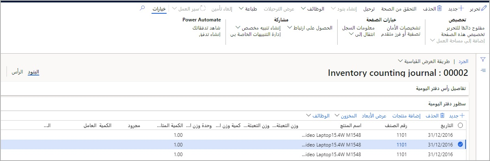
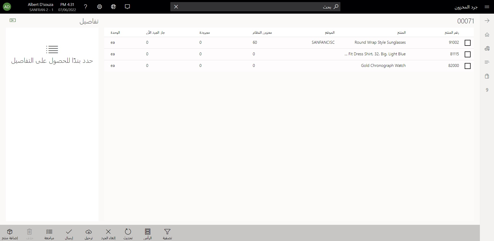

سيسمح إنشاء دفتر يومية جرد في المركز الرئيسي (HQ) لـ Commerce للشركة بإنشاء دفاتر يومية جرد لأحد المتاجر بشكل استراتيجي. ويمكن أن تساعد هذه الطريقة في تسهيل طلب الشركة لمتجر ما أن يقوم بجرد أصناف معينة بصورة دورية، مثل الأصناف المعرضة للسرقة بدرجة كبيرة أو الأصناف عالية القيمة. 

يتم إنشاء دفاتر يومية الجرد، والمعروفة أيضاً باسم **عمليات جرد المخزون** في Commerce، عن طريق تحديد **الجرد** في دفتر اليومية ثم تحديد الموقع والمستودع المناسبين للمتجر. يمكن للمستخدم الذي يقوم بإنشاء دفتر يومية الجرد بعد ذلك إضافة المنتجات سطراً بسطر أو استخدام الوظيفة **إضافة منتجات** لإضافة أصناف مجمعة حسب التدرجات الهرمية للمنتج. 

يوجد دفتر يومية **الجرد** في **البيع بالتجزئة والتجارة > إدارة المخزون > عمليات جرد المخزون** في إدخال دفتر يومية الجرد.

عندما يتم إنشاء عمليات جرد المخزون لمستودع متجر ما في المركز الرئيسي، ستظهر دفاتر يومية الجرد هذه في نقطة البيع من خلال مكالمة في الوقت الفعلي إلى المركز الرئيسي عندما يحدد مستخدم نقطة البيع عملية **جرد المخزون**. يمكن لمستخدم المتجر بعد ذلك الاطلاع على قائمة الأصناف في دفتر اليومية وملء الكمية المجرودة المناسبة. 

تُظهر لقطة الشاشة التالية سجل **HOUSTON-14** لمتجر **HOUSTON** لنقطة بيع المجموعة في صفحة **جرد المخزون**.

 

