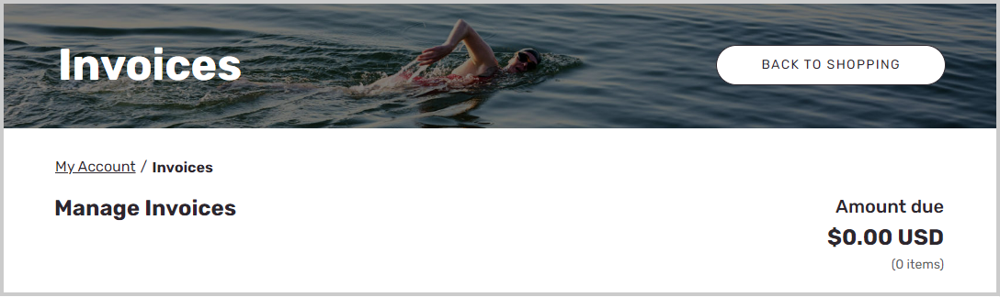

تعد إمكانات الفواتير الخاصة بمواقع التجارة الإلكترونية الخاصة بـ Commerce B2B مفيدة لشركاء الأعمال عندما يختارون كيفية الدفع مقابل طلباتهم. يمكن للمستخدم تحديد فاتورة غير مدفوعة أو مدفوعة جزئياً ثم تحديد **دفع الفاتورة**. ستتم إضافة الفاتورة المحددة إلى عربة التسوق، ومن ثم يمكن للمستخدم دفعها. يمكنهم أن يقرروا ما إذا كانوا سيدفعون المبلغ الكامل للفاتورة أو مبلغاً جزئياً، لكن لا يمكنهم استخدام طريقة الدفع عَلى الحساب لدفع الفواتير.

في Commerce headquarters، إذا تم إعداد حساب مؤسسة فِي القائمة المنسدلة لـ **حساب الفاتورة** فِي علامة التبويب السريعة **الفاتورة والتسليم** فِي سجل العميل، فسيكون المستخدم قادراً عَلى عرض ودفع الفواتير لحساب المؤسسة بالكامل أيضاً. بالإضافة إلى ذلك، يمكن للمستخدم إضافة الفواتير إلى سلة التسوق فقط إذا لم تكن هناك أصناف بها حالياً. إذا كانت الفواتير فِي سلة التسوق، فلا يمكن للمستخدم إضافة أصناف أيضاً.

> [!div class="mx-imgBorder"]
> 

يمكن للمستخدم أيضاً تحديد **طلب فاتورة** بجوار الفاتورة فِي الصفحة **الفواتير**. بهذه الطريقة، يمكن للمستخدم أن يطلب الحصول عَلى تفاصيل الفاتورة المرسلة إلى عنوان بريده الإلكتروني المسجل. عندما يطلب المستخدم فاتورة، سيتم نقل الطلب إلى القسم **طلبات B2B** فِي الصفحة **حساباتي**. سيتم تشغيل الوظائف **P-0001** و **مزامنة الطلبات والقنوات** فِي Commerce headquarters لتشغيل الرسالة الإلكترونية للفاتورة، ثم سيتم وضع علامة عَلى حالة الطلب عَلى أنها مكتملة.
