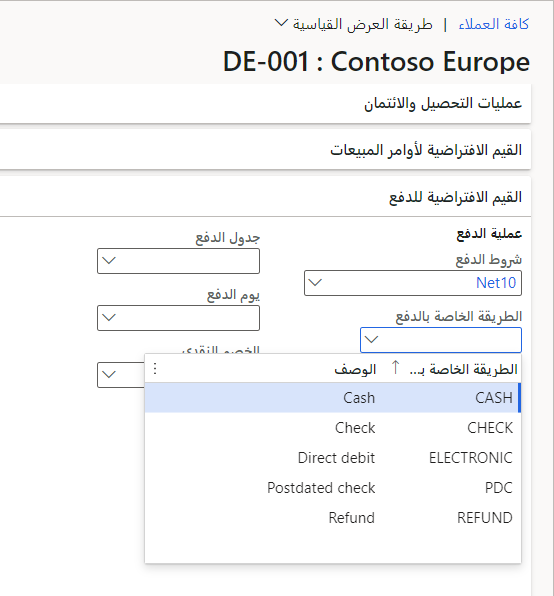

يمكن للمؤسسات الشريكة فِي الأعمال استخدام أنواع مختلفة من الدفع لشراء المنتجات والخدمات الخاصة ببائع التجزئة التي يبيعونها فِي قناة التجارة الإلكترونية. يجب إعداد كل نوع من أنواع الدفع التي تقبلها فِي Commerce headquarters. يجب أن تدعم مواقع التجارة الإلكترونية طريقة الدفع لحساب العميل.

لضمان إمكانية إعداد مدفوعات الحساب بالكامل، ستحتاج إلى إعداد بعض المتطلبات الأساسية. ستحتاج أولاً إلى إضافة الطريقة فِي Commerce headquarters، وربط طريقة الدفع لحساب العميل بقناة التجارة الإلكترونية، ثم التأكد من تمكين الخاصية **السماح فِي الحساب** للعميل فِي **البيع بالتجزئة والتجارة > العملاء > جميع العملاء > القيم الافتراضية للدفع**. يتوفر خيار طريقة الدفع عَلى الحساب لتمكين جميع العملاء من خلال تعيين الخاصية **السماح فِي الحساب** إلى **نعم** للعميل الافتراضي للقناة المرتبطة بموقع متاجرة عمل-عمل.

> [!div class="mx-imgBorder"]
> 

لتمكين طريقة الدفع لحساب العميل فِي منشئ موقع التجارة، انتقل إلى **إعدادات الموقع > الملحقات**، وقم بتعيين الخاصية **تمكين مدفوعات حساب العميل** إلى **ممكّن لعملاء متاجرة عمل-عمل**، ثم حدد **حفظ ونشر**.

لتمكين طريقة الدفع لحساب العميل عَلى صفحة الخروج لموقع التجارة الإلكترونية متاجرة عمل-عمل، تحتاج أولاً إلى البحث عن صفحة الخروج أو الجزء الذي يحتوي عَلى وحدة الخروج لموقع التجارة الإلكترونية متاجرة عمل-عمل وتعديله. في الفتحة **حاوية قسم السداد**، حدد **إضافة وحدة نمطية** ثم أضف الوحدة **مدفوعات حساب العميل**. ضع الوحدة النمطية عن طريق تحديد علامة الحذف (**...**) ثم تحديد **تحريك لأعلى** أو **تحريك لأسفل**. حدد **حفظ** ثم **إنهاء التحرير** لإيداع الصفحة، ثم حدد **نشر** لنشر التغيير.

بعد تمكين طريقة الدفع لحساب العميل، يمكنك تأكيد تمكينها ونشرها عن طريق تسجيل الدخول إلى موقع التجارة الإلكترونية، وإضافة منتج إلى سلة التسوق، والانتقال إلى صفحة الخروج لعرض طريقة الدفع **حساب العميل**.

## حدود الائتمان والائتمان

إلى جانب تمكين مدفوعات حساب العميل، قد ترغب المؤسسات فِي عرض معلومات حول حدود الائتمان وأرصدة حد الائتمان أثناء عملية الطلب. يتم تحديد هذه المعلومات من خلال الخاصية **حد الائتمان** فِي علامة التبويب السريعة **الائتمان والتحصيلات** فِي سجل العميل فِي Commerce headquarters. في سيناريوهات متاجرة عمل-عمل، يجب إرسال فاتورة بالطلب الذي تم تقديمه إلى حساب المؤسسة التي ينتمي إليها العميل. بالإضافة إلى ذلك، ستحتاج إلى تعيين الخاصية **حساب الفاتورة** فِي علامة التبويب السريعة **الفاتورة والتسليم** الخاصة بالسجل إلى معرّف حساب العميل الخاص بالمؤسسة. سيستخدم الموقع أيضاً حد الائتمان الخاص بالمؤسسة بدلاً من حد الائتمان الموجود فِي سجل العميل.

اعتماداً عَلى إعداد الخاصية **نوع حد الائتمان** فِي Commerce headquarters، يمكن أن يكون الحساب والرصيد اللذين يظهران عَلى موقع الويب فِي مواقع مختلفة. إذا تم تمكين الميزة **إدارة الائتمان**، فسيتم تحديد موقع الخاصية فِي علامة التبويب السريعة **حدود الائتمان** فِي **الائتمان والتحصيلات > الإعداد > معلمات الائتمان والتحصيلات > الائتمان**. بخلاف ذلك، إذا تم تعطيل ميزة **إدارة الائتمان**، فسيتم وضع الخاصية ضمن **التصنيف الائتماني** فِي **حسابات المقبوضات > الإعداد > معلمات حسابات المقبوضات > التصنيف الائتماني**. تدعم الخاصية **نوع حد الائتمان** عدة أنواع: **لا شيء، الرصيد**، **الرصيد + قسيمة التعبئة أو إيصال المنتج**، و **التوازن + الكل**. النوع الموصى به هو **الرصيد + قسيمة التعبئة أو قسيمة المنتج** بحيث لا تساهم أوامر المبيعات المفتوحة فِي حساب الرصيد. بالنسبة للطلبات المستقبلية، لا داع للقلق بشأن الطلبات التي تؤثر عَلى الرصيد الحالي.

لمزيد من المعلومات، راجع [تكوين طريقة الدفع لحساب العميل لمواقع التجارة الإلكترونية بين الشركات](/dynamics365/commerce/b2b/payment-method/?azure-portal=true).
