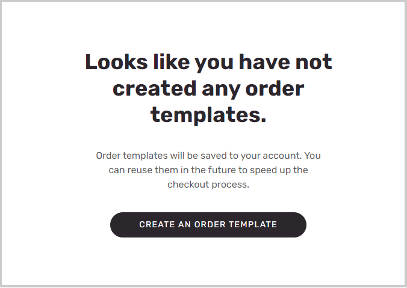

غالباً ما يعرف عملاء متاجرة عمل-عمل تماماً العناصر التي يرغبون فِي شرائها، وغالباً ما يتخطون مرحلة اكتشاف المنتج وينتقلون مباشرةً إلى الطلب. لتسهيل هذا العامل وتلبية احتياجاتهم، يمكن أن توفر مواقع التجارة الإلكترونية متاجرة عمل-عمل إمكانيات تساعد العملاء عَلى طلب هذه العناصر بسرعة وكفاءة.

يسمح الطلب المجمّع حسب رقم العنصر لمستخدمي موقع التجارة الإلكترونية للتجارة الإلكترونية متاجرة عمل-عمل بإضافة عناصر إلى سلة التسوق عن طريق إدخال أرقام عناصر المنتج مع الكمية المطلوبة. يمكنك استخدام وحدة **الطلب السريع** لإعداد هذه الإمكانية عَلى موقع الويب الخاص بك.

يعد الطلب بالجملة حسب المتغير طريقة شائعة لإضافة منتجات مختلفة ومتغيراتها بسرعة فِي طريقة عرض واحدة تُظهر توفر المخزون حسب الحجم واللون والنمط. يمكن لمستخدمي الموقع إدخال نفس الكمية لجميع المنتجات المتوفرة عن طريق تحديد **إدخال كل الكميات** فِي هذه الصفحات.

يعد الطلب بالجملة أحد الخيارات ويمكنك أيضاً إنشاء قوالب أوامر لطلب عناصر معينة معاً. قد ترغب فِي تجميع كل نوع زي موحد معاً للحصول عَلى ترتيب أكثر كفاءة، إذا كنت تقدم طلبات لمستشفى أو مدرسة أو غير ذلك. بالنسبة إلى هذه السيناريوهات، تعمل مواقع التجارة بين الشركات عَلى تمكين إنشاء قالب الطلب بحيث يمكن لمستخدمي الموقع إنشاء أي عدد من القوالب المخصصة ثم طلب كل العناصر أو بعضها من تلك القوالب حسب الحاجة.

> [!div class="mx-imgBorder"]
> 

يمكن لمستخدمي الموقع إعادة الترتيب من محفوظات الطلبات الخاصة بالعناصر لديهم. بالإضافة إلى ذلك، يمكنهم شراء العناصر المحددة من سجل الطلبات أو إضافة جميع العناصر المشتراة من الماضي إلى سلة التسوق الحالية.
