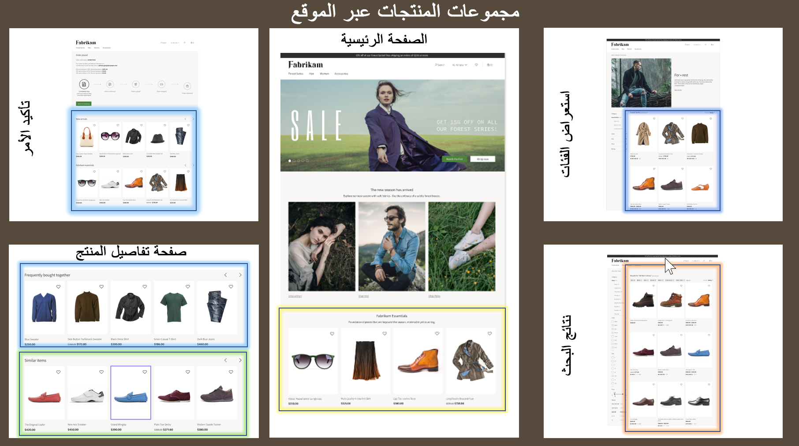

توفر توصيات الذكاء الاصطناعي في Dynamics 365 Commerce قوائم منتجات محسّنة وبميزة التعلم من الآلة والتي تتوفر لبائعي التجزئة لتنفيذها عبر أعمالهم التجارية. 

يمكن استخدام حل Commerce لعرض توصيات المنتج على موقع ويب التجارة الإلكترونية وأجهزة نقطة البيع (POS). يساعد استخدام التوصيات القائمة على الذكاء الاصطناعي على تحسين استكشاف المنتجات ومساعدة العملاء في اكتشاف محتوى جديد قد لا يدرك (المتسوق) أنه مهتم بشرائه أو لم يعثر على بديل له.

ويمكن دمج توصيات المنتج من خلال سياق رحلة المتسوق، كما يمكن أن يساعد المتسوقين على اكتشاف المنتجات المتعلقة بها بسرعة. ويعتبر هذا الانعكاس القوي لسلوك المستخدم وتفضيلاته مفيداً لمساعدة المتسوقين في العثور على المنتج الصحيح في المكان الصحيح في رحلة التسوق لديهم. 

وباستخدام التوصيات لتحسين اكتشاف المنتج، يمكن لبائعي التجزئة إنشاء فرص أكثر تحولاً، للمساعدة في زيادة عوائد المبيعات وتعظيم رضا العملاء والاحتفاظ بهم. كما يمكن استخدام البيع المتلازم وزيادة المبيعات لمساعدة العملاء في اكتشاف المنتجات التي لم يكن يعتزم شرائها أصلاً.

اكتشف بائعو التجزئة مجموعة وافرة من توصيات التطبيق عبر متاجرهم عبر الإنترنت، والتي تشمل: 

- **صفحة الوجهة** – يمكن لبائعي التجزئة تمييز المنتجات في القوائم **الجديدة** و **الأكثر مبيعاً** و **المنتجات المتداولة** في صفحة الوجهة في متجرهم.
- **صفحه تفاصيل المنتج** – في هذه الصفحة، يمكن لبائعي التجزئة اقتراح أصناف إضافية من المحتمل أن يتم شراؤها استنادا إلى سلوك المستهلك. وتظهر هذه الأصناف في قائمة **الأشخاص يفضلون أيضاً**.
- **صفحه الحركة أو صفحه المغادرة** – أثناء المغادرة، يمكن لبائعي التجزئة اقتراح أصناف تكميلية، لإكمال أمر قائم على المحتويات الموجودة في سلة العملاء. ستظهر هذه الأصناف في القائمة **الأشياء المشتراة معاً بشكل متكرر**.
- **التوصيات المخصصة** – بالنسبة للعملاء الذين يقومون بتسجيل الدخول، يمكن لبائعي التجزئة تقديم قائمة **منتقاة من أجلك** المستندة إلى سجل عمليات الشراء الأخيرة، كما يمكنهم تخصيص سيناريوهات القائمة الموجودة لكل عميل.

## وحدات مجموعة المنتجات
تساعد وحدات مجموعة المنتجات بائعي التجزئة في بناء خبرات تسوق قوية من خلال تقديم واجهة ظاهرية بديهية يمكن استخدامها لتكوين مجموعة منتجات على نحو سريع. 

تعرض الصورة التالية أنواعاً مختلفة من مجموعات المنتجات التي يتم استخدامها في موقع التجارة الكترونية.

 
يمكن تقسيم وحدة مجموعة المنتجات إلى أربعة أنواع مميزة من المجموعات:

- **القائمة التحريرية** – قائمة بالمنتجات التي تم تنظيمها يدوياً والاحتفاظ بها في حل Commerce. تتضمن هذه القائمة المنتجات التي يتم فرزها حسب الفئة أو حسب علاقتها مع المنتجات الأخرى أو التي تم تنظيمها.
- **الخوارزمية** - تحتوي هذه القوائم على عناصر مثل المنتجات الجديدة أو الأكثر مبيعاً أو المتداولة.
- **توصيات التعلّم الآلي والتوصيات السياقية** – هذه القوائم تتألف من فئات مثل **الأشخاص يفضلون أيضاً** و **الأشياء المشتراة معاً بشكل متكرر**.
- **منتقاة من أجلك** – تدعم هذه القائمة النتائج المخصصة للعملاء المسجل دخولهم فقط، وغير متاحة للمستخدمين الضيوف.

توضح لقطة الشاشة التالية كيفية إعداد قائمة منتجات جديدة من إعداد تكوين قائمة المنتجات، والذي يتم استخدامه في موقع التجارة الإلكترونية.

## خدمة التوصيات
تستخدم خدمه توصيات المنتجات تقنيتي الذكاء الاصطناعي والتعلّم الآلي من خلال استخراج البيانات التشغيلية في Commerce، ثم إرسالها إلى متجر Azure Data Lake storage أو متجر أحد الكيانات. بعد ذلك، يتم استخدام هذه البيانات لتدريب نماذج التوصيات على القوائم **الأشخاص يفضلون أيضاً** و **الأشياء المشتراة معاً بشكل متكرر** و **منتقاة من أجلك** و **منتجات جديدة** و **الأفضل مبيعاً** و **المنتجات المتداولة**.

