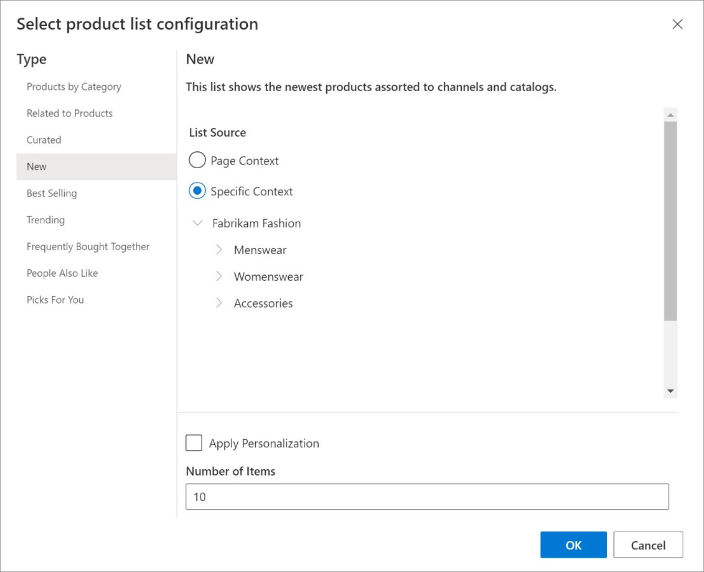

توفر توصيات الذكاء الاصطناعي في Dynamics 365 Commerce قوائم منتجات محسّنة وبميزة التعلم من الآلة والتي تتوفر لبائعي التجزئة لتنفيذها عبر أعمالهم التجارية.Dynamics 365 Commerce AI recommendations provide optimized, machine-learned product lists that are available for retailers to implement across their businesses. 

يمكن استخدام حل Commerce لعرض توصيات المنتج على موقع ويب التجارة الإلكترونية وأجهزة نقطة البيع (POS).The Commerce solution can be used to show product recommendations on an e-Commerce website and point of sale (POS) devices. يساعد استخدام التوصيات القائمة على الذكاء الاصطناعي على تحسين استكشاف المنتجات ومساعدة العملاء في اكتشاف محتوى جديد قد لا يدرك (المتسوق) أنه مهتم بشرائه أو لم يعثر على بديل له.Using AI-powered recommendations helps improve product discovery and helps customers discover new content that they (the shopper) might not have realized they were interested in purchasing or would not have found otherwise.

ويمكن دمج توصيات المنتج من خلال سياق رحلة المتسوق، كما يمكن أن يساعد المتسوقين على اكتشاف المنتجات المتعلقة بها بسرعة.Product recommendations can be integrated throughout the context of a shopper’s journey and can help shoppers quickly discover products that are relevant to them. ويعتبر هذا الانعكاس القوي لسلوك المستخدم وتفضيلاته مفيداً لمساعدة المتسوقين في العثور على المنتج الصحيح في المكان الصحيح في رحلة التسوق لديهم.This powerful reflection of user behavior and preference is beneficial to help shoppers find the right product in the right place in their shopping journey. 

وباستخدام التوصيات لتحسين اكتشاف المنتج، يمكن لبائعي التجزئة إنشاء فرص أكثر تحولاً، للمساعدة في زيادة عوائد المبيعات وتعظيم رضا العملاء والاحتفاظ بهم.By using recommendations to enhance product discovery, retailers can create more conversion opportunities, help increase sales revenue, and even amplify customer satisfaction and retention. كما يمكن استخدام البيع المتلازم وزيادة المبيعات لمساعدة العملاء في اكتشاف المنتجات التي لم يكن يعتزم شرائها أصلاً.Cross-selling and upselling can also be used to assist customers in finding products that they did not originally intend to buy.

اكتشف بائعو التجزئة مجموعة وافرة من توصيات التطبيق عبر متاجرهم عبر الإنترنت، والتي تشمل:Retailers have discovered a multitude of application recommendations throughout their online stores, including: 

- **صفحة الوجهة** – يمكن لبائعي التجزئة تمييز المنتجات في القوائم **الجديدة** و **الأكثر مبيعاً** و **المنتجات المتداولة** في صفحة الوجهة في متجرهم.**Landing page** – Retailers can highlight products in the **New**, **Best Selling**, and **Trending** lists on their store’s landing page.
- **صفحه تفاصيل المنتج** – في هذه الصفحة، يمكن لبائعي التجزئة اقتراح أصناف إضافية من المحتمل أن يتم شراؤها استنادا إلى سلوك المستهلك.**Product details page** – On this page, retailers can suggest additional items that are also likely to be purchased based on consumer behavior. وتظهر هذه الأصناف في قائمة **الأشخاص يفضلون أيضاً**.These items appear in the **People also like** list.
- **صفحه الحركة أو صفحه المغادرة** – أثناء المغادرة، يمكن لبائعي التجزئة اقتراح أصناف تكميلية، لإكمال أمر قائم على المحتويات الموجودة في سلة العملاء.**Transaction page or Checkout page** – During checkout, retailers can suggest complementary items, to complete an order based on the existing contents of the customer’s cart. ستظهر هذه الأصناف في القائمة **الأشياء المشتراة معاً بشكل متكرر**.These items appear in the **Frequently bought together** list.
- **التوصيات المخصصة** – بالنسبة للعملاء الذين يقومون بتسجيل الدخول، يمكن لبائعي التجزئة تقديم قائمة **منتقاة من أجلك** المستندة إلى سجل عمليات الشراء الأخيرة، كما يمكنهم تخصيص سيناريوهات القائمة الموجودة لكل عميل.**Personalized recommendations** – For signed-in customers, retailers can provide a personalized **Picks for you** list based on recent purchase history and can personalize existing list scenarios for each customer.

## وحدات مجموعة المنتجاتProduct collection modules
تساعد وحدات مجموعة المنتجات بائعي التجزئة في بناء خبرات تسوق قوية من خلال تقديم واجهة ظاهرية بديهية يمكن استخدامها لتكوين مجموعة منتجات على نحو سريع.Product collection modules help retailers build compelling shopping experiences by providing an intuitive visual interface that can be used to quickly compose product collections. 

تعرض الصورة التالية أنواعاً مختلفة من مجموعات المنتجات التي يتم استخدامها في موقع التجارة الكترونية.The following image shows the different types of product collections that are being used on an e-Commerce site.

 
يمكن تقسيم وحدة مجموعة المنتجات إلى أربعة أنواع مميزة من المجموعات:The product collection module can be broken into four distinct types of collections:

- **القائمة التحريرية** – قائمة بالمنتجات التي تم تنظيمها يدوياً والاحتفاظ بها في حل Commerce.**Editorial** – A list of products that are manually curated and maintained in Commerce. تتضمن هذه القائمة المنتجات التي يتم فرزها حسب الفئة أو حسب علاقتها مع المنتجات الأخرى أو التي تم تنظيمها.This list includes products that are sorted by category, by their relation to other products, or are curated.
- **الخوارزمية** - تحتوي هذه القوائم على عناصر مثل المنتجات الجديدة أو الأكثر مبيعاً أو المتداولة.**Algorithmic** – These lists contain items such as new, best-selling, or trending products.
- **توصيات التعلّم الآلي والتوصيات السياقية** – هذه القوائم تتألف من فئات مثل **الأشخاص يفضلون أيضاً** و **الأشياء المشتراة معاً بشكل متكرر**.**Machine learned, contextual recommendation** – These lists are comprised of categories such as **People also like** and **Frequently bought together**.
- **منتقاة من أجلك** – تدعم هذه القائمة النتائج المخصصة للعملاء المسجل دخولهم فقط، وغير متاحة للمستخدمين الضيوف.**Picks for you** – This list supports personalized results for signed-in customers only and are not available for guest users.

توضح لقطة الشاشة التالية كيفية إعداد قائمة منتجات جديدة من إعداد تكوين قائمة المنتجات، والذي يتم استخدامه في موقع التجارة الإلكترونية.The following screenshot shows how to set up a new product list from a product list configuration that is being used on an e-Commerce site.

## خدمة التوصياتRecommendation service
تستخدم خدمه توصيات المنتجات تقنيتي الذكاء الاصطناعي والتعلّم الآلي من خلال استخراج البيانات التشغيلية في Commerce، ثم إرسالها إلى متجر Azure Data Lake storage أو متجر أحد الكيانات.The product recommendations service uses artificial intelligence (AI) and machine learning technologies by extracting the data from the Commerce operational database and then sending it to Azure Data Lake storage or an entity store. بعد ذلك، يتم استخدام هذه البيانات لتدريب نماذج التوصيات على القوائم **الأشخاص يفضلون أيضاً** و **الأشياء المشتراة معاً بشكل متكرر** و **منتقاة من أجلك** و **منتجات جديدة** و **الأفضل مبيعاً** و **المنتجات المتداولة**.Then, this data is used to train recommendation models for the **People also like**, **Frequently bought together**, **Picks for you**, **New**, **Best selling**, and **Trending** lists.

