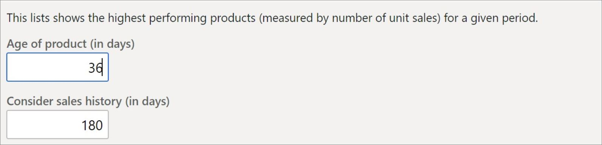

يمكن لتجار التجزئة تشغيل التوصيات بنقرة زر واحدة. يشرح هذا الموضوع كيف يمكنك تمكين توصيات المنتج والقوائم المخصصة لعملاء Commerce. 

> [!NOTE]
> سيؤدي تمكين التوصيات أيضاً إلى تمكين التوصيات الشخصية. لا يمكن لتجار التجزئة تمكين التخصيص دون تمكين خدمة التوصيات الأساسية أولاً. 

## الفحص المسبق للتوصيات

قبل تمكين التوصيات، لاحظ أن توصيات المنتج مدعومة فقط لعملاء Commerce الذين قاموا بترحيل وحدات التخزين الخاصة بهم لاستخدام Azure Data Lake storage، وأن الوظيفة غير متاحة للعملاء المحليين.

قبل تمكين التوصيات، تأكد من إجراء التكوينات التالية على الشبكة:

1.  تأكد من شراء Azure Data Lake storage والتحقق منه بنجاح في البيئة. 
2.  تأكد من تمكين قياس **RetailSales** لمتجر الكيان وتعيينه على **التحديث التلقائي**. 
3.  تأكد من أن تكوين هوية Azure Active Directory (Azure AD) يحتوي على إدخال لـ **التوصيات**. 

## تكوين هوية Azure AD
يُعد التأكد من تكوين هوية Azure AD لاحتواء إدخال للتوصيات خطوة مطلوبة لجميع العملاء الذين يقومون بتشغيل خدمة تأجير البنية التحتية (IaaS) والذين قاموا بإعداد بيئتهم الخاصة على النظام الأساسي Azure. بالنسبة للعملاء الذين يعملون على أجهزة Windows تم تكوينها مسبقاً أو أجهزة Windows الظاهرية مع Azure Service Fabric، يجب أن تكون هذه الخطوة تلقائية، ونوصي بالتحقق من تكوين الإعداد كما هو متوقع.

للتحقق من إعداد هوية Azure AD، اتبع الخطوات التالية:

1.  في Commerce، ابحث عن صفحة **تطبيقات Azure Active Directory**.
2.  تحقق من وجود إدخال لـ **RecommendationSystemApplication-1**.

    إذا لم يكن الإدخال موجودا، فقم بإضافة إدخال جديد بالمعلومات التالية:

    - **معرف العميل** - d37b07e8-dd1c-4514-835d-8b918e6f9727
    - **الاسم** - RecommendationSystemApplication-1
    - **معرف المستخدم** - RetailServiceAccount

3.  حدد **حفظ** وأغلق الصفحة.

لتشغيل توصيات المنتج، اتبع الخطوات التالية:

1.  انتقل إلى **البيع بالتجزئة وCommerce > توصيات المنتج > معلمات التوصيات**.
2.  في الصفحة **المعلمات العامة المشتركة**، حدد **توصيات المنتج**.
3.  قم بتعيين الخيار **تمكين التوصيات** على **نعم**.

توضح لقطة الشاشة التالية كيفية تمكين التوصيات في Commerce.
 

بالنسبة للتحديث 10.0.12، يمكن للتجار تمكين التوصيات من صفحة **إدارة الميزات** وتنفيذ المهام المتعلقة بالتوصيات من صفحة **تكوين التوصيات**. 

 

 
يبدأ إجراء تمكين التوصيات بعملية إنشاء قوائم توصيات المنتج. قد يستغرق الأمر عدة ساعات قبل أن تصبح القوائم متاحة ويمكن عرضها في نقطة البيع أو في Commerce.

بعد تمكين توصيات المنتج، ستصبح الإعدادات الافتراضية سارية المفعول مع القيم التي يتم ملؤها تلقائياً، يمكن تكوين معلمات السوق هذه لتجار التجزئة لتعكس تدفق الأعمال بشكل أفضل. نوصي بقضاء بعض الوقت في تقييم ما إذا كانت النتائج تتناسب مع حركة بيع المنتجات.

في الوقت الحالي، يمكن تكوين نوعين من معلمات السوق بواسطة تجار التجزئة:

- **عمر المنتج (بالأيام)** - يمكن استخدام المنتجات التي تمت إضافتها خلال العدد المحدد من الأيام قبل التاريخ الحالي لتحديد المنتجات المرشحة. تشير القيمة الافتراضية في الصورة إلى أنه يمكن استخدام المنتجات القديمة التي يصل عمرها إلى 180 يوماً في قائمة **المنتجات المتداولة**.
- **مراعاة محفوظات المبيعات (بالأيام)** - يمكن استخدام حركات المبيعات التي حدثت خلال العدد المحدد من الأيام قبل التاريخ الحالي لطلب المنتجات. تشير القيمة الافتراضية التي تظهر أعلى هذه المعلمة إلى أنه سيتم استخدام جميع مشتريات المنتج في آخر 36 يوماً لتحديد موضع المنتج في قائمة **المنتجات المتداولة**.

 
بعد تمكين التوصيات في Commerce، تحتاج إلى إضافة لوحة التوصيات إلى شاشة التحكم في نقطة البيع باستخدام أداة التخطيط قبل أن تبدأ التوصيات في الظهور على السداد وتسجيل الخروج.

## تمكين توصيات منتجات القناة متعددة الاتجاهات المخصصة
شاهد مقطع الفيديو التالي لمعرفة كيفية تمكين التوصيات الشخصية للقناة متعددة الاتجاهات.

> [!VIDEO https://www.microsoft.com/videoplayer/embed/RE4xo0b]
