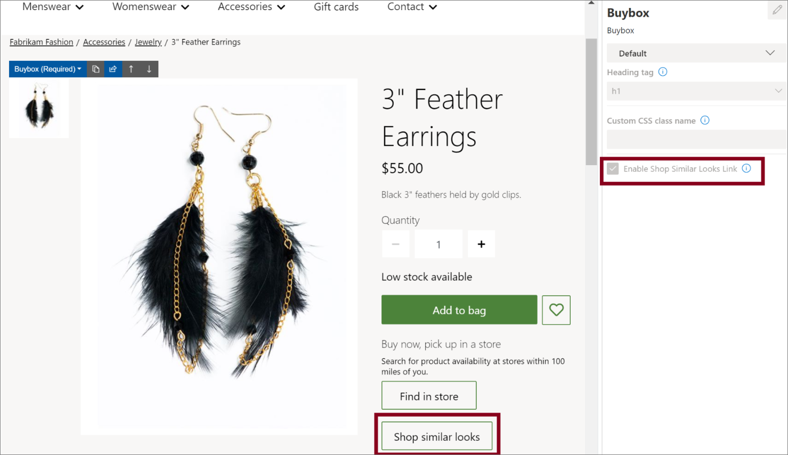

باستخدام قوة الذكاء الاصطناعي والتعلّم الآلي، توفر ميزة **التسوق بحثاً عن أشكال مماثلة** خيارات جديدة وجذابة في بداية تجربة التسوق. يمكن أن يكون التأثير تحويلياً، مما يؤدي إلى زيادة المبيعات حيث يكتشف العملاء المزيد مما يريدونه في تجربة مرئية سهلة الاستخدام. تستخدم هذه الوظيفة الصور الموجودة في كتالوج المنتجات الحالي وهي متاحة في نقطة البيع وتجارب المتجر عبر الإنترنت. 

     
بعض الأمثلة على السيناريوهات هي:

- يرى العميل سترة سوداء مخططة ويتلقى توصية بشأن سترة مماثلة باللون الأحمر. يختار العميل المنتج الموصى به بدلاً من المنتج الذي تم عرضه في الأصل ثم يتلقى توصيات لمنتجات مماثلة باللون الأحمر.

- يستخدم أحد العملاء توصيات **التسوق بحثاً عن أشكال مماثلة** لاكتشاف أقراط مطابقة لخاتم يهتم العميل بشرائه.

لمعرفة المزيد حول كيفية إعداد ميزة توصيات **التسوق بحثاً عن أشكال مماثلة** والمتطلبات الأساسية الخاصة بها، راجع [تمكين توصيات "التسوق بحثاً عن أشكال مماثلة"](/dynamics365/commerce/shop-similar-looks/?azure-portal=true).
