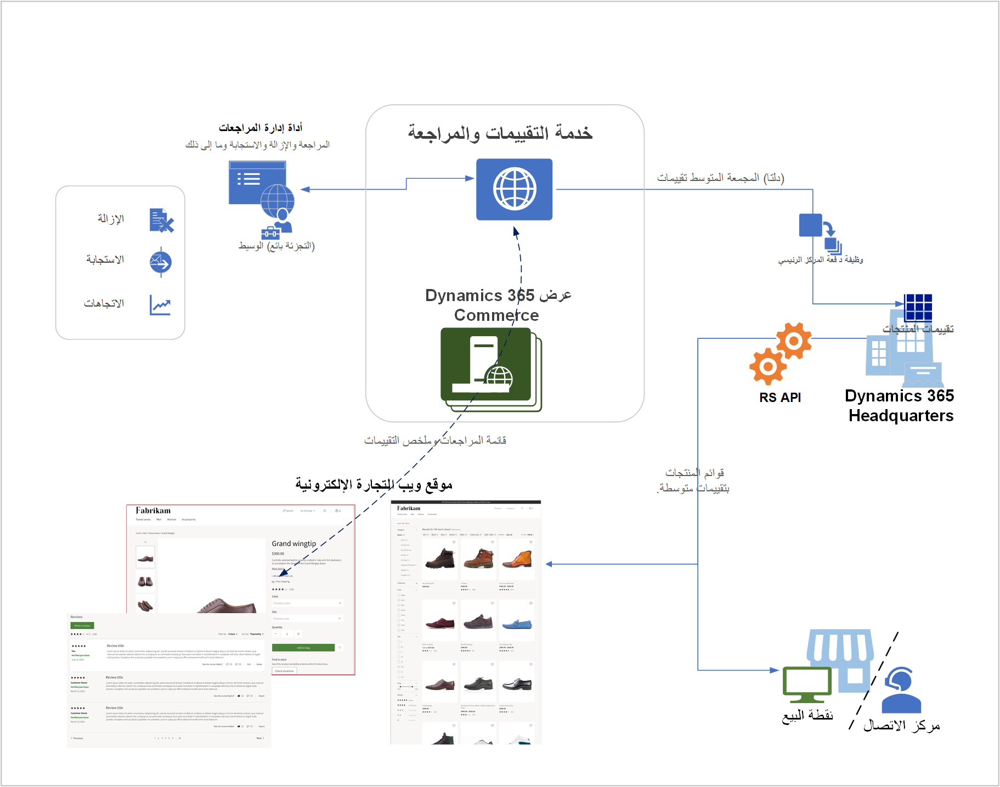

تعد وظيفة التصنيفات والمراجعات ضمن حل القناة متعددة الاتجاهات ومتوفرة أصلاً كجزء من Dynamics 365 Commerce. 

ومن خلال تطبيق هذه الوظيفة، يمكنك مساعدة المستهلكين في اتخاذ قرارات مستنيرة بشأن عملية الشراء. كما تتيح لبائعي التجزئة معرفة مراجعات وتصنيفات المنتجات من العملاء في Commerce. ومن ثم، يمكن لبائعي التجزئة استخدام هذه التصنيفات والمراجعات لتقديم خبرة مباشرة أكثر من خلال التعامل مع العملاء عبر مراجعة الردود وتحديثات معلومات جودة المنتج والإرشادات. ويمكن بعد ذلك مشاركة هذه المعلومات مع العملاء المتبقيين عبر قنوات مختلفة، مما يؤدي إلى إنشاء تجربة تسوق محسنة. 

والجزء الأساسي في الحل Commerce هو الخدمة التي تلتقط التصنيفات والمراجعات ويقوم بمعالجة البيانات الملتقطة وتجميع التقييمات والمراجعات والمشكلات. تكون الخدمة متعددة المستأجرين مقترنة بشكل وثيق مع النظام الأساسي لتقديم التجارة الإلكترونية. باستخدام هذه السمة، يمكنك الاستفادة من الوظيفة بشكل أساسي، بحيث يقوموا على الفور، عندما يتم إرسال المراجعات، بمعالجتها عبر الخدمة المعرفية والتحقق التلقائي من المراجعة. 

بعد إجراء هذه العملية، تصبح المراجعات متوفرة لكل شخص لعرضها دون الحاجة إلى انتظار أحد الوسطاء البشريين للتدخل. كما أن المراجعات المماثلة يمكن أيضاً تسهيلها عبر الوسطاء. بعد انتهاء المعالجة والتجميع، يتم إدخال البيانات في نظام التشغيل وقاعدة بيانات القناة، مما يمكًن خادم البيع بالتجزئة من إقران ملخص التقييم مع معلومات المنتج لصفحات الفئات وقوائمها. ونتيجةً لذلك، يمكنك دائماً الحصول على ملخص التصنيف بجانب معلومات المنتج للقوائم ونتائج البحث. نظراً لأن البيانات يتم إدخالها في الشبكة وتكون متوفرة عبر اتصال خادم البيع بالتجزئة، ستكون قادراً على استخدام نفس المعلومات في تطبيق نقطة البيع (POS) وسيناريوهات مركز الاتصال.

تساعد المراجعات على تجسين جودة المنتجات، مما يؤدي إلى مبيعات محسّنة. عندما يقوم العميل بمراجعة أحد المنتجات، يمكنك الرد على هذه المراجعة وسيظهر الرد على العميل بشكل فوري. يمكن أن يكون الرد في شكل معلومات المشاركة فيما يتعلق بتحسين الجودة للمنتج أو تعليمها لكيفية استخدام المنتج. سيكون هذا الرد ظاهراً أيضاً لكل العملاء الآخرين بشكل فوري. هذه الميزة هي التي تتم إتاحتها عبر عمليه التوسط. 

بخصوص المراجعات، يمكنك تصفيتها على فئات متعددة ورؤية العناصر المهمة فقط. ونظراً لأنه يمكن لأي مستخدم الإبلاغ عن أي مشكلة في المراجعة، يمكنك تصفية المشكلات على معلمات مختلفة، وعلى سبيل المثال، عرض المراجعات فقط التي لها اهتمامات مشابهة لتلك التي تم التعبير عنها بواسطة المستخدمين. 

توضح الصورة التالية كيفية إعداد هيكل التصنيفات والمراجعات في Commerce.

 
يتم ربط الخدمة "التصنيفات والمراجعات" في Headquarters التي تجعل البيانات المجمعة متاحة للقنوات المختلفة. كما يتم توصيلها بأداة إدارة المراجعات، وهي الخدمة التي يمكنك استخدامها لتحليل محتوى المراجعات والإشراف عليها قبل مشاركتها عبر القنوات وجعلها متوفرة للعملاء.

