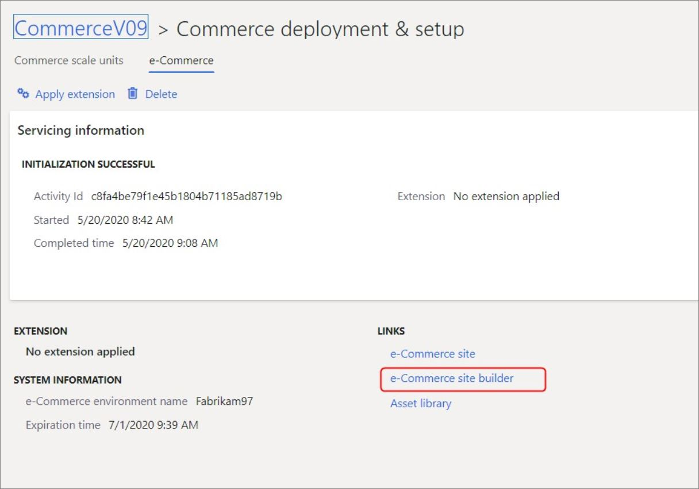
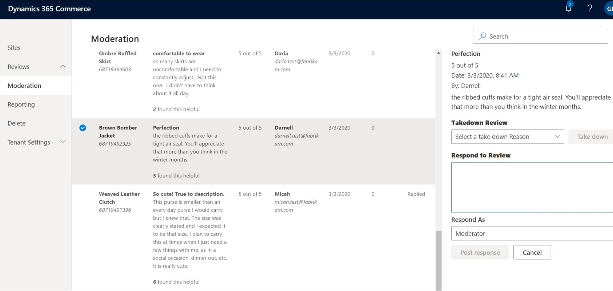
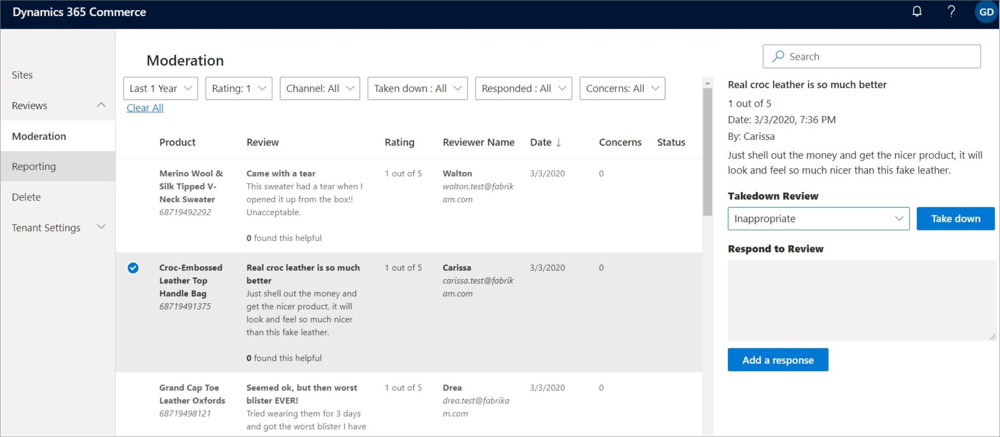

يستخدم Commerce خدمات Microsoft Azure Cognitive Services للإشراف على نص المراجعة تلقائياً عن طريق تنقيح الكلمات البذيئة. بالإضافة إلى ذلك، يمكن للمشرفين استخدام أداة الإشراف على التقييمات والمراجعات للمهام اليدوية التالية:

- الإشراف على المراجعات من خلال الرد عليها أو إزالتها.
- حذف مراجعات العميل بناءً على طلب العميل.

للوصول إلى ميزات الإشراف على التقييمات والمراجعات في أداة إدارة موقع التجارة الإلكترونية، اتبع الخطوات التالية:

1.  قم بتسجيل الدخول إلى Dynamics Lifecycle Services.
2.  افتح المشروع الذي يحتوي على البيئة حيث تريد تهيئة التجارة الإلكترونية.
3.  في قسم **البيئات**، حدد البيئة.
4.  ضمن **ميزات البيئة**، حدد **إدارة Commerce**.
5.  في علامة التبويب **التجارة الإلكترونية** ضمن **الروابط**، حدد **مُنشئ موقع التجارة الإلكترونية**.

    

لقراءة المراجعات التي تم إنشاؤها بواسطة العملاء، يمكنك إجراء بحث عن مراجعة من خلال صفحة **الإشراف** بناءً على **معرف المنتج**، **اسم المنتج**، أو **نص المراجعة**. تتيح لك عوامل التصفية الإضافية تحديد المراجعات حسب الفترة أو التصنيف أو القناة أو حالة الشكوى (تمت إزالتها أو الرد عليها أو الإبلاغ عنها).

في بعض الأحيان، قد يعبر العملاء الذين اشتروا منتجاً عن رضاهم أو عدم رضاهم، أو يذكرون أنهم لا يفهمون كيفية استخدام المنتج. بصفتك مشرفاً، يمكنك نشر رد على مراجعة ما، ويمكنك إنشاؤه باستخدام صفحة **الإشراف**. تظهر هذه الاستجابة مع المراجعة على الموقع. 

 
من المحتمل أن يكون لدى المشرفين تبرير تجاري لإزالة مراجعات العملاء. يمكنك إزالة مراجعة عن طريق تحديد مكان المراجعة في صفحة **الإشراف**، وتحديد سبب من القائمة المنسدلة **إزالة المراجعة**، ثم تحديد الزر **إزالة**.

بإمكان شركة تدير موقع تجارة إلكترونية إما الاشتراك لطلب الإشراف اليدوي على المراجعات والتقييمات الواردة، أو يمكنها نشرها تلقائياً في الموقع. يؤدي اختيار الاشتراك في الإشراف اليدوي إلى السماح للشركة بالمزيد من التحكم في المحتوى الذي يصل في نهاية المطاف إلى موقعها على الويب ويمكنه أن يمنع عرض أي تعليقات غير لائقة. عندما يقوم المشرف بمراجعة التقييمات أو المراجعات، سيكون قادراً على الموافقة على النشر في موقع التجارة الإلكترونية من خلال تقديم سبب تجاري صالح. طوال عملية المراجعة، ستعمل Azure Cognitive Services بشكل مستمر على تصفية الألفاظ البذيئة في جميع العناوين والمحتوى لضمان حماية موقع الويب الخاص بالشركة. 

راجع [تمكين طلب المشرف لميزة التقييمات والمراجعات في منشئ مواقع Commerce](/dynamics365/commerce/manual-publish-rating-reviews/?azure-portal=true) لمعرفة المزيد حول كيفية إعداد عملية الإشراف اليدوي. 
 

في حالات معينة، قد يرغب العملاء في حذف تقييماتهم ومراجعاتهم نهائياً من أحد مواقع التجارة الإلكترونية. يمكن تلبية هذا الطلب من خلال الوظيفة الأساسية لـ Commerce، التي تسمح بحذف تقييمات العملاء ومراجعاتهم. عندما يتلقى أحد المشرفين طلب إزالة من أحد العملاء، يمكنه استخدام ميزة حذف المراجعة، المقترنة بمعلومات حساب الحساب، لإزالة التقييمات والمراجعات المعنية. 

قد يستغرق الأمر ما يصل إلى سبعة أيام حتى تتم إزالة بيانات العميل تماماً من Commerce، لذلك يجب على المشرفين أخذ ذلك في الاعتبار عند التواصل مع العملاء. في حالة وجود عناصر متعددة في نتائج البحث، وهو ما يمكن أن يحدث عندما يغير العملاء أسماءهم في إعدادات حساباتهم، يجب على المشرف تحديد **حذف** لكل عنصر على حدة.

يمكن للمشرفين استخدام أداة الإشراف على التقييمات والمراجعات لاستيراد التقييمات وبيانات المراجعات بشكل مجمّع، والتي يمكنهم استخدامها بعد ذلك لتحليل الاتجاهات. بعد ذلك، يمكنهم استخدام قالب Power BI الذي يتضمن مقاييس أساسية لتوصيل البيانات المستوردة المجمعة وعرض لوحة المعلومات. يمكن أيضاً تخصيص هذا النموذج لتلبية الاحتياجات المحددة للمشرف. لتنزيل بيانات التقييمات والمراجعات، يمكنك استخدام القسم **إعداد التقارير** في أداة الإشراف وتحديد **تنزيل بيانات المراجعات** لاسترداد البيانات بتنسيق مفصول بفاصلة (CSV).

من قسم **إعداد التقارير**، يمكنك أيضاً عرض اتجاهات التقييمات والمراجعات باستخدام قالب Power BI. لإكمال هذه المهمة، تحتاج إلى تنزيل قالب Power BI وإعداده بالتصنيفات التي تم تنزيلها بالفعل وملف CSV كمصدر بيانات. بعد تطبيق مصدر البيانات الجديد وفترة معالجة البيانات، ستتمكن من عرض اتجاهات التقييمات والمراجعات التي تم تحليلها.

