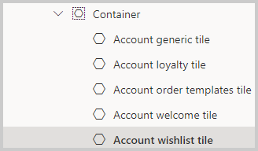
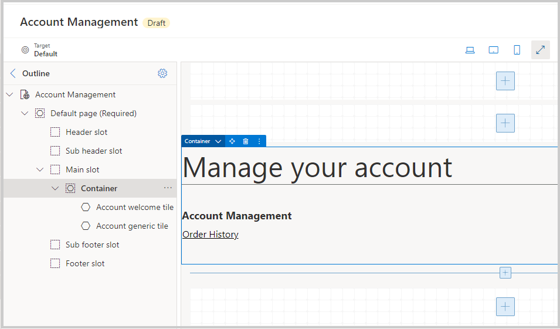

في Dynamics 365 Commerce، تسمح صفحات إدارة الحساب للعميل أو شريك الأعمال بعرض المعلومات المتعلقة بحساباتهم وطلباتهم، على غرار معظم مواقع الويب التي قد تكون طلبت منها المنتجات الشخصية. تتضمن هذه الصفحات الصفحة المقصودة **إدارة الحساب**، وصفحات ملف تعريف مستخدم، والعناوين، وسجل الأمر، وتفاصيل الأمر، ونقاط الولاء، وقوائم الرغبات.

تحتوي صفحة **إدارة الحساب** على عدة وحدات:

-   **الحاوية** - يجب وضع جميع وحدات الصفحة المقصودة إدارة الحساب داخل حاوية.

-   **لوحة ترحيب الحساب**‎ - توفر رسالة ترحيب في صفحة إدارة الحساب التي تتضمن خصائص العنوان.

-   **لوحة عامة للحساب** - توفر عناوين وروابط لصفحات إدارة الحساب، مثل **سجل الأمر‬** أو **ملف التعريف الخاص بي‬**. يمكنك استخدام هذه اللوحة لإعداد لوحة لأي صفحة.

-   **لوحة قائمة أمنيات الحساب** - توفر دعماً للعناصر الموجودة في قائمة أمنيات العميل. تتضمن خصائص العنوان ورابط عرض التفاصيل، حيث تعيد توجيه المستخدمين إلى صفحة قائمة الأمنيات.

-   **‏‫لوحة عنوان الحساب‬** - توفر ملخصاً لعناوين المستخدم وتتضمن خصائص العناوين ورابط عرض التفاصيل.

-   **لوحة ولاء الحساب**‎ - تقوم بعرض معلومات برنامج الولاء وربطها ولها حالتان مختلفتان. الحالة الأولى هي إظهار روابط للانضمام إلى برنامج الولاء إذا لم يكن المستخدم عضواً بالفعل. وتظهر الحالة الثانية روابط لعرض تفاصيل الولاء عندما يكون المستخدم عضواً. تشتمل الخصائص على العنوان، ورابط تسجيل، ورابط عرض الولاء.

> [!div class="mx-imgBorder"]
> 

تشبه عملية إنشاء صفحة إدارة الحساب إنشاء صفحة تسجيل شركاء الأعمال. ستبدأ بقالب لتضمين الوحدات التي تريد استخدامها على الصفحة، ثم ستنشر القالب المراد استخدامه. أيضاً، سيتم استخدام القالب الذي تقوم بإنشائه للصفحة المقصودة "إدارة الحساب" لعدة صفحات أخرى على موقع التجارة الإلكترونية B2B.

> [!div class="mx-imgBorder"]
> 

عندما يكون لديك القالب، يمكنك إنشاء صفحة جديدة، وترتيب اللوحات والوحدات والرسومات لتشبه موقع الويب الخاص بك، كما هو موضح في الصورة التالية.

> [!div class="mx-imgBorder"]
> 

صفحة **إدارة الحساب** تتضمن **‏‫صفحة ملف التعريف الخاصة بي‬**، والتي تعرض معلومات حساب العميل، مثل الاسم ورقم الهاتف. يمكن للعميل تحديث معلوماته على هذه الصفحة، ويمكن تخصيصها بحيث تتضمن المزيد من تفضيلات الحساب، مثل الاشتراك في الرسائل الإلكترونية التسويقية والترويجية. إذا كنت تقوم بإعداد سمات عملاء مخصصة، فسيعرض قسم **معلومات إضافية** هذه السمات أيضاً.

تتوفر **صفحة العنوان** للعملاء لإضافة عناوين إلى حساباتهم مع قائمة بالعناوين التي سبق لهم إضافتها أو حفظها في الحساب. سيقوم العميل بإدخال هذه العناوين في هذه الصفحة عند وضع أحد الأوامر. يمكن للعملاء استخدام وحدة عنوان المستخدم لإضافة العناوين وتحريرها، وتعيين العنوان الأساسي، وإظهار العناوين الموجودة على الصفحة.

تعرض الصفحتان **سجل الأمر** و **تفاصيل الأمر** ملخصاً لجميع الأوامر التي أرسلها العميل أو شريك الأعمال باستخدام حسابه. بالإضافة إلى ذلك، تقدم هذه الصفحات ملخصاً سريعاً للعناصر التي طلبها العميل، ورقم التأكيد، ومعرف المبيعات، ومعلومات التعقب، والمزيد. كما يمكن أن تتضمن الصفحات معلومات مثل عنوان الشحن ومعلومات الدفع والخصومات والضرائب وتكاليف الشحن للأمر. في حالة تحديد أمر في الصفحة **سجل الأمر**، سيتم فتح الصفحة **تفاصيل الأمر** لتوفير المزيد من المعلومات.

بالإضافة إلى ذلك، يمكنك استخدام الصفحة **برنامج الولاء** للاشتراك في برنامج الولاء أو إدارته. بعد أن يشترك العميل أو شريك الأعمال في برنامج الولاء، يمكن أن تتضمن الصفحة تفاصيل مثل عدد النقاط التي تم ربحها والنقاط التي تم استبدالها. يمكنك أيضاً التأكد من عرض المكافآت لكونك جزءاً من البرنامج في هذه الصفحة. تستخدم هذه الصفحة وحدة تفاصيل الولاء لعرض هذه المعلومات.

تستخدم صفحات **قائمة الأمنيات** وحدة قائمة الأمنيات وهي شائعة لإدارة الحساب. تعرض هذه الصفحات عادةً قائمة بالعناصر التي أضافها العميل إلى قائمة الأمنيات الخاصة به. يمكنك إضافة منتجات ومتغيرات المنتجات إلى قائمة الأمنيات، حيث يمكن للعميل إزالة عنصر من القائمة أو إضافة عنصر مباشرة إلى سلة التسوق.

> [!div class="mx-imgBorder"]
> 
