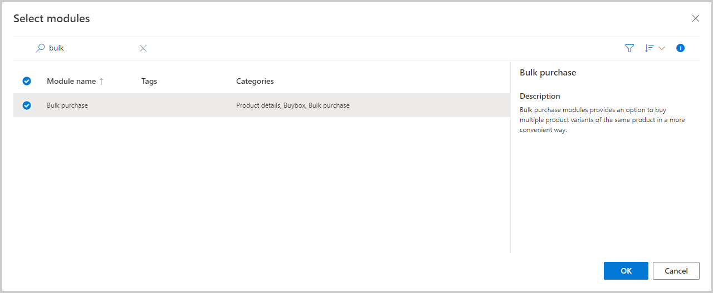

عندما يرغب العملاء في طلب متغيرات متعددة لنفس المنتج، ستلغي الوحدة النمطية للشراء المجمع الحاجة إلى تحديد مجموعة أبعاد المنتج، وتحديد الكمية، وإضافة المتغير إلى سلة التسوق، ثم تكرار العملية لمجموعات أخرى من أبعاد المنتج. توفر إضافة الوحدة النمطية للشراء المجمع في صفحة **تفاصيل المنتج** تجربة قائمة على المصفوفة تتيح للعميل إضافة متغيرات متعددة للمنتج إلى سلة التسوق في وقت واحد.

> [!div class="mx-imgBorder"]
> 

تشبه عملية إضافة الوحدة النمطية للشراء المجمع هذه إضافة الوحدة النمطية **أمر سريع**. أولاً، ستحتاج إلى تعديل القالب لصفحة **تفاصيل المنتج**. أضف الوحدة النمطية إلى الحاوية الموجودة في الوحدة النمطية **‏‏صفحة افتراضية** في جزء القالب **رئيسي**. بعد أن تقوم بإضافة وحدة **الشراء المجمع** النمطية، يمكنك حفظ القالب وإنهاء تحريره ونشره. بعد نشر القالب، انتقل إلى صفحة **تفاصيل المنتج** الخاصة بموقعك الإلكتروني. قم بتحرير الصفحة، وإضافة وحدة **الشراء المجمع** النمطية إلى حاوية النص الرئيسي، ثم يمكنك حفظ الصفحة وإنهاء التحرير ونشرها.

> [!div class="mx-imgBorder"]
> 
