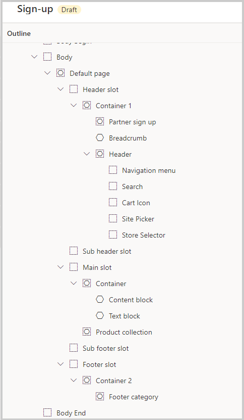

ينبغي على شركاء الأعمال الذين يستخدمون صفحات ومحتوى متاجرة عمل-عمل (B2B) طلب الوصول من خلال عملية. لكي يتمكنوا من إرسال الطلب، ستحتاج إلى إنشاء صفحة ستساعدك على تسهيل الطلب وإدارة شركاء الأعمال. تتوفر وحدة نمطية وقالب لمساعدتك في إنشاء صفحة طلب شريك أعمال. يمكنك استخدام الوحدة النمطية **تسجيل الشريك**، إلى جانب الوحدة النمطية **عنوان حساب الأعمال**، لبدء طلبات المستخدمين ليصبحوا شركاء أعمال، ثم الحصول على معلومات للطلب.

لمزيد من المعلومات، راجع [إعداد موقع التجارة الإلكترونية B2B](/dynamics365/commerce/b2b/set-up-b2b-site/?azure-portal=true).

> [!div class="mx-imgBorder"]
> 

خطوتك الأولى في العملية هي إنشاء قالب ثم إضافة وحدات نمطية إلى القالب لإنشاء الصفحة. من منظور مستخدمي الأعمال، ستعرض الحقول المكان الذي يمكنهم من خلاله ملء عناوينهم ومعلومات أخرى حول الشركة التي يمثلونها. بعد أن يرسل مستخدم الأعمال طلبه ليصبح شريك أعمال، يمكنك تحديث معلومات المقر الرئيسي في تطبيقات التمويل والعمليات لمزامنة البيانات وإكمال إنشاء مستخدم الأعمال. بعد ذلك، سيصبح مستخدم الأعمال متطوعاً محتملاً في تطبيقات التمويل والعمليات، ويمكنك الموافقة عليه في علامة التبويب **المبيعات والتسويق** لإكمال العملية. بعد الموافقة عليه، سيتمكن شريك الأعمال من التسجيل للحصول على حساب على موقع التجارة الإلكترونية على الويب مع معلومات التعريف وكلمة المرور للتسوق على موقع التجارة الإلكترونية على الويب.
