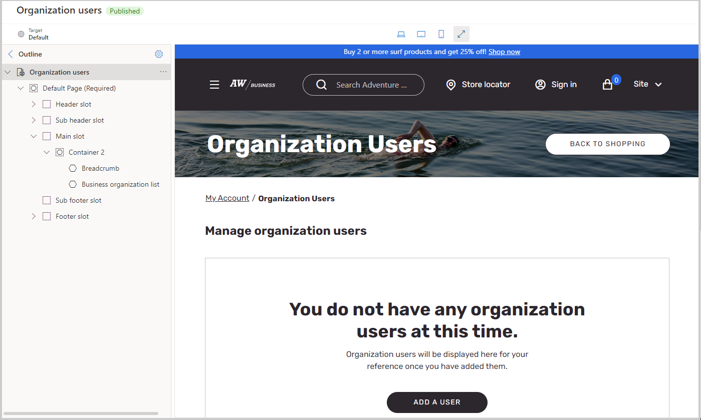

تتطلب مواقع ويب الخاصة بالتجارة الإلكترونية في B2B أن تسجل المؤسسات لتصبح شركاء عمل. ويقومون بإرسال تفاصيل التسجيل إلى موقع ويب الخاص بالتجارة الإلكترونية، ثم سيمر التسجيل من خلال عملية تأهيل. يتم بدء هذه العملية من خلال صفحة تسجيل شريك الأعمال. ولكن، بعد تسجيلها، يمكنك تعيين مسؤول لمؤسستهم. بعد ذلك، يمكن للمسؤول إضافة المزيد من مستخدمي شركاء الأعمال من خلال موقع التجارة الإلكترونية باستخدام الوحدة النمطية **‏‫لقائمة مؤسسات الأعمال‬**. يمكن لمستخدمي المؤسسة إضافة المستخدمين أو إزالتهم وتحديد أرصدة الحسابات وطلب كشوفات الحساب للمستخدم.

لإنشاء صفحة مستخدمي المؤسسة في منشئ الموقع، ستستخدم قالب **إدارة الحساب** لإنشاء صفحة باسم **مستخدمو المؤسسة**. بعد إضافة **رأس** و **تذييل** الصفحة، ستقوم بإضافة الوحدة النمطية **للحاوية** مع الوحدة النمطية **مسار التنقل** ووحدة نمطية لـ **قائمة مؤسسات الأعمال**. في خصائص **العنوان**، قم بتغيير النص إلى **مستخدمي المؤسسة**. بعد إنشاء الوحدة النمطية، يمكنك تحرير الخصائص لتمكين خصائص **فرز الجدول** و **‏‫فواصل صفحات الجدول**. أضف الرابط في الصفحة المقصودة لإدارة الحساب لإنهاء العملية.

> [!div class="mx-imgBorder"]
> 
