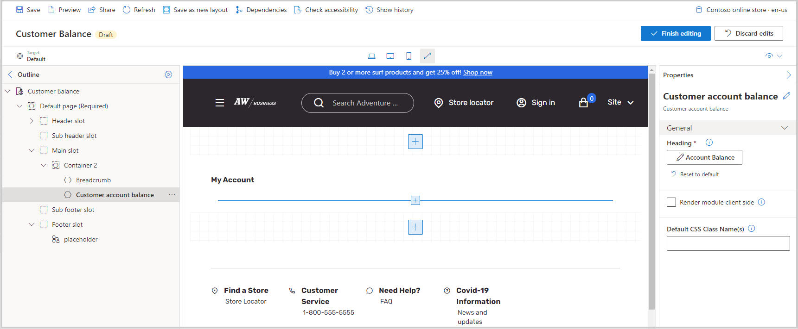

ستحتاج إلى إنشاء صفحات رصيد العملاء قبل أن يتمكن مستخدم B2B الذي قام بتسجيل الدخول من عرض رصيده على الموقع. يمكنك استخدام هذه الصفحة لعرض حسابات العملاء المعتمدة للاستخدام في دفع الأوامر. بالإضافة إلى ذلك، يمكنك عرض الرصيد المتاح لحساب العميل من صفحة إدارة حساب المستخدم.

> [!div class="mx-imgBorder"]
> 

لإنشاء صفحة رصيد العميل، ستحتاج إلى إنشاء صفحة جديدة باستخدام قالب **إدارة الحسابات**. بعد إضافة رأس وتذييل الصفحة، سيكون التركيز علي الفتحة **الرئيسية**. أولاً، قم بإضافة وحدة نمطية **تفصيلية** ثم قم بإضافة الوحدة النمطية **لرصيد حساب العميل**. قم بإعادة تسمية نص **العنوان** إلى **رصيد الحساب** ثم احفظ الصفحة وانشرها. ستحتاج أيضاً إلى التأكد من إضافة الرابط إلى صفحة رصيد العميل في صفحة **"حسابي"** الخاصة بالوحدة النمطية **للوحة رصيد حساب العميل**.
