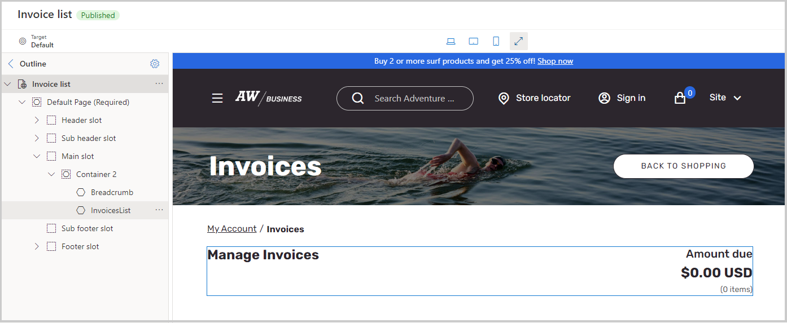

غالباً ما تتعامل الشركات مع حركات B2B على رصيد العملاء ثم ترسل فاتورة إلى العملاء بعد تحقيق الأمر. ونتيجة لذلك، تتيح مواقع التجارة الإلكترونية B2B للعملاء عرض فواتيرهم وتصفيتها لعرض الفواتير المدفوعة وغير المدفوعة والمدفوعة جزئياً مع تواريخ الاستحقاق.

يمكنك إعداد صفحات الفاتورة حيث سيحدث هذا النشاط باستخدام الوحدة النمطية **لقائمة الفواتير**، حيث تعرض الصفحة قائمة بجميع الفواتير المتاحة. من صفحة قائمة الفواتير، يمكن للمستخدمين أيضاً دفع الفواتير أو طلبها. عند تحديد فاتورة في صفحة **قائمة الفواتير**، تعرض صفحة **تفاصيل الفاتورة** تفاصيل تلك الفاتورة. يمكن للمستخدمين أيضاً تحديد **معرف الفاتورة** في صفحة **قائمة الفواتير** كما ستظهر صفحة **تفاصيل الفاتورة** وتعرض لهم المزيد من التفاصيل. ستقوم بإنشاء هاتين الصفحتين بطريقة مماثلة لإنشاء الصفحات التي تعرفت عليها بالفعل.

لإنشاء صفحة قائمة فواتير في أداة إنشاء المواقع، ستستخدم قالب **إدارة الحساب** لإنشاء صفحة تسمى **قائمة الفواتير**. ستحتوي هذه الصفحة على **رأس** و **تذييل** و **الجزء** **الرئيسي**. سيتضمن **الجزء** **الرئيسي** الوحد النمطية **للحاوية** التي تحتوي على الوحدة النمطية **للتنقل التفصيلي** والوحدة النمطية **InvoicesList**. بعد الانتهاء من إضافة الوحدات النمطية، احفظ الصفحة ثم حدد **إنهاء التحرير** لتسجيل الدخول إلى الصفحة ونشرها. بعد ذلك، ضمن صفحة **إدارة الحسابات** التي تم الانتقال إليها، قم بتحرير جزء خصائص اللوحة للوحدة النمطية لـ **لوحة فواتير الحساب** وقم بإضافة ارتباط إلى **قائمة الفواتير** ثم قم بنشر هذه الصفحة أيضاً.

> [!div class="mx-imgBorder"]
> 

تتم إضافة صفحة **تفاصيل الفاتورة** في مُنشئ الموقع بنفس طريقة إضافة الوحدات النمطية الأخرى. باستخدام قالب **الصفحة المقصودة لإدارة الحساب** ستنشئ صفحة جديدة تسمى **تفاصيل الفاتورة**. في قسم **الجزء** **الرئيسي** بهذه الصفحة، ستقوم بإضافة **التنقل التفصيلي** والوحدة النمطية **تفاصيل الفاتورة** ثم ستقوم بحفظ الصفحة والانتهاء من تحريرها ثم نشر الصفحة.
