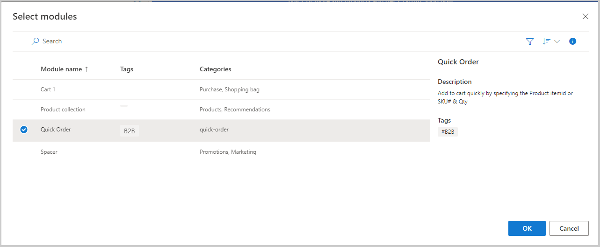

توفر وحدة **الطلب السريع** طريقة لإضافة عناصر متعددة إلى سلة التسوق باستخدام معرّفات العناصر. عندما تتم إضافة الوحدة إلى صفحة عربة التسوق الخاصة بالموقع، فإنها تمكن العملاء من إضافة عناصر متعددة بسرعة. ستحتاج إلى قالب عربة موجود لإضافة هذه الوحدة إليه.

بعد تحديد قالب صفحة عربة التسوق لموقعك، سترغب فِي تحرير القالب. انتقل إلى قسم **الفتحة** **الرئيسية** فِي وحدة **الصفحة الافتراضية**، وحدد علامة الحذف (**...**)، ثم حدد **إضافة وحدة**. في المربع **إضافة وحدة نمطية**، حدد وحدة **حاوية** جديدة. في فتحة **الحاوية**، أضف وحدة أخرى. في هذه الوحدة الجديدة، حدد وحدة **الطلب السريع** ثم قم بحفظ القالب وإنهاء التحرير ونشره.

بعد قيامك بتحرير القالب، ستقوم بتحرير صفحة سلة التسوق الخاصة بك لتضمين الوحدة الجديدة. في وحدة **الفتحة** **الرئيسية** لـ **الصفحة الافتراضية** الخاصة بك، عَلى الصفحة فِي منشئ الموقع، ستضيف وحدة **حاوية** ثم تضيف وحدة **طلب سريع** فيها. بعد إنشاء وحدة **الطلب السريع**، يمكنك حفظ صفحتك الجديدة وإنهاء تحريرها ونشرها.

> [!div class="mx-imgBorder"]
> 
