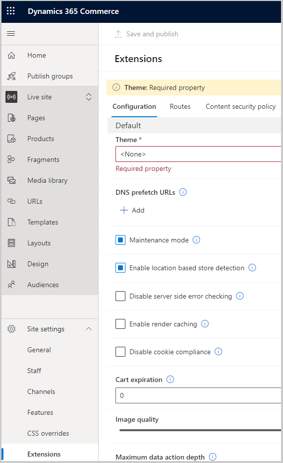
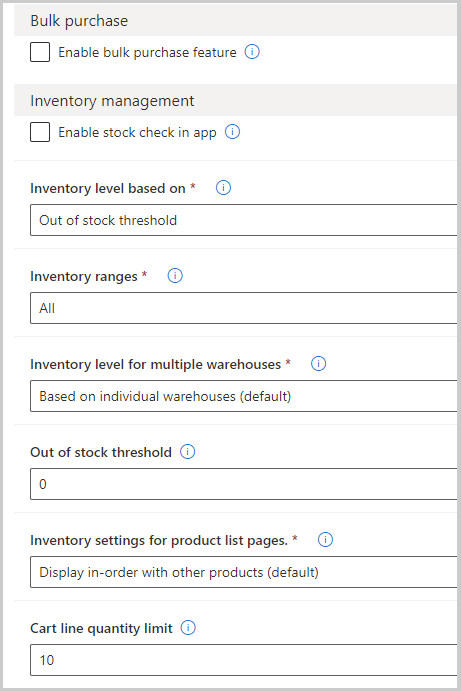

الإعدادات عَلى مستوى الموقع هي إعدادات خاصة بموقع التجارة الإلكترونية والتي تحدد بشكل كبير التجربة لأي شخص يزور الموقع. توجد هذه الإعدادات فِي أداة إنشاء الموقع ضمن **إعدادات الموقع > الملحقات**.

> [!div class="mx-imgBorder"]
> 

يمكن أن تكون بعض الإعدادات ميزات مضمنة أو مستبعدة بناءً عَلى الإعدادات الموجودة فِي هذا القسم من أداة إنشاء المواقع. يمكنك تمكين فحص المخزون فِي أحد التطبيقات من خلال إعدادات إدارة المخزون أو تمكين ميزة الشراء بالجملة عَلى الموقع الذي تقوم بإنشائه. يمكنك تمكين فحص المخزون فِي أحد التطبيقات من خلال إعدادات **إدارة المخزون** أو تمكين ميزة الشراء بالجملة عَلى الموقع الذي تقوم بإنشائه. تأكد من أن الامتدادات الموجودة داخل Microsoft Dynamics 365 Lifecycle Services هي الأحدث المتوفرة من Microsoft وأنها تتطابق مع الإصدار الذي تم نشر موقع التجارة الإلكترونية عليه. سيضمن هذا التأكيد أنه يمكنك عرض جميع إعدادات الموقع الصحيحة والمحدثة فِي منشئ موقع التجارة.

> [!div class="mx-imgBorder"]
> 

على الرغم من توفر العديد من الخيارات المختلفة فِي الإعدادات عَلى مستوى الموقع، هناك خياران مخصصان لمواقع متاجرة عمل-عمل:

-   **تمكين مدفوعات حساب العميل** - يتيح هذا الإعداد للمستخدمين الدفع مقابل الطلبات باستخدام حسابات العملاء.

-   **تمكين حدود كمية الطلب** - يتيح لك هذا الإعداد تعيين قيود عَلى عدد العناصر التي يمكن لشخص ما طلبها لكل منتج أو فئة.

يمكنك تعيين كلا الإعدادين لجميع العملاء، عملاء متاجرة عمل-عمل فقط، لعملاء متاجرة عمل-عمل فقط، أو يمكنك تعطيل كليهما لجميع العملاء، وهو الإعداد الافتراضي. ابحث فِي إعدادات الموقع للتأكد من أن موقعك قد تم إعداده بأفضل طريقة لشركتك.
