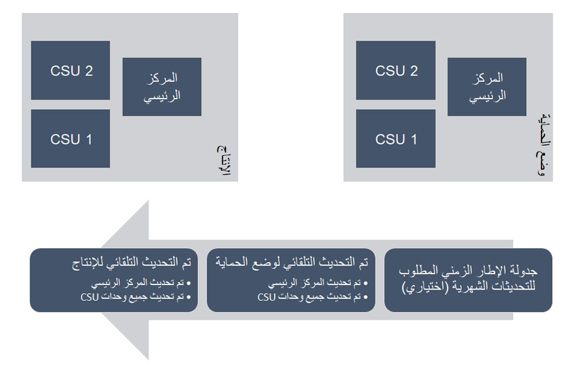
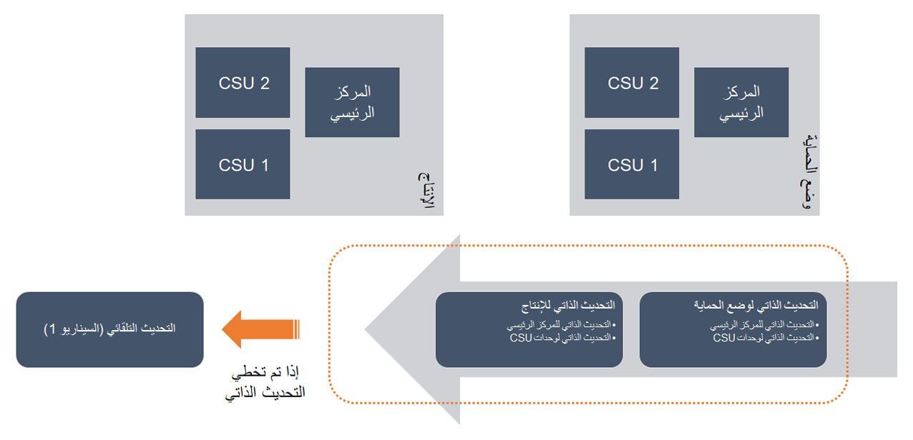
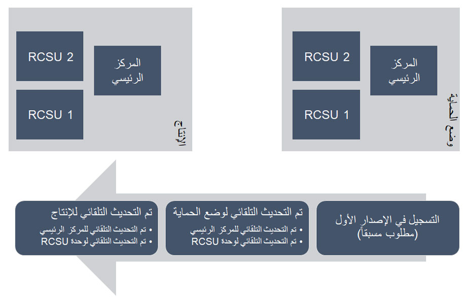

يمكن إجراء عملية تحديث التجارة في عدة سيناريوهات. يتم تمييز هذه السيناريوهات بناءً على نوع التحديث الذي سيتم تطبيقه. السيناريوهات المحتملة هي:

- التحديث التلقائي
- التحديث الذاتي 
- الإصدار الأول

## التحديث التلقائي
يُعرف التحديث التلقائي أيضاً باسم **إصدار واحدة** والغرض من ذلك هو أن جميع العملاء يستخدمون نفس الإصدار عبر النظام الأساسي. تصبح التحديثات عبارة عن تحديثات لا تعمل باللمس، مما يعني أن التحديثات تتم تلقائياً. 

يتيح هذا السيناريو التحديث التلقائي لـ TEST،UAT،Sandbox والإنتاج، وهو موضح في الصورة التالية.

## التحديث الذاتي
ينطبق نهج التحديث الذاتي على متاجر الطوب والملاط ووحدات مقياس التجارة (CSUs). تبدأ التحديثات بتحديث مكون المقر الرئيسي للتجارة (HQ) ثم كل وحدات CSUs بشكل منفصل لتمكين منهجية الطرح التدريجي. 

يتيح لك الطرح التدريجي التحقق من صحة سيناريوهات الإنتاج قبل دفع التحديث إلى الإنتاج، ويساعدك على التأكد من أن جميع المتاجر تستخدم نفس الإصدار. 

يتمثل الاختلاف بين هذا الأسلوب والتحديث الآلي بالكامل في أنه على الرغم من تحديث كل شيء تلقائياً، تتم إدارة عملية التحديث الذاتي فيما يتعلق بجدول التحديث. يمكّنك هذا النهج من إنشاء فترة تجميد مؤقتة في حالة الإجازات أو فترات العمل الحرجة التي لم يتم فيها تنفيذ عملية التحديث التلقائي. بعد انتهاء هذه الفترة، سيتم تشغيل التحديث يدوياً أو إجراء سيناريو التحديث التلقائي. 

يظهر سيناريو التحديث الذاتي في الصورة التالية.

  

## الإصدار الأول
الإصدار الأول هو المكان الذي قمت فيه بالاشتراك للحصول على أحدث الإصدارات بشكل متكرر أكثر من نوع التوفر العام القياسي للعميل. من حيث التحديثات، إنه نفس نموذج التحديثات التلقائية. الاختلاف الوحيد هو أنك في هيكل أحدث من البيئة القياسية، مع آخر التحديثات والمعلومات. 

يظهر سيناريو الإصدار الأول في الصورة التالية.

 

## خيارات التحديث

يتوفر نوعان من التحديثات:

- **تحديث الجودة** – إصدار تراكمي يحتوي على إصلاحات للمشكلات المتعلقة بإصدار المنتج الذي تقوم بتشغيله حالياً.
- **تحديث الخدمة** – الإصدار الذي يتم تطبيقه تلقائياً حالياً على البيئات استناداً إلى إعدادات التحديث في Lifecycle Services (LCS). وهو عبارة عن إصدار تراكمي يحتوي على ميزات ووظائف جديدة وتحديثات الجودة ذات الصلة المتوفرة بشكل عام.

لمزيد من المعلومات، راجع [قم بتنزيل التحديثات من Lifecycle Services (LCS)](/dynamics365/fin-ops-core/dev-itpro/migration-upgrade/download-hotfix-lcs/?azure-portal=true#segment-update-option-by-product-and-version).

