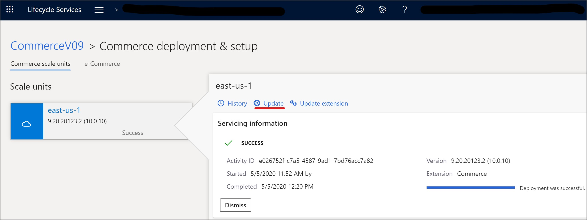

لعرض التحديثات المتوفرة لبيئتك، اتبع الخطوات التالية:

1. قم بتسجيل الدخول إلى Lifecycle Services باستخدام بيانات الاعتماد الخاصة بك.
2. في مشروع Lifecycle Services، حدد بيئة.
3. في صفحة **تفاصيل البيئة** قم بالتمرير لأسفل لرؤية **التحديثات المتاحة**.

    
 

لتطبيق تحديث على بيئة غير إنتاجية باستخدام Lifecycle Services، اتبع الخطوات التالية:

1. قم بتسجيل الدخول إلى Lifecycle Services باستخدام بيانات الاعتماد الخاصة بك.
2. في مشروع Lifecycle Services، حدد بيئة.
3. افتح عرض **تفاصيل البيئة** للبيئة حيث تريد تطبيق التحديث.
4. حدد التحديث الذي تريد تثبيته في قسم **التحديثات المتوفرة**.
5. حدد **عرض التحديث**.
6. في صفحة **التحديثات الثنائية** حدد **حفظ الحزمة**.

    
 
7. في صفحة **مراجعة وحفظ التحديثات** حدد الحزم التي تريد تثبيتها ثم حدد **حفظ الحزمة**.

    
 
8. في صفحة **حفظ الحزمة في مكتبة الأصول** أدخل القيم في حقلي **الاسم** و **الوصف** ثم حدد **حفظ الحزمة**. سترى الرسالة التي تفيد **تم حفظ حزمة التحديث في مكتبة الأصول؛ قد يستغرق هذا عدة دقائق**. 
9. عندما يتم حفظ حزمة التحديث بنجاح، حدد **تم**. 
10. في صفحة **تفاصيل البيئة** حدد **صيانة > تطبيق التحديثات** لتطبيق تحديث.
11. حدد الحزمة المراد تطبيقها. يمكنك استخدام عامل التصفية للعثور على الحزمة الخاصة بك.
12. حدد **تطبيق**. تتغير الحالة في الزاوية العلوية اليمنى من صفحة **تفاصيل البيئة** من **في قائمة الانتظار** إلى **قيد التقدم** و يعرض قسم **تحديثات البيئة** الآن تقدم الحزمة. يمكنك تحديث الصفحة للتحقق من الحالة.
13. عند تطبيق الحزمة، تتغير حالة البيئة إلى **تم التوزيع** وتتغير حالة الخدمة إلى **مكتمل**.

> [!NOTE]
> كل تحديث أو حزمة تريد تطبيقها يجب أن يسبق تطبيقها بنجاح على بيئة إنتاج آلية واحدة على الأقل في نفس المشروع.

للتعرف على المتطلبات الأساسية والخطوات لتطبيق تحديث على بيئة إنتاج، راجع [تطبيق التحديثات على مجموعة بيئات](/dynamics365/fin-ops-core/dev-itpro/deployment/apply-deployable-package-system?azure-portal=true#apply-a-package-to-a-production-environment-by-using-lcs).

## تحديث Commerce Scale Unit 

لتحديث Commerce Scale Unit ‏(CSU) (المُدارة بواسطة Microsoft)، اتبع الخطوات التالية:

1. قم بتسجيل الدخول إلى Lifecycle Services باستخدام بيانات الاعتماد الخاصة بك.

2. في مشروع Lifecycle Services، حدد بيئة Commerce الخاصة بك.

3. في قسم **إدارة البيئة** حدد **إدارة** في قسم **ميزات البيئة** بجوار **Commerce**.

    
    
4. في قسم **Commerce scale units** حدد وحدة المقياس التي تريد تحديثها ثم حدد **تحديث**.

    
    
5. في صفحة **تحديث** التي تفتح، حدد إصدار التحديث الذي تريد تطبيقه من القائمة المنسدلة **تحديد إصدار** ثم حدد **تحديث**. 

> [!NOTE]
> يتطلب تطبيق تحديث الجودة عادةً حوالي ساعة واحدة من وقت تعطل القنوات التجارية المرتبطة بوحدة المقياس.

## حزم التوزيع والتثبيت المستقلة لـ Store Commerce لنظام Windows وStore Commerce للمتصفحات ومحطة الأجهزة (HWS) وملحقات CSU
تقوم وظيفة إدارة الحزم بتقسيم الامتدادات عن المكونات الرئيسية، مما يسمح لك بإدارة كل حزمة على حدة. يتم فصل إطار عمل المثبت الأساسي ومثبتات الملحقات. يدعم تطوير Store Commerce لـ Windows وStore Commerce للمتصفحات وتعبئة هذه الحزمة المستقلة ونموذج التثبيت من خلال توريث تقنيات حزمة Windows الاختيارية وجسر سطح المكتب وMSIX.
 
يتم إنشاء جميع امتدادات Store Commerce لنظام Windows كملفات APPX منفصلة ضمن هذا النموذج، وتقوم الذاكرة الأساسية لـ Store Commerce بتحميل ملفات APPX هذه كوظائف إضافية. سيتم تشغيل الوظائف الإضافية (ملحقات APPX) ضمن سياق الذاكرة الأساسية لهوية تطبيق Store Commerce لنظام Windows. لن يتمكن امتداد APPX من العمل من تلقاء نفسه. فقط APPX الأساسي سيكون قادراً على تحميله. قم بترحيل الكود إلى قالب الامتداد الجديد لترحيل امتداد Store Commerce لنظام Windows القديم إلى هذا النموذج الجديد. لدعم عناصر تحكم وإطار عمل واجهة المستخدم الجديدة، قد تكون هناك حاجة إلى بعض إعادة بناء التعليمات البرمجية.

تسمح أطر عمل التثبيت HWS وCSU بإنشاء أدوات التثبيت التي تحتوي فقط على مكونات الامتداد.

## تجربة عدة تطوير البرامج (SDK) عبر الإنترنت من Commerce
يتم نشر جميع تحديثات SDK في مستودع NuGet وGitHub العام بحيث يمكن تنزيل التحديثات وتطبيقها على البيئة في دقائق. هذا النهج يوفر الوقت والجهد للمطورين.

- **تطوير الامتداد** - لتقليل التكلفة وتبعية VM لتطوير Lifecycle Services، يتم فصل تجربة تطوير التجارة عن VM لمطور Lifecycle Services، ويتم دعم التطوير خارج VM للمطور. يمكن إجراء التطوير على أي جهاز تطوير يدعم تكوينات بيئة تطوير التجارة.
- **مرجع Commerce SDK إلى NuGet** - يمكن أن تستهلك الإضافات مراجع Commerce SDK بعد إعادة تصميمها ونشرها في تغذية NuGet جديدة. يمكن للملحق تنزيل الثنائيات من حزمة NuGet بدلاً من الرجوع إليها يدوياً في مجلد SDKReference. باستخدام سير عمل مدير الحزم NuGet يمكن تحديث الحزمة إلى أحدث إصدار متوفر.
- **Commerce SDK samples to GitHub** - جميع نماذج Commerce SDK عامة على GitHub بحيث يمكن للملحقات الرجوع إليها، ويمكن للمستخدمين معرفة كيفية تخصيص حل Dynamics 365 Commerce لدعم الأعمال المخصصة عملية. بدون الحاجة إلى تنزيل أي إصلاح عاجل ثنائي من Lifecycle Services وتطبيقه، يمكن تنزيل العينات المحدثة بسهولة أو الرجوع إليها عن طريق الاستنساخ إلى هذا المستودع العام.

