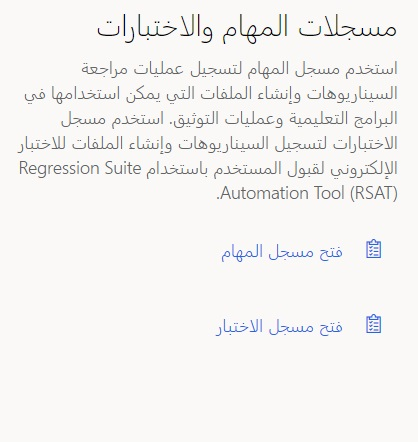
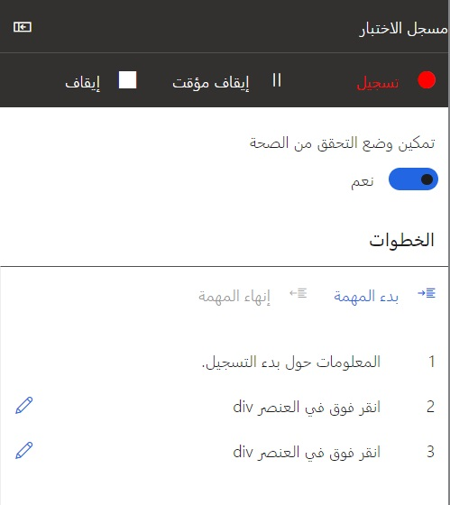
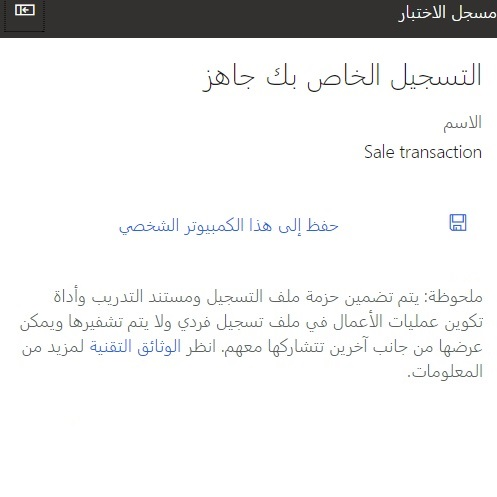

لإنشاء تسجيل باستخدام ميزة "مسجل الاختبارات"، تحتاج أولاً إلى تمكين التسجيل التجريبي في Store Commerce. لتشغيل وظيفة التسجيل التجريبي في Store Commerce، اتبع الخطوات التالية في Commerce:

1.  انتقل إلى **البيع بالتجزئة والتجارة > إعداد القناة > إعداد نقطة البيع > السجلات**.
2.  حدد السجل الذي ينبغي تشغيل وظيفة التسجيل التجريبي فيه.
3.  في علامة التبويب **السجل** في علامة التبويب السريعة **عام**، قم بتعيين الخيار **تمكين مسجل الاختبار والمهمة** على **نعم**.
4.  حدد **حفظ**.
5.  انتقل إلى **البيع بالتجزئة والتجارة > تكنولوجيا معلومات البيع بالتجزئة والتجارة > جدول التوزيع**.
6.  حدد المهمة **السجلات (1090)**، ثم حدد **تشغيل الآن**.

شاهد الفيديو التالي للحصول على عرض توضيحي حول كيفية استخدام مسجل المهام مع تطبيقات التمويل والعمليات بحيث يمكنك إنشاء حالات اختبار لاستخدامها مع RSAT. وهذه هي الطريقة نفسها المتبعة في Commerce.

 > [!VIDEO https://www.microsoft.com/videoplayer/embed/RE4uM5U]

اتبع الخطوات التالية لإنشاء تسجيل جديد باستخدام مسجل الاختبار:

1.  تشغيل Store Commerce لـلمتصفحات.
2.  حدد رمز الهامبرغر في الجزء الأيمن، ثم حدد **الإعدادات**. لا تقم بتسجيل الدخول إلى Store Commerce للمتصفحات. يجب تسجيل خطوة تسجيل الدخول كجزء من تدفق التسجيل التجريبي، لذلك تحتاج إلى تشغيل المُسجل قبل تسجيل الدخول.
3.  في صفحة **الإعدادات**، في القسم **مسجلات الاختبار والمهمة**، حدد **فتح مسجل الاختبار**.
    
4.  حدد **إنشاء تسجيل جديد**.
5.  أدخل **الاسم** و **الوصف** للتسجيل، ثم حدد **بدء**. يدخل مسجل الاختبار في وضع التسجيل، وتبدأ جلسة التسجيل. تعرض الصفحة **مسجل الاختبار** المعلومات وعناصر التحكم المتعلقة بجلسة التسجيل.

    
    
    يجب أن يبدأ كل تسجيل تجريبي من صفحة تسجيل الدخول إلى Store Commerce للمتصفحات. إذا تم بدء التسجيل من الصفحة الرئيسية، فستفشل أي حركة أو تشغيل آخر للصفحة، وستحتاج إلى بدء التسجيل مرة أخرى من صفحة تسجيل الدخول.

6.  قم بإجراء التسجيل في واجهة مستخدم Store Commerce.
7.  بعد إنهاء جلسة التسجيل، يمكنك تحميل التسجيل عن طريق تحديد **حفظ إلى هذا الكمبيوتر**.
    

يتم حفظ ملف ‎.axtr في نظام الملفات المحلي. يجب تحميل هذا الملف يدوياً إلى LCS أو Azure DevOps ثم حذفه من نظام الملفات أو تأمينه.

للتحميل إلى Azure DevOps مباشرةً:

1.  قم بتغيير امتداد الملف ‎.axtr إلى ‎.zip.
2.  افتح حزمة ‎.zip.
3.  سيكون داخل الحزمة ملف باسم Recording.xml. تحميل ملف Recording.xml إلى حالة الاختبار في Azure DevOps. لا تقم بتحميل حزمة ‎.zip أو ‎.axtr بالكامل.
