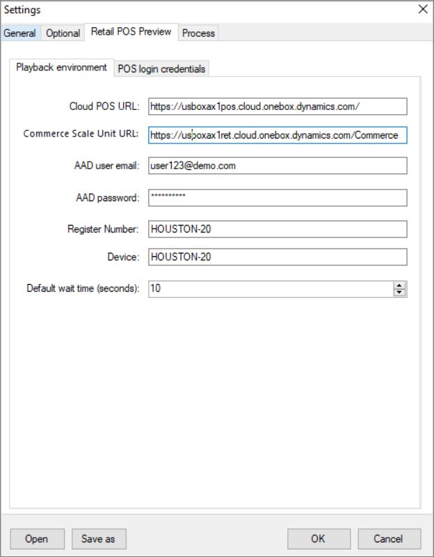
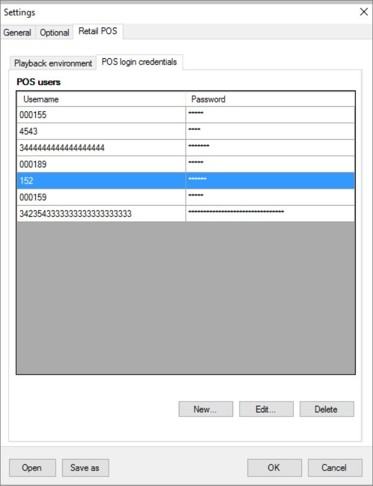

يمكنك تنزيل ملف حزمة Windows Installer‏ (MSI) لـ RSAT من [Regression Suite Automation Tool ‏(RSAT لتطبيقات Finance and Operations)](https://www.microsoft.com/download/details.aspx?id=57357).You can download the Windows Installer (MSI) package file for RSAT from [Regression Suite Automation Tool (RSAT for Finance and Operations apps)](https://www.microsoft.com/download/details.aspx?id=57357). انقر نقراً مزدوجاً فوق الملف MSI لتشغيله.Double-click the MSI file to run it. بعد تثبيت RSAT، سيطالبك بمكتبات برنامج تشغيل مستعرض الويب وSelenium.After you install RSAT, it will prompt for Selenium and web browser driver libraries. إذا كانت المكتبات المطلوبة مفقودة، فسيقوم RSAT بتثبيتها لك تلقائياً.If the needed libraries are missing, RSAT will automatically install them for you.

يصف الإجراء التالي التكوين المطلوب لتشغيل حالات اختبار نقطة البيع لتكوين RSAT.The following procedure describes the configuration that is required to run the POS test cases to configure RSAT.

1.  افتح RSAT من سطح المكتب.Open RSAT from your desktop.
2.  حدد **الإعدادات** في أعلى اليمين لتكوين RSAT.Select the **Settings** button in the upper right to configure RSAT.
3.  في مربع الحوار **الإعدادات**، حدد علامة التبويب **اختياري** وحدد خيار **تكوين Retail POS** لتمكين أتمتة Retail POS.In the **Settings** dialog box, select the **Optional** tab and select the **Configure Retail POS** option to enable the Retail POS automation.
4.  في مربع الحوار **الإعدادات**، في علامة التبويب **Retail POS** في علامة التبويب **بيئة التشغيل**، قم بتعيين الحقول التالية:In the **Settings** dialog box, on the **Retail POS** tab of the **Playback environment** tab, set the following fields:
    - **عنوان URL لنقطة البيع السحابية** - أدخل عنوان URL لبيئة نقطة البيع السحابية حيث تريد إجراء الاختبار.**Cloud POS URL** – Enter the URL of the Cloud POS environment where you want to run the test.
    - **عنوان URL لوحدة Commerce Scale Unit** – أدخل عنوان URL لوحدة Commerce Scale Unit الذي يجب استخدامه لتنشيط الجهاز إذا لم يتم تنشيط الجهاز بالفعل.**Commerce Scale Unit URL** – Enter the Commerce Scale Unit URL that should be used for device activation if the device hasn't already been activated. 
    - **البريد الإلكتروني لمستخدم Azure AD** - أدخل عنوان البريد الإلكتروني لمستخدم Azure Active Directory‏ (Azure AD) الذي يجب استخدامه لتنشيط الجهاز.**Azure AD user email** – Enter the email address of the Azure Active Directory (Azure AD) user that should be used for device activation. يجب أن يكون لدى مستخدم Azure AD إذن لتنشيط الجهاز.The Azure AD user must have permission to activate the device.
    - **كلمة مرور Azure AD** - أدخل كلمة مرور مستخدم Azure AD التي يجب استخدامها لتنشيط الجهاز.**Azure AD password** – Enter the password of the Azure AD user that should be used for device activation.
    - **رقم التسجيل** – أدخل معرف رقم التسجيل (القناة) حيث يجب تشغيل الاختبار.**Register number** – Enter the ID of the register number (channel) where the test should be run.
    - **الجهاز** أدخل معرف الجهاز الذي يجب تشغيل الاختبار.**Device** – Enter the ID of the device where the test should be run.
    - **وقت الانتظار الافتراضي**– أدخل وقت الانتظار بالثواني، قبل فشل حالة الاختبار إذا لم يتم العثور على أي عنصر.**Default wait time** – Enter the wait time, in seconds, before the test case fails if any element isn't found. أثناء تنفيذ الاختبار، يستمر محرك التشغيل في محاولة العثور على عنصر البحث حتى يمر وقت الانتظار الافتراضي هذا.During test implementation, the playback engine keeps trying to find the find element until this default wait time has passed. حينئذٍ، سيفشل في حالة الاختبار ويخبرك أن العنصر الذي تم تسجيله لم يتم العثور عليه أو لم يتم تحميله للتشغيل.It will then fail the test case and notify you that the element that was recorded wasn't found or loaded for playback. تعرض لقطة الشاشة التالية مثالاً على كيفية ملء إعدادات RSAT.The following screenshot shows an example of how to populate settings for RSAT.
    
     

5.  حدد علامة التبويب **بيانات اعتماد تسجيل الدخول إلى نقطة البيع**. أثناء جلسة تسجيل، يلتقط مسجل الاختبار اسم المستخدم فقط من نقطة البيع،Select the **POS login credentials** tab. During a recording session, the test recorder captures only the username from the POS. ولا يخزّن أي كلمات مرور.It doesn't store any passwords. ومع ذلك، لإجراء الاختبار، يجب أن يكون لديك اسم المستخدم وكلمة المرور المستخدمَين لتسجيل الدخول إلى نقطة البيع.However, to run the test, you must have the username and the password that are used to sign into POS. تلتقط علامة التبويب هذه اسم مستخدم وكلمة مرور نقطة البيع بحيث يتم تخزين معلومات كلمة المرور خارج ملف التسجيل.This tab captures the POS username and password so that the password information is stored outside the recording file. أثناء تنفيذ الاختبار، يتم تعيين معرف المستخدم بعد ذلك إلى نفس معرف المستخدم الذي تم إدخاله في RSAT، ويتم استرداد كلمة المرور.During test implementation, the user ID is then mapped to the same user ID that is entered in RSAT, and the password is retrieved. لذلك، في علامة التبويب **بيانات اعتماد تسجيل الدخول إلى نقاط البيع**، يجب إدخال جميع معلومات اسم المستخدم وكلمة المرور التي تم استخدامها أثناء جلسة التسجيل حتى يمكن استرداد كلمة المرور أثناء التشغيل التجريبي.Therefore, on the **POS login credentials** tab, you must enter all the username and password information that was used during the recording session so that the password can be retrieved during the test run. بخلاف ذلك، سيفشل تنفيذ الاختبار، وسيتم إعلامك بعدم العثور على تفاصيل تسجيل الدخول.Otherwise, test implementation will fail, and you will be notified that sign-in details were not found. تُظهر لقطة الشاشة التالية كيفية تحديد بيانات اعتماد تسجيل الدخول إلى RSAT.The following screenshot shows how to select the login credentials for RSAT.

     
6.  حدد **جديد**.Select **New**.
7.  في حقل **اسم المستخدم**، أدخل اسم المستخدم لتسجيل الدخول إلى نقطة البيع.In the **Username** field, enter the username for sign-in to POS.
8.  في حقل **رقم المرور**، أدخل رقم المرور لتسجيل الدخول إلى نقطة البيع.In the **Password** field, enter the password for sign-in to POS.
9.  كرر الخطوات من 6 إلى 8 لإدخال أسماء المستخدمين وكلمات المرور الأخرى.Repeat steps 6 through 8 to enter other usernames and passwords.
10. لتعديل مجموعة من بيانات اعتماد تسجيل الدخول إلى نقطة البيع، حدد **تعديل**.To edit a set of POS sign-in credentials, select **Edit**.
11. لحذف مجموعة من بيانات اعتماد تسجيل الدخول إلى نقطة البيع، حدد **احذف**.To delete a set of POS sign-in credentials, select **Delete**.
